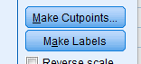
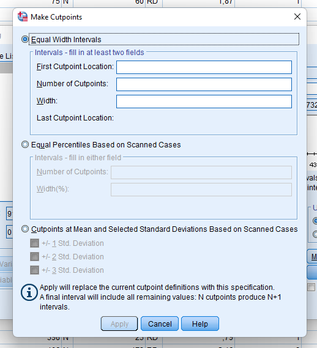
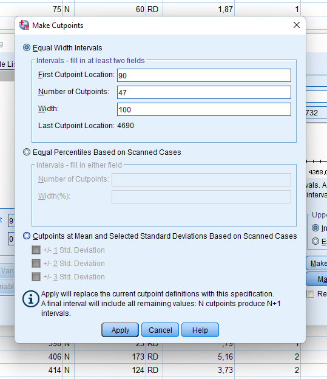

- Establecer el tamaño del bloque
- Crear puntos de corte
	- NEcesito llenar 2 de los 3
	- 
	- 
	-
	- 
	-
	-
	- 
	-
		- 
		- 
-
	- 
	- 
-
	- {:height 415, :width 596}
-
	- 
-
-
- Inckye o no incluye el blockque superior, si le pongo incluida
- 
- Añdo as etiquetas
- Suntuario MAs elastico
-
- >El costo fijo  de la empresa son $10 millones cada mes
- Tenemos que recuperar unos $ 20 millones mensuales
- Costo Marginal 74 ctv por KWH
-
- Consumo Total  en el Primer mes  $ 11 MIllones