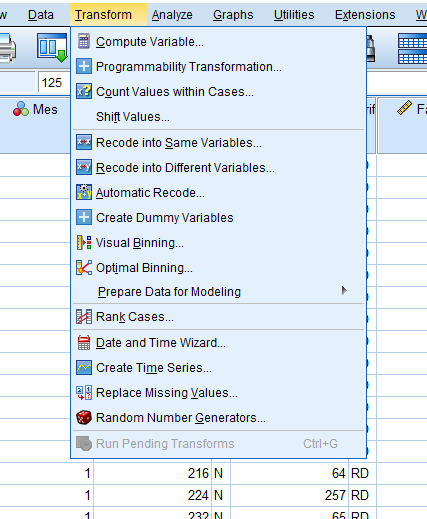
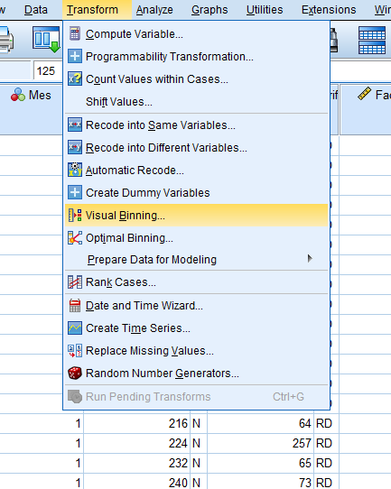
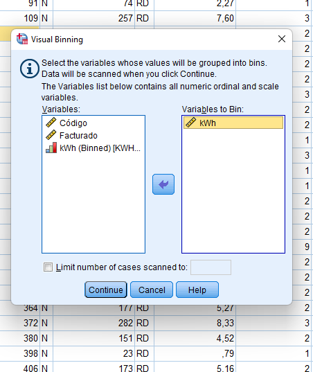
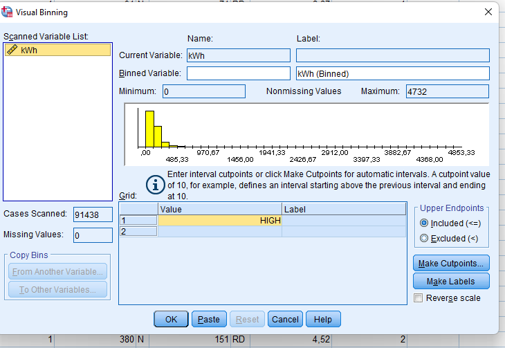
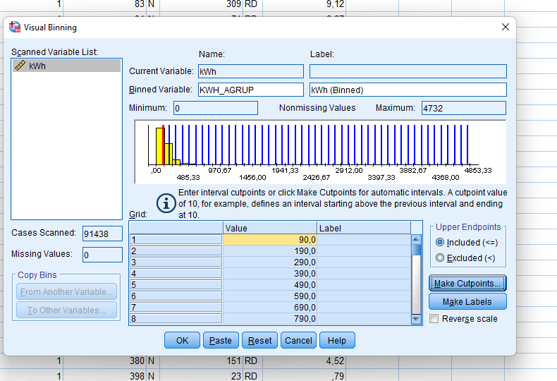
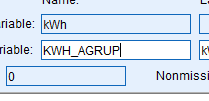
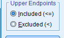
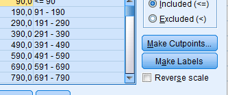

- Establecer el tamaño del bloque
- Crear puntos de corte
	- NEcesito llenar 2 de los 3
	- 
	- 
	-
	- 
	-
	-
	- 
	-
	- {:height 415, :width 596}
- 
-
-
-
- 
-
- Inckye o no incluye el blockque superior, si le pongo incluida
- 
- Añdo as etiquetas