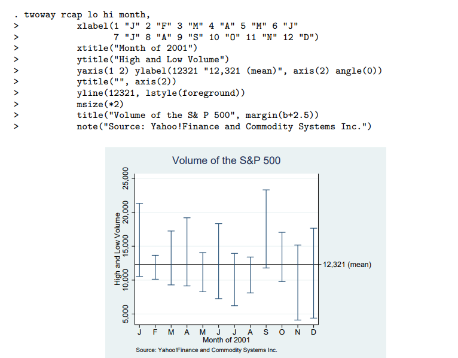
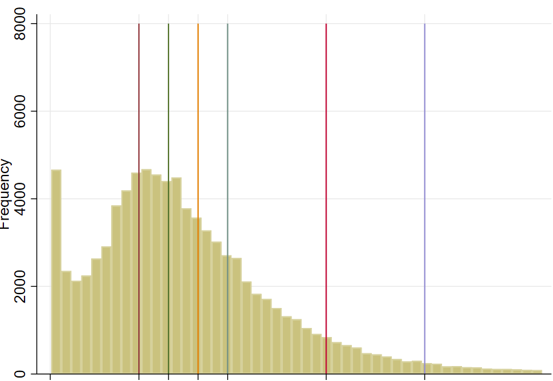

- # Universidad
  collapsed:: true
	- {{embed ((61dc237b-1620-4acf-8aea-326df2e12c22))}}
	- {{embed ((61dcd0c2-d41c-4bf5-ad98-1393ce2f51d5))}}
	-
- [[CheckMe]]
  collapsed:: true
	- Conseguir información de las ASO:
	  collapsed:: true
	  SCHEDULED: <2022-01-10 Mon .+15d>
		- Nombres de las presentaciones
		- Para presentación de Pitch vía zoom
		- Prospecciones de Empresas a visitar
			-
- [[Notas]] // [[Ideas]]
	- Acceso a bases digitales desde la UCuenca
	  collapsed:: true
		- https://www.youtube.com/watch?v=v4qGfT3nVTI
	- How to learn data science with Coursera in 2022 (beginner-friendly) Usando Notion
	  collapsed:: true
		- https://www.youtube.com/watch?v=GYRz3RAu4Bk
	- [[Stata]]
		- Expandir uso de summarize o sum
		  collapsed:: true
			- https://psychstatistics.com/2020/07/23/stata-descriptive-statistics-mean-median-variability/
		- Borrar Leyenda de un grafico
		  collapsed:: true
			- Eliminar leyenda de un grafico
			- https://www.stata.com/statalist/archive/2008-07/msg01036.html
			- ```stata
			  legend(off)
			  ```
		- Añadir valores especificos a un grafico en stata
		  collapsed:: true
			- https://www.stata.com/manuals/g-3axis_label_options.pdf
			- 
		- Añadir linea vertical en grafico Stata
		  collapsed:: true
			- https://www.stata.com/statalist/archive/2006-02/msg00654.html
			- ```stata
			  hist kWh if kWh <500 & kWh >0, freq  addplot(pci 0 90 8000 90 || pci 0 120 8000 120 || pci 0 150 8000 150 || pci 0 180 8000 180 || pci 0 280 8000 280 || pci 0 380 8000 380  ) xlabel(0 90 120 150 180 280 380 , labsize(2)) legend(off)
			  ```
			- 
		-
- Deuda externa 
  collapsed:: true
	- Dos paises con los cuales tenemos los mayores compromisos de deuda externa (excel)
	- y cual es la relación deuda PIB en junio del 2021 , saldo de deuda interna y saldo de deuda externa
- E
-