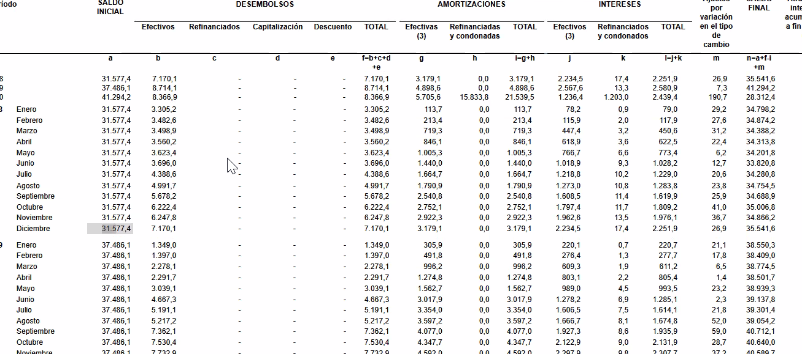

- Deuda externa Pública
  collapsed:: true
	- 2010
	  collapsed:: true
		- Tasa de interés
		- ```calc
		  326.9/7364.2*100
		  
		  
		  ```
	- 2015
	  collapsed:: true
		- ```calc
		  1068.0/17455.4*100
		  ```
	- 2019
	  collapsed:: true
		- ```calc
		  2580.9/37486.1*100
		  ```
	- 2020
	  collapsed:: true
		- ```calc
		  2439.4/41294.2*100
		  
		  ```
- Deuda externa Privada
  collapsed:: true
	- 2010
	  collapsed:: true
		- Tasa de interés
		- ```calc
		  326.9/7364.2*100
		  
		  
		  ```
	- 2015
	  collapsed:: true
		- ```calc
		  1068.0/17455.4*100
		  ```
	- 2019
	  collapsed:: true
		- ```calc
		  2580.9/37486.1*100
		  ```
	- 2020
	  collapsed:: true
		- ```calc
		  2439.4/41294.2*100
		  
		  ```
- Diapos
  collapsed:: true
	- 
	- 
- Los niveles de deuda interna no comprometen el pago futuro
- ---
- No somos una aplicación de rastreo, somos una aplicación que te acerca a tu mascota mucho mas,
- Toby te a mandado un mensaje
- Parece que toby tiene hambre
- Toby quiere explorar el mundo
- Toby esta estresado
-
- Toby ven a comer
- Toby ven a casa
-
- GIf de carga de perritos
  collapsed:: true
	- https://www.google.com/search?q=loading+gif+pet&tbm=isch&ved=2ahUKEwi6sb-_prr1AhVOjeAKHQhzATsQ2-cCegQIABAA&oq=loading+gif+pet&gs_lcp=CgNpbWcQAzIECAAQEzIICAAQCBAeEBMyCAgAEAgQHhATMggIABAIEB4QEzIICAAQCBAeEBM6BwgjEO8DECc6BQgAEIAEOgQIABAeUL0CWPEMYLIOaABwAHgAgAH1AYgBwweSAQMyLTSYAQCgAQGqAQtnd3Mtd2l6LWltZ8ABAQ&sclient=img&ei=MyzmYfrLCs6aggeI5oXYAw&bih=869&biw=1920#imgrc=tddn7mgIDaK2kM
- Gif perrito
  collapsed:: true
	- https://www.google.com/search?q=dog+gif+motion+graphic&hl=es-419&sxsrf=AOaemvJ2c52Hd4sLfdl0oYfQ9TmgCNQAiw:1642475748615&source=lnms&tbm=isch&sa=X&ved=2ahUKEwjrh7H8qrr1AhUMRjABHearAuwQ_AUoAXoECAEQAw&biw=1920&bih=869&dpr=1#imgrc=WH_zgVFN2i8hnM
-
- Diseño de loadings
	- https://think360studio.com/blog/how-progress-bar-indicators-help-in-mobile-ux-design