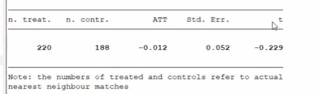
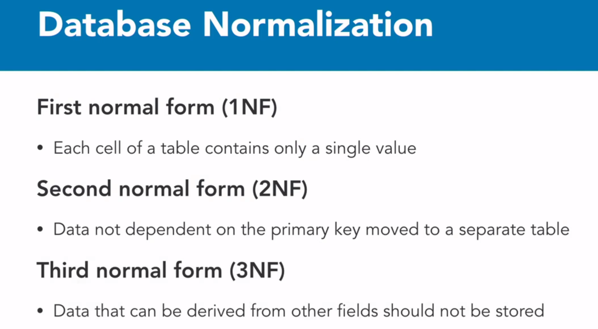

- Aplicación diff and diff
  query-table:: false
  collapsed:: true
	- https://rr4---sn-hp57kndz.c.drive.google.com/videoplayback?expire=1642616586&ei=yh7oYZCeEIeM8wTChJXQCQ&ip=200.55.237.84&cp=QVRJVEdfVVVWR1hPOjBJV3Z0bk01bVF4NjE2aHZoRUUzQ1dMbnpSNVBqYjRzMzN1aGI4NnZ1Vk4&id=e8c8f9cd222ac052&itag=22&source=webdrive&requiressl=yes&mh=WR&mm=32&mn=sn-hp57kndz&ms=su&mv=m&mvi=4&pl=21&ttl=transient&susc=dr&driveid=1Q3RcHmsp2RE1zecgNYi74Sr_6GmAJ2C2&app=explorer&mime=video/mp4&vprv=1&prv=1&dur=6174.975&lmt=1610587667180170&mt=1642601791&sparams=expire,ei,ip,cp,id,itag,source,requiressl,ttl,susc,driveid,app,mime,vprv,prv,dur,lmt&sig=AOq0QJ8wRQIhAItEL7x2uiaf2ZQAEn4Pvq8VEFN6RyBnoeGHBrXhUfPTAiBhVddRWlWRABELDt0Fg2qVCNoAXx1tFbFY8JmQEsxPNA==&lsparams=mh,mm,mn,ms,mv,mvi,pl&lsig=AG3C_xAwRAIgHPqK0rbJQhutsh4BrX0TyhV_NWVSS6Vag0twJk0h4e0CICRPquibDWDQM9VBImJEWTcgL70ASYEZB5xh90DgAAi6&cpn=4ydR2uyLHfsk9ED3&c=WEB_EMBEDDED_PLAYER&cver=1.20220112.01.00
- Propensive score macth
  collapsed:: true
	- https://rr2---sn-hp57kn6l.c.drive.google.com/videoplayback?expire=1642616564&ei=tB7oYbeEKoiu8wT3m4LwBQ&ip=200.55.237.84&cp=QVRJVEdfVVVURVhPOjBJV3Z0bEs1bVF4NjE2aHRmRUUzQ1dMbnpQM1BqYjRzMzN1Zno4NnZ1Vk4&id=753663dd5aa8b0e0&itag=22&source=webdrive&requiressl=yes&mh=oe&mm=32&mn=sn-hp57kn6l&ms=su&mv=m&mvi=2&pl=21&ttl=transient&susc=dr&driveid=1CPkzLwqLsyQfekuaSzsFGZWt0KGaxeYM&app=explorer&mime=video/mp4&vprv=1&prv=1&dur=6693.523&lmt=1607644634118603&mt=1642601791&sparams=expire,ei,ip,cp,id,itag,source,requiressl,ttl,susc,driveid,app,mime,vprv,prv,dur,lmt&sig=AOq0QJ8wRQIgMbyf5YdzgeR1diig2JZs_qqTDVgLDCSslH5IF5YKp1ACIQCf_MCYhxtT4WBqH00-yvbtLMIJGJJeCWUdUTSw2WDiVg==&lsparams=mh,mm,mn,ms,mv,mvi,pl&lsig=AG3C_xAwRQIhAMQvvLATQG0UY-9l_k1SgustqRCf1EFbAKKUyKXB7A64AiAhb0pV1ESsiW6i4M0_rrLfbeig8di4cT49DQrcEZsX7Q==&cpn=OJ16b2LCFWjVTMri&c=WEB_EMBEDDED_PLAYER&cver=1.20220112.01.00
- 
- Disminuye un 1.2%
  collapsed:: true
	- today
	-
- ¿Qué buscan los métodos de matching?
	- Tratar de encontrar un contrafactual que sea lo mas similar posible al grupo de tratamiento
- El Propensitive scorre machin
	- ¿Cuando es útil?
		- Es útil cuando creemos que solo las características observadas son las que afectan la participación del programa
		- Cuando un tratamiento no puede ser aleatorizado
	- Que busco con el PSM
		- Busco encontrar un contrafactual lo mas similar posible al grupo de tratamiento, en términos de características observadas
	- Buscamos un gran grupo de no participantes que sean individuos observacional mente similares a los participantes en termínanos de características no afectadas por el programa
	- Que nos permite el PSM
		- Asignar el efecto del programa aun si no se aleatorizo.
- DOING Investigar informatica saturday [[Sat, 22-01-2022]] en base de datos relacionales
  :LOGBOOK:
  CLOCK: [2022-01-21 Fri 18:23:17]
  :END:
	- 
	- # Normalización de bases de datos
		- Se lleva a cabo con la finalidad de minimizar la redundancia de los datos en una base de datos relacional
		- Las formas normales son aplicadas a las tablas de una base de datos
		-
		- ## Primera forma normal (1FN)
			- Si todos los atributos de una del dominio son simples e indivisibles
			- No existe variación del numero de columnas
			- Existe dependencia funcional en todos los campos
			- Existe independencia de orden  en filas y columnas, un cambio de orden de los datos no modifica s significado
		- ## Segunda Forma Normal (2FN)
			-
	- El creador de las tres formas normales fue Edgr F.Codd
	-