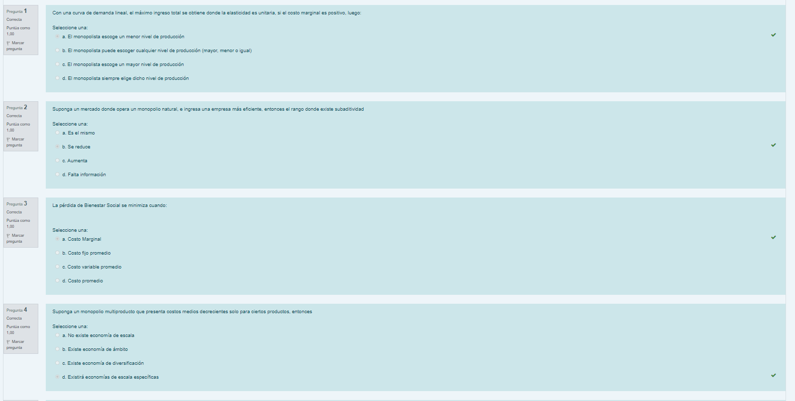

- > Ojalá me hubiera dado permiso para hacer un trabajo imperfecto desde el principio
- > Me doy permiso para hacer un trabajo menos que perfecto ahora en lugar de esperar hasta que haya pasado el plazo
- ssas
- Tachar tareas con una gran lineal roja , acompañada de un pequeño sonido triunfal, [[Efecto Estimulo Recompensa]]
-
- [[Organización Vertical]]
-
- Prueba #kanban
	- dasd
	- asd
	- as
	- dasd
		- ASD
			- ADS
	-
-
- dfsfsd #kanban
	- da
	- da
	- wq
	- e
-
- Hola #colum-2
	- asddaasdasdfkdjlkjflkjsdflkjsadlfkjaslkdfjasñlkfjalkfjañlksdfjalkdfjñalsdkjfañlskdjfkdjfñalkdjfsalkdjf
	- dsfsñdlkfjñlksjfñalksfjñalksdjñalksdfjalkñsdfjñalksdjfalñkjfalñksdjfñalksdjfñalskdj
	- dasdsdfsdfsd
		- sasaas
		- AS
		- as
		- asd
			- dasddas
			- das
			- das
				- ad
				-
		- asdasd
		- sdas
		- dss
		-
		-
	- sdas
	- sdaasdasd
- asd
- asd
-
-
-
-
- Examen final Regu
	- 