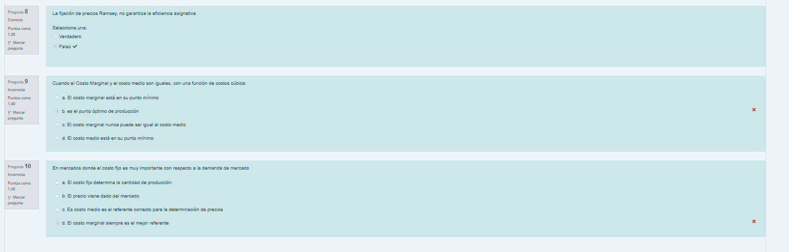
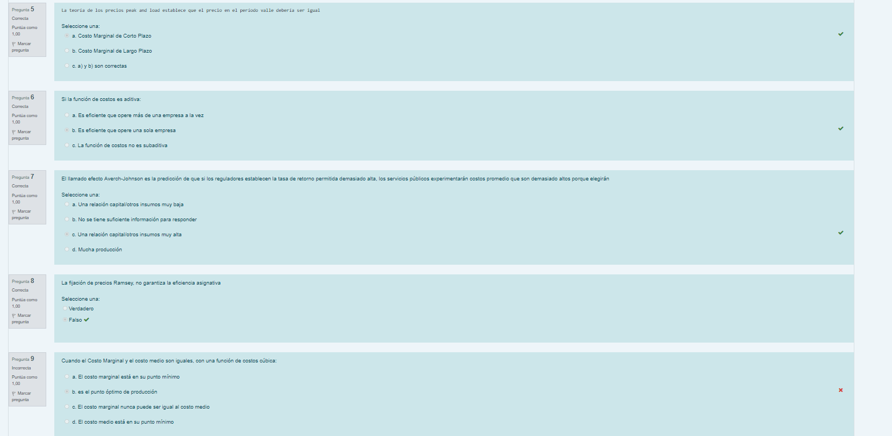

- > Ojalá me hubiera dado permiso para hacer un trabajo imperfecto desde el principio
- > Me doy permiso para hacer un trabajo menos que perfecto ahora en lugar de esperar hasta que haya pasado el plazo
- ssas
- Tachar tareas con una gran lineal roja , acompañada de un pequeño sonido triunfal, [[Efecto Estimulo Recompensa]]
-
- [[Organización Vertical]]
-
- Prueba #kanban
	- dasd
	- asd
	- as
	- dasd
		- ASD
			- ADS
	-
-
- dfsfsd #kanban
	- da
	- da
	- wq
	- e
-
- Hola #colum
	- # [[Regulación]]
		- Supletorio de Regulación
		- Estudiar Todo Incluido Ejercicios
		-
		-
	- # [[Finanzas Públicas]]
		- ((6201acf8-f52b-47e6-9a04-0d50bb3bdd4e))
		- Quedan  por revisar, todos los capitulos
		- que no se han visto hasta  ahora
		-
		-
	- # [[Métodos Para el Análisis Regional]]
		- Estudiar Todo, Incluido GEODA
		-
- Examen Regulación
	- 
	- {:height 389, :width 778}
	- 
-