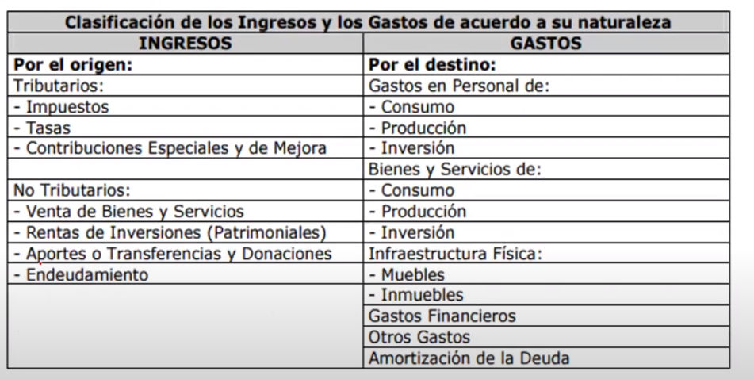

- ¿Qué es?
	- Es el que se debe cumplir para armar un presupuesto
- ¿Cuales son las etapas del ciclo presupuestario?
	- Son 6,  en el orden:
		- 1. Programación
			- ¿Que se realiza en la etapa de programación?
				- En general
					- Es la etapa en la que  se especifican los objetivos y metas señalados en la planificación del Estado e Institucional en el P.N.D ([[Plan Nacional de Desarrollo]]). Aquí las entidades definen los programas, proyectos y actividades a incorporar en el presupuesto
				- En especifico
					- Se elaboran los
						- **Catálogos**
							- Lisado de instituciones , programas y proyectos
						- **Clasificadores**
							- Listado de uso institucional que especifica la gestión que se va a realizar tanto de donde proviene y hacia donde irán esos recursos .
							- Uno de los clasificadores mas importantes es
								- El clasificador presupuestario
									- 
									- ¿Cual es la clasificación Económica de los ingresos y gastos?
										- Ingresos
											- Corrientes
											- De capital
											- De Fianciamiento
										- Gastos
											- Corrinetes
											- Producción
									-
								- **Clasificador presupuestario para el Ecuador**
			- ¿Qué pasa si una obra no entra dentro de esta programación?
				- No se puede designar presupuesto si una obra no cosnta dentro de los objeticos o metas del P.N.D
			- ¿ Cual es el objetivo de la programación?
				- Es medir la capacidad real de ejecución de las entidades, y la capacidad de cubrir el gasto de inversión, con la finalidad de optimizar el desempeño de la inversión pública
		- 2.Formulación
		- 3. Aprobación
		- 4. Ejecución
		- 5. Evaluación y Seguimiento
		- 6. Clausura y Liquidación
-