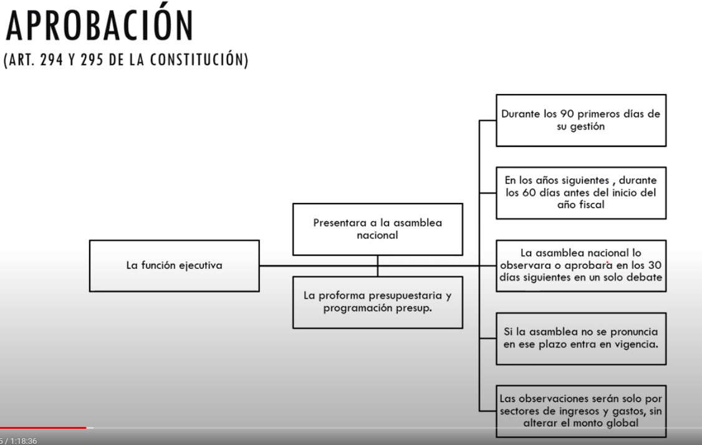

- # ¿Qué es?
	- Es el que se debe cumplir para armar un presupuesto
- # ¿Cuales son las etapas del ciclo presupuestario?
	- Son 6,  en el orden:
		- 1. Programación
			- ¿Que se realiza en la etapa de programación?
				- En general
					- Es la etapa en la que  se especifican los objetivos y metas señalados en la planificación del Estado e Institucional en el P.N.D ([[Plan Nacional de Desarrollo]]). Aquí las entidades definen los programas, proyectos y actividades a incorporar en el presupuesto
				- En especifico
					- Se elaboran los
						- **Catálogos**
							- Lisado de instituciones , programas y proyectos
						- **Clasificadores**
							- Listado de uso institucional que especifica la gestión que se va a realizar tanto de donde proviene y hacia donde irán esos recursos .
							- Uno de los clasificadores mas importantes es
								- El clasificador presupuestario
									- De acuerdo a su naturaleza
										- 
									- De Acuerdo a su clasificación económica
										- # Es importante aprenderse los códigos
										- Forma de los códigos, cada uno cuenta con 6 digitos
											- 
											- 
											- Clasificador presupuestario #documento
												- <object data="G:/Otros ordenadores/Mi Ordenador/Habilidades/Universidad/Fianzas Públicas/Documentos/clasificador_presupuestario.pdf" type="application/pdf" width="100%" height="800px"></object>
										- Ingresos
											- 1 - Corrientes
											- 2 - De capital
											- 3 - De Fianciamiento
										- Gastos
											- 5- Corrientes
											- 6 -De Producción
											- 7 -De Inversión
											- 8- De Capital
											- 9- De Aplicación del financiamiento
										- **Clasificador presupuestario para el Ecuador**
											- Es importante aprenderse los códigos de primer y segundo nivel, los de primer nivel son de la clasificación económica y los de segundo nivel son los de clasificación de su naturaleza
											- 
			- ¿Qué pasa si una obra no entra dentro de esta programación?
				- No se puede designar presupuesto si una obra no cosnta dentro de los objeticos o metas del P.N.D
			- ¿ Cual es el objetivo de la programación?
				- Es medir la capacidad real de ejecución de las entidades, y la capacidad de cubrir el gasto de inversión, con la finalidad de optimizar el desempeño de la inversión pública
		- 2.Formulación
			- En esta Etapa el ministerio de finanzas CONSOLIDA la Proforma Presupuestaria
			- Es cuando yo incorporo las proyecciones económicas dentro de las asignaciones presupuestarias, es decir se asigna un  presupuesto según cual sea la proyección
			- Se asigna un presupuesto en base a indicadores macroeconómicos
		- 3. Aprobación
			- A nivel Gubernamental la encargada de aprobar el presupueto público es:
				- La asamblea nacional(Entre octubre y noviembre)
					- ¿Que pasa si no se aprueba?
						- Entra por el ministerio de la ley
				- ¿Qué puede modificar la asamblea de esta propuesta de presupuesto?
					- Puede modificar a que se designa dicho presupuesto (Si puede alterar los rubros internos )
					- No puede modificar el Monto del presupuesto (No puede alteral el rubro global )
			- De que mas depende la aprovación del presupuesto
				- Del tiempo en el que se encuentre el gobierno de turno
					- 
		- 4. Ejecución
			- Lo importante de esta etapa es que distingo distintos tipos de presupuestos , el mimos presupuesto que se va modificando durante el año fiscal, estos presupuesto son
				- Estos presupuestos constan en las proformas presupuestarias .
				-  Presupuesto inicial
					- Que es el valor aprobado por la Asamblea
				- Presupuesto Codificado
					- Es el primer presupuesto modificado , luego que la asamblea ya lo allá aprobado
				-  Presupuesto Comprometido
					- Es el presupuesto en el cual  el gobierno a través de documentos se compromete a pagar ciertos rubros, Compromisos a través de contratos de pagos futuros de una obra a realizar
				-  Presupuesto Devengado
					- Es el presupuesto una vez ya se a realizado el pago, como cuando el gobierno contrata la construcción e una via y ya paga el 40% de aquello
				-  Presupuesto Pagado
					- Una vez se a cumplido con el pago del 100% de servicio requerido a proveedores de vienes o servicios adquiridos
		- 5. Evaluación y Seguimiento
			- Es una etapa en la que se realiza evaluación y seguimiento  de resultados físicos y financieros obtendios y los efectos que estos han producido
			- Grado de Cumplimiento de las metas y objetivos
			- Grado de eficiencia
			- Ajustes para solucionar desvíos
		- 6. Clausura y Liquidación
			- Se da cuando se termina el año fiscal
			- Al terminar el año fiscal (31 de diciembre) cada institución  cierra su presupuesto y ve cuanto a ejecutado y cuanto no
			- ¿Qué es la Liquidación Presupuestaria?
				- Realizada la clausura se hace un informe económico de los resultados de la ejecución presupuestaria, este ejercicio se conoce como Liquidación Presupuestaria.
				-
- 1. Planes y metas
	- 2. Revisión de indicadores y estimación de ingresos
		- 3. Aprobación
- # Archivos
	- {{query documentos}}