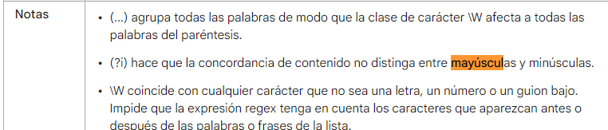

- Expresiones Regulares
  collapsed:: true
	- Todas las expresiónes
	- https://docs.vmware.com/es/vRealize-Log-Insight/8.6/com.vmware.log-insight.user.doc/GUID-88B2952D-3112-46BC-B126-84C9BF38B6D2.html
	- Seleccionar solo la palabra que contenga una ultima letra
	- http://w3.unpocodetodo.info/utiles/regex.php
- Hace que no distinga entre mayúsculas y minúsculas
  collapsed:: true
	- ```Python
	  if re.search(r'(?i)HOLA','Hola como estas'):
	    print("SO")
	    
	  *SO
	  ```
	- 
	- https://support.google.com/a/answer/1371417?hl=es
- Como empezar con la programación
	- Primero instalamos Node
		- Node
			- Es el motor donde corre javascript nos permite escribir en
			- Node nos instala npm