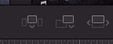

- 
- En el U6 te dice como exportar en vertical o cuadrado , utilizando la edición ya realizada
- Como cortara, Básicamente lo mejor
-
-
- Letra `i` punto de entrada
- El Primer botón Inserta en nuevo video entre dos
- El botón del centro, pone el nuevo clip siempre al final
- Elimina el plano siguiente y lo remplaza con el nuevo plano el de la derecha
- 
-