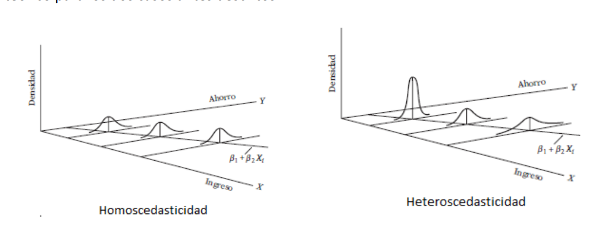

- Heterocedasticidad
	- La varianza de los errores no es constante
	  collapsed:: true
		- {:height 282, :width 473}
	- ¿Cómo detectamos la heterocedasticidad? 
		- Test de White
		  collapsed:: true
			- En stata
				- {{embed ((c923113e-05a6-4186-8401-3015d4c07281))}}
				-
		- Test Breush y Pagan
		  collapsed:: true
			- Hipotesis Nula
			  collapsed:: true
				- $H_0$ :Varianzas de los errores constantes
			- Código Stata
			  collapsed:: true
				- {{embed ((36eea4e8-4e33-4daf-bae6-f81bb09a4813))}}
	- ¿ A que se puede deber la heterocedasticida ?
		- A la mala especificación del modelo
- Endogeneidad
  collapsed:: true
	- ¿ Que es la endogeneidad?
	  collapsed:: true
		- La Endogeneidad es lo que se produce cuando las variables exógenas están corraladas con los términos de perturbación , con el error de la regresión.
	- ¿Por que se da esto?
	  collapsed:: true
		- Puede deberse a una relación causal inversa
		- ¿QUe es una relación causa inversa?
			- Se da cuand la varaible endogena tiene consecuencaias sobre alguna covariable
			- Cuand hay variables que se han omitido en el modelo
			- O cuando existen variables sujetas a errores de medición
	- ¿Qu genera la enodogenidad?
		- Genera estimaciones sesgadas e inconsistentes
	- ¿ Como corregimos la endogeneidad?
		- Variables Instrumentales
			-
- Especificación del modelo
	- ¿Cómo sabemos la correcta especificación del modelo?
		- Test de Ramsey
			- Donde $H_0$ El modelo esta bien especificado
			- En Stata
				- {{embed ((8d3feec9-0966-42ae-8d02-8186b4043d5a))}}
-