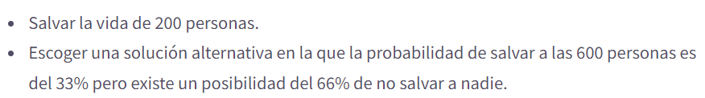
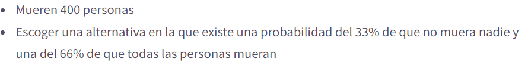
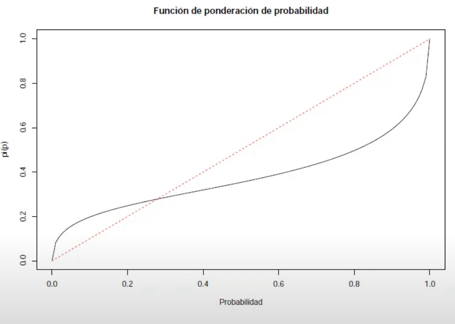

-
- # Unidad 1  #yellow
  collapsed:: true
  Fundamentos de la economía experimental y del comportamiento (ECC)
	- ## 1. 1 Economía como disciplina Experimental #red ((61993a92-3c67-4e6d-a4de-3637d9faee8c))
	- ## 1. 2 Principios de la Economía Experimental #red
	- ## 1.3 Economía del Comportamiento
	  collapsed:: true
		- ¿ Que es a Economía del comportamiento?
		  collapsed:: true
			- Es una rama de la [[Economía]] que se basa en **uso** de la **evidencia** de la economía clasica , la [[Psicología]] y otras ciencias sociales , para **crear escenarios de estudio**  de la toma de decisiones, no basadas en la optimización del modelo clasico
		- ¿Qué estudia la Economía del comportamiento?
		  collapsed:: true
			- Se encarga por ende del estudio de tendencias cognitivas, emociones humanas y sociales  en busca de una mejor comprensión de la toma de decisiones económicas
		- ¿ Que busca la Economía del comportamiento?
		  collapsed:: true
			- Busca ampliar la racionalidad
			- Busca entender el comportamiento humano y sus consecuencias
		- ¿ Cual es el interés de los [[biólogos]] y [[psicólogos]] en la economía del comportamiento?
		  collapsed:: true
			- Debido al enfoque de calculo y maximización lógica en mecanismos biológicos esto es el campo de la [[Neureconomía]]
		- ¿  Cual es la relación entre Economía del comportamiento  y el modelo económico estándar?
		  collapsed:: true
			- La base de la relación
			  collapsed:: true
				- La economía del comportamiento  trata de probar el [[modelo económico estándar]] en humanos, pudiendo así refinarlo con lo que verdaderamente se observa en el mundo real
			- Herramientos
			  collapsed:: true
				- Ciencias Sociales Varias
				  collapsed:: true
					- [[Psicología]]
				- Experimentos de laboratorio
				- Herramientas empiricas
				  collapsed:: true
					- Encuestas
					- Estudios de caso
					- Métodos estadístico
			- Camerer (2004) señala que la economía conductual aumenta el poder explicativo de la economía al darle a esta una base [[Psicología]] mas realista, además de extender  la [[Elección Racional]] y los [[Modelos de Equilibrio]] (Camerer,2006).
		- ¿Por que es un campo respetable dentro de la economía?
		  collapsed:: true
			- Debido al éxito al explicar anomalías del modelo estándar y el desarrollo teórico que a tenido, se a convertido en un campo respetable
		- Historia y evolución de la teoría del comportamiento
		  collapsed:: true
			- Bernoulli (1738)
			  collapsed:: true
				- Explica la aversión al riesgo en función a utilidad marginal decreciente del dinero.
			- Adam Smith (1759)
			  collapsed:: true
				- Teoría de los sentimientos morales: rolde las emociones en la toma de decisiones.
			- Bentham ( 1789)
			  collapsed:: true
				- Aborda el concepto de utilidad con base en el sentimiento de bienestar del  los sujetos.
			- Post-Guerra ( 1940-...)
			  collapsed:: true
				- Aplicación de econometría y procesos computacionales
				- Friedman: La complejidad del comportamiento no requiere atención, pero si sus generalidades, la teoría económica no se planteaba la precisión de sus supuestos.
			- Simon(1955)
			  collapsed:: true
				- Plantea lo que se conoce como [[Racionalidad Limitada]]
			- Decadas ('50s-'60s)
			  collapsed:: true
				- Se evidencia mediante estudios las anomalías a la hora de tomar decisiones
				-
			- ---
			- Daniel Kahneman y Amos Tverskey (' 70s)
			  collapsed:: true
				- Nace la  Economía del Comportamiento con la obra:
					- Prospect theory: An analysis of decision under risk’
			- ---
			-
		- Metodología de la Economía del comportamiento 
		  collapsed:: true
			- Teoría
			  collapsed:: true
				- Identificar teorías adecuadas , supuestos, axiomas
			- Evidencia
			  collapsed:: true
				- Estudio de campo
				  collapsed:: true
					- Experimento
					- Encuestas
					- Estudios de caso
					-
				- ¿ Por que no presenta problemas de validez?
				  collapsed:: true
					- Debido a que representa la realidad como es
				- ¿ Por que presenta problema de validez conceptual ?
				  collapsed:: true
					- Por el cuestionamiento ¿ Mide lo que se pretende?
				- ¿Qué son los factores confusores ?
				  collapsed:: true
					- Debido a efectos en el resultado que no se pueden aislar
			- Conciliación
			  collapsed:: true
				- Disposición a unir conocimientos e información de diversas disciplinas para crear un marco de entendimiento
		- Diferencias entre Economía Experimental y Economía del Comportamiento
		- |**Economía del Comportamiento** | **Economía experimental**| 
		  | Teorías para explicar el comportamiento en entornos económicos | Enfoque Metodológico|
		  |Interdisciplinario| Kit de herramientas|
		  |No descarta supuestos clásicos| Comprueba o refuta la economía clásica|
		- > No existe una relación necesaria entre economía conductual y la experimental
		-
		-
- # Unidad 2  #yellow
  collapsed:: true
	- ##  Ampliación de la Racionalidad  #yellow
	  collapsed:: true
		- ¿ Cuales son las características de los procesos involucrados en la toma de decisiones?
		  collapsed:: true
			- Preferencias
			  collapsed:: true
				- Escalas definida sobre un conjunto de bienes, basadas en valores y actitudes con los posibles resultados
			- Creencias
			  collapsed:: true
				- Son la probabilidad que damos a la ocurrencia de cada resultado, en base a la información que disponemos de que se de ese resultado.
			- [[Racionalidad]]
		- ¿Cuáles son los supuestos del [[modelo económico estándar]] ?
		  collapsed:: true
			- {{embed ((61986c0a-c73c-4efc-8d25-a4989c91fe8c))}}
			- De acuerdo con los axiomas y supuestos descritos , somos:
			  collapsed:: true
				- Racionales
		- ##  Sesgo cognitivo #yellow
		  id:: 61985334-f1bd-466f-a97e-9543d114a293
			- ¿ Donde se presentan los sesgos cognitivos?
			  collapsed:: true
				- Antes de revisar los sesgos , debemos plantearnos cuales son los criterios que se postulan en la racionalidad y que se ven influenciados por estos segos
				- {{embed ((61993171-c97f-46cb-a0bf-b2d27fbff677))}}
				  id:: 61997b0e-18bf-42f5-9a86-efda43a5b885
			- ¿ Que es un sesgo cognitivo?
			  collapsed:: true
				- Es una interpretación errónea sistemática de la información disponible  a la hora de procesar pensamientos, hacer juicios de valor y ==tomar decisiones==
			- Efectos #red
				- Efecto dotación #green
					- Este efecto nos causa que tendemos a valorar más un objeto que poseemos frente a otro que todavía no es nuestro.  Nos cuesta mas despegarnos de las cosas con las que hemos creado un vinculo emocional asociado a la de propiedad.
					- Esto quiere decir que damos utilidad a algo dependiendo de la posesión de aquello.
					- Factor [[Psicología]] principal: aversión al riesgo
					- Importancia dentro de la economía: La propiedad y los intercambios son ejes de la economía
				- Efecto Marco #green
				  collapsed:: true
					- Es un  [[sesgo cognitivo]]  en el cual las personas tienden a evitar los riegos , si las opciones se plantean en función de la ganancia, pero suelen ser mas arriesgadas , si el problema se plantea en forma que implique perdida.
					- Ejemplo:
					- Se plantea en forma de ganancia
					- 
					- En esta ocasión se eligió en su mayoría la primera opción
					- Ahora se presenta en forma de perdida
					- 
					- En esta ocasión se escogió la segunda opción
					- Viola el supuesto ((619971f6-62bf-47ca-a1cf-eb0f11796938))
				- Efecto Anclaje #green
				  collapsed:: true
					- Es un  [[sesgo cognitivo]] debido al anclaje ya ajuste que provoca darle un mayor peso a la primera noticia, argumento o evidencia que se tiene sobre algo a la hora de tomar una decisión, de esta forma ajustando la respuesta del individuo hasta tener una respuesta final, usando esta primera impresión como ancla de su respuesta. Sesgando la respuesta final entorno a este ajuste o ancla inicial.
					- id:: 619a437e-524a-4307-af41-bd6334f6012b
					  link:: https://bit.ly/3nDh9BH
				- Efecto gratis #green
				  collapsed:: true
					- Le damos un mayor valor a las cosas cuando se las anuncia como "Gratis"
			- Falacias #yellow
			  id:: 61984d8e-6a49-43b5-9976-544cefe9b6f3
			  collapsed:: true
				- Son un tipo de sesgo cognitivo que distorsionan ((61984d1e-b1e3-4ffb-909b-c5efe8e02089))  el como captamos la realidad
				- Falacia del [[coste hundido]] #yellow
				  collapsed:: true
					- Es un ((61985334-f1bd-466f-a97e-9543d114a293)) que consiste en darle valor y esfuerzo a una inversión irrecuperable, algo que nunca va a volver, con la única razón de mantener a flote un programa, proyecto una decisión , por la expectativa de recuperar lo entregado (dinero, tiempo, etc.) y por el temor que nos inspira asumir la pérdida  de lo entregado.
		- ## 2. Heurísticas, Sesgos y actualización Bayesiana  #yellow
		  collapsed:: true
			- ¿ Que son los heurísticos?
			  collapsed:: true
				- Los heurísticos son reglas generales y poco definidas que funcionan como “atajos” mentales para resolver problemas que paso a paso serían en extremo complejos. [🔗](https://www.divulgaciondinamica.es/blog/3-heuristicos-clave-la-toma-decisiones/)
			- Heurística de disponibilidad #green
			  collapsed:: true
				- Este sesgo nos genera que demos mayor probabilidad a un evento que es de fácil recordad. Esto pude generar que estimemos con mayor probabilidad la ocurrencia de eventos raros debido a que es lo primero que recordamos, pudiendo deberse esto a la publicidad que hayamos visto de ese evento
				- En pocas palabras nuestra mente utiliza ejemplos inmediatos, los que primero se te vienen a la cabezas , para calcular las probabilidades de algo que este pasando.
				- Por ejemplo si quiero una gaseosa; en lo primero que pienso es Cocacola, como la que mayor probabilidad de bienestar o satisfacción me puede dar ante esa necesidad
			- Heurística de representatividad #green
			  collapsed:: true
				- Se basa en tomar decisiones a través de juicios en los que encasillamos la situación en un  categoría u otro según se parezca o sea representativa de esa categoría debido a las características que posee.
				- Danos la probabilidad de ocurrencia de B con respecto al grado de relación o similaridad que guarde con A, sin tomar en cuenta las ocurrencias por separado de B
				- Ejemplo:
					- Si un producto es caro , solemos encasillarlo como producto de buena calidad, y de la misma forma si algo es de buena calidad solemos encasillarlo como algo caro
				- link:: [🔗](https://www.divulgaciondinamica.es/blog/3-heuristicos-clave-la-toma-decisiones/)
			- Sesgo de Frecuencia Base #green
			  collapsed:: true
				- Solemos dar mas peso a la información de un caso en particular de un evento que al información  del mismo evento, ósea la información base o  general.
				- De este modo daremos la probabilidad de un evento en base a un caso en particular que a la  probabilidad general o base de ese evento
				- Consecuencias: Sobreestimación de eventos
				- Ejemplo:[[Paradoja del Falso Positivo]]
				- link:: [🔗](https://psicologiaymente.com/inteligencia/falacia-frecuencia-base)
			- La ley de los pequeño números #green
			  collapsed:: true
				- Sujetos tienden a pensar que una pequeña muestra es representativa de la sociedad
				- Se cree que una muestra se distribuye de la misma forma que la población, por lo tanto es valido e igual  inferir resultados de una muestra de 7, 70 o 7000 observaciones de una muestra hacia la población, debido a que a cada muestra se le aplica principios de poblaciones infinitas sin distinció.
				- Se piensa que se han planteado variables independientes e idénticamente distribuidas.
				- Ejemplo:
				  collapsed:: true
					- 9 de cada 10 especialistas lo recomiendan
				- ¿Cuál es la falacia y efecto que se enmarca en esta ley?
				  collapsed:: true
					- 🌱 Falacia del apostador
					  collapsed:: true
					  id:: 619a6bc3-3a6c-4c2a-a6b2-146c60a526ea
						- Creer que un evento esta  ***Negativamente*** correlacionado con el primero
						  id:: 619a6bc3-9342-44a7-b7a8-9f4a32f86373
					- 🌱 Efecto de la Mano caliente #red
					  collapsed:: true
						- Creer que un evento esta  ***Positivamente*** correlacionado con el primero
						- Se calcula que por un buen resultado en un evento inicial se incrementa en gran medida la probabilidad de éxito de un resultado futuro
						- Se da cuando se tiene incertidumbre en como es la distribución de los resultados
						- Ejemplo:
							- La sobreestimación de tendencias en los [[Mercados Financieros]], en el corto plazo, ((619a6bc3-3a6c-4c2a-a6b2-146c60a526ea)) en el largo plazo efecto de la mano caliente
				- 🌱 ¿Cuándo no se cumple esta ley?
				  collapsed:: true
					- En eventos no independientes : eventos de permutación aleatoria
					- Eventos aleatorios: Sesgos de parte de administrador
					- Probabilidades cambiantes. Puede favorecer a un jugador
			- Sesgos de auto evaluación
				- 🌱 Exceso de seguridad #green
				  collapsed:: true
					- Sobreestimación
					  collapsed:: true
						- Sobre valoración de habilidades
					- Sobreposicionamieto
					  collapsed:: true
						- Sobre estimación de capacidades en base a un punto de referencia
						- Ejemplo:
						  collapsed:: true
							- La mayoría de conductores se creen mejor que el promedio
					- Sobreprecisión
					  collapsed:: true
						- Excesiva seguridad sobre la precisión de nuestras creencias
						- Ejm:
						  collapsed:: true
							- Sobre estimación de la precisión en inversores
				- 🌱 Falta de seguridad #green
				  collapsed:: true
					- Subestimación de confianza tanto en tareas difíciles con bajan probabilidad de exito, como en tareas fáciles, con alta probabilidad de éxito
					- Eso debido a la falta de información de sus habilidades y su probabilidad de éxito, estimadolas así de forma regresiva las propias  habilidades y mucho mas regresivas la de los otros
				- 🌱 Sesgo de autoservicio #green
				  collapsed:: true
					- Conjunto de diferentes sesgos de creencias, en los cuales el individuo se atribuye el éxito a habilidades y destrezas propias y atribuye el fracaso a factores externos.
					- Tendencia a modelar crecías y juicios con el objetivo  de mejorar una opinión propia
					- Este error es una función positiva de la utilidad
				- 🪴 Sesgo de Poyección #yellow
				  collapsed:: true
					- Se basa en creer que nuestra utilidad futura dependerá de los mismos factores de los que depende hoy, esto quiere decir que nuestras preferencias futuras serán las mismas o muy cercanas a las actuales
					- Estudios concluyen que aproximadamente los consumidores predicen los gustos futuros  aproximadamente entre los actuales y los futuros
					- Ejm:
						- Luego del almuerzo 42% elige snacks
						- Media tarde 78% los elije
					- Función Matemática
						- ((619a8033-e651-4106-ad3b-3bcf7b6778ee))
						- Por lo que la utilidad futura que espera el individuo es:
						- ((619a8015-f3e8-4072-894b-f7c829583f36))
						- Donde:
							- ((619a804d-769f-4ce9-8003-66266bf83c79))
		- ## Causas de la irracionalidad  #yellow
		  collapsed:: true
			- Baumeister(2001) ha identificado 5 causas del comportamiento irracional o también conocidas como comportamientos contraproducentes
			- 🌱  Angustia emocional
			  collapsed:: true
				- ¿Cual es la posición del [[modelo económico estándar]] frente a las emociones?
				  collapsed:: true
					- Recordemos que la posición de los economistas es no tener en cuenta las emociones para sus análisis, ya que estas tienden a nublar el buen juicio, dando así decisiones "irracionales" o lo que se conoce conductas contra producentes
				- ¿Cuál es la posición de la economía conductual frente a las emociones?
				  collapsed:: true
					- Dependiendo de la situación las emociones **Mejoran** o empeoran la toma de decisiones.
					- Ejem
						- ¿Cómo afecta de mala manera las emociones en nuestra toma de decisiones?
						  collapsed:: true
							- La ira en la toma de decisiones, genera estrés sobre al decisión a aceptar, o aumenta su nivel de exposición al riesgo, hechos que se eliminan si se hacer reflexionar al individuo sobre este echo.
						- ¿Como afecta de buena manera las emociones en la toma de decisiones?
						  collapsed:: true
							- Cuando una emoción nos genera compromiso para llevar a cabo ciertas actividades, en circunstancias en las que un estado racional no lo haría
							- 🌱 [[Efecto reputación]]
								- El mismo que sirve para mantener nuestro interés a largo plazo
				- 🌱 Memoria
				  collapsed:: true
					- Aquellas emociones tanto positivas como negativas no suelen permanecer mucho tiempo en un individuo hasta que este recupere su estado "neutro"
					- Sin embargo solemos creer que estas emociones se quedaran con nosotros mucho mas tiempo del que realmente es, es decir sobreestimamos el tiempo en el que sentiremos las emociones, [[sesgo de durabilidad]].
					- 🌱 Implicaciones
						- Para Políticas de felicidad (bienestar subjetivo )
				- 🌱 Disonancia cognitiva #green
				  collapsed:: true
					- Es el conflicto mental que se da cuando nuestras creencias entran en conflicto con nuestras actitudes o con otras creencias que tenemos generándonos así incomodidad.
					- También se puede dar cuando nos rehusamos a cambiar nuestras creencias frente a evidencia que las contradice
					- Esta incomodidad se resuelve con acciones irracionales
			- 🌱  Autoestima amenazada
			  collapsed:: true
				- Si la Autoestima se ve amenazada, esto puede afectar a  al proceso de toma de decisiones
				- La baja auto estima puede provocar comportamiento contraproducente, irracional, por ejemplo los desordenes alimenticios o el abuso del alcohol
				- Sin embargo la auto estima alta también puede generar comportamiento contraproducente, como el abuso de las drogas.
			- 🌱  Falla de autorregulación
			  collapsed:: true
				- ¿Qué es la autorregulación?
				  collapsed:: true
					- Se da Auto regulación cuando se reflexiona sobre ventajas y desventajas antes de tomar una decisión, con la autorregulación somos capaces de diferenciar el costo a corto y a largo plazo, así como sus beneficios los que genera decisiones Inter temporales.
					- Auto regulación implica retraso de la gratificación
				- ¿Cómo se relaciona con la disonancia cognitiva?
				  collapsed:: true
					- reduce la autorregulación
				- Las fallas de auto regulación provocan que exista sesgo hacia el presente
				- ¿Cuáles son las personalidades que se distinguen de la autorregulación?
				  collapsed:: true
					- Personalidad de largo plazo
					  collapsed:: true
						- Paciente- Maximiza la utilidad a través del tiempi
					- Personalidad de corto plazo
					  collapsed:: true
						- Impulsivo- Maximiza la experiencia inmediata
			- 🌱  Fatiga de decisión
			  collapsed:: true
				- Existe un costo psicológico de tomar decisiones
				- La toma de decisión puede llegar a ser compleja, esto puede llevar a tomar malas decisiones, pues se a reducido nuestra capacidad de toma de decisiones optimas
				- Esta es una de las razones por las que las personas son criaturas de hábitos, debido a que esto evita la necesidad de gastar recursos escasos al tomar decisiones.
			- 🌱  Rechazo y pertenencia
			  collapsed:: true
				- El sentido de pertenencia es innato
				- Es más fuerte que el deseo de autoestima
				- El rechazo genera decisiones menos eficientes, comportamiento agresivo y menos cooperativo.
				- Ejm: 
				  collapsed:: true
					- crear el sentido de pertenencia en mujeres ayuda a incrementar permanencia y representación
	- ##  Teoría Prospectiva  _1637533445262_0.pdf) #yellow
	  id:: 619acd7b-c30d-4687-b87f-c7d1ad7bb6a3
		- Es un modelo alternativo para que explica la toma de decisiones individuales bajo riesgo. Esta teoría fue desarrollada para alternativas simples con resultados monetarios y probabilidades dadas.
		- La teoría prospectiva distingue dos fases en el proceso de elección : una fase de preparación o edición y una subsecuente de evaluación.
		-  Fase de Edición
			- Aplicación de diferentes operaciones para transformar los resultados y probabilidades asociadas  a los prospectos disponibles / ofertados.
			-  Codificación
			  id:: 619adee6-d652-4d62-917f-a9d294c838ab
				- Las ganancias o las perdidas se valoraran dependiendo del punto inicial en el que se encuentre el individuo, no es lo mismo como te sientes al tener  10$ después de tener 1 $ que después de tener 20 $,
				- Es decir la ganancia o la perdida se hace relativa a un punto de referencia.
			-  Combinación
			  collapsed:: true
				- Donde se presentan las siguientes alternativas (200,.25;200,.25), esto es una lotería donde ganas 200 con una probabilidad de 0.25 en una opción, y ganas 200 con una probabilidad de 0.25 en la otra opción: Lo que nos daría un valor esperado de  →
				- VE=(200) (0.25)+(200)(0.25) =100  → Esto se puede simplificar combinando →
				- VE= (200) (0.5) = 100
			-  Segregación:
			  collapsed:: true
				- En esta ocasión se agrega un componente no riesgoso y se evalúa respecto a uno riesgoso:  (300,0.80)(200,0.20) → de aquí podemos sacar un componente no riesgo y otro riesgoso que nos de el mismo valor esperado.
				- VE= (300)(0.80)+(200) (0.20)=280
				- VE= 200+(100)(0.80) =280
			-  Cancelación
			  collapsed:: true
				- El componente compartid es suprimido
				- Tenemos (200,0.20;100,0.50;-50,0.30) y (200,0.20; 150,0.50;-100,0.30) → lo que puede reducirse por cancelación a la comparación entre (100,0.50;-50,0.30) y (150,0.50;-100,0.30)
			-  Simplificación
			  collapsed:: true
				- Redondear probabilidades o resultados  (101, 0.49) como (100, 0.49) o (101, 0.50).
				- Además una de las formar de simplificar es reduciendo los resultados extremadamente improbables
			-   Escaneo
			  collapsed:: true
				- Para poder eliminar las alternativas dominadas
			-
		-  Fase de Evaluación
		  collapsed:: true
			- Una vez que ya emos editado nuestras opciones queda obtener su valor, para ello no usamos únicamente probabilidades sino ponderaciones de las probabilidades $$ \pi (p)$$, esto para optener el valor total de x $$v(x)$$, como en este caso se toman en cuenta dos escenarios también le sumamos  $$\pi(q) v(y)$$ con lo que la formula para el valor propuesta por [[Kahneman & Tversky]] es:
			- #+BEGIN_CENTER
			  ((619aff0a-2243-49b6-8035-109eaadb2603))
			  #+END_CENTER
			- Para un valor global de un prospecto regular
			- En caso de certeza
			- ((619aff4b-9adf-4862-9221-d27179becf90))
			- Para un  valor global de un proceso estrictamente  +/-, se deine como:
			- ((619aff83-a0cf-412f-9ebc-3760f85b814d))
			- Donde $v(y)$ es el componente no/menos riesgoso
			- y ((619affbe-4020-4cec-942b-6c68392ca7ba))
			- Esto se puede apreciar en su grafica, donde las ganancias son cóncavas y las perdidas convexas con mayor pendiente debido a la aversión al riesgo mayor que la ganancia
			- ((619b0020-b91e-46c5-aaf8-d42df7848b2e))
			- recordar que debido a que en esta teoría se de la una mayor probabilidad cundo la probabilidad es baja y una menor probabilidad cunado la probabilidad es alta , ose se ponderan las probabilidades, esto se podría expresar con la siguiente formula
			- ((619b00da-d762-4676-a956-7751bfb501c5))
			- Así como de manera gráfica:
			- {:height 343, :width 448}
			- En eje x la probabilidad $p$ y en el eje y la ponderación $\pi(p)$
		- [🎥 0 ](https://www.youtube.com/watch?v=upVbs5j15mA&t=308s)  [🎥 1 ](https://www.youtube.com/watch?v=PqUZ9H_XOb8) [🎥 2 ](https://www.youtube.com/watch?v=jS1kjXu2q3Y)
		  background-color:: #793e3e
	- ##  Preferencias Sociales  #red
	  collapsed:: true
		-  Juego del Ultimátum
		-  Juego del Dictador
		-  Juego de Confianza/reciprocidad
		-   Bienes públicos
		-
	-
- # Unidad 3
	- ## 0. Introducción _1640726025438_0.pdf)
	  collapsed:: true
		- ¿ Que es un experimento?
		  collapsed:: true
			- Es una situación controlada, muchas de las características son implementadas por diseño, con el fin de observar las decisiones e interacciones individuales resultantes.
			- ¿ Como se consideran un experimento respecto a los datos?
			  collapsed:: true
				- Un experimento es un proceso de generación de datos controlado
			- ¿A que nos referimos cuando hablamos de control?
			  collapsed:: true
				- Se da cuando la mayoría de los factores que influyen en el comportamiento se mantienen y solo se varía un factor de interés (el "tratamiento") a la vez
				- La variación controlada es un factor crucial para hacer inferencia causal
			- ¿Cuál es una definición mas formal de experimento?
			  collapsed:: true
				- Un experimento es la elección de un conjunto de ==n== inputs, que definen el entorno, asicado con ==m== medidas de sus consecuencias con el objetivo de inferir su relación causal ==F==
			-
		- ¿ Cual es el objetivo de un experimento?
		  collapsed:: true
			- Inferir relaciones causales entre el entorno  diseñado y el comportamiento de los individuos
		- ¿Qué tipo de experimentos podemos realizar?
		  collapsed:: true
			- De Campo
			- De Laboratorio
		- ¿Los experimentos se ven influenciados únicamente por los ==n== inputs controlados?
		  collapsed:: true
			- No debido a que influyen muchas mas decisiones que no controlamos _ej : el nivel de ruido que se prioduce fuera del laboratorio_
			-
			-
			-
			-
		- ¿De que depende la elección de los imputs?
		  collapsed:: true
			- Depende de la relación de la relación  y el fenómeno que el experimento busca estudiar- Es decir, depende de la pregunta de investigación
			  collapsed:: true
			-
		- ¿Cuál es la relación que guarda con los modelos teóricos y con la vida económica real?
		  collapsed:: true
			- Similar a un modelo teórico ya que selecciona un conjunto de dimensiones a estudiar , de un fenómeno de interés.
			- Se asemeja con la realidad , ya que existen infinitas  causas que no podemos controlar u observar.
		-  ¿Cuáles son los aspectos básicos que según Smith(2014) se deberían conocer a la hora de llevar a cabo experimentos? [ 📝  ](61cbb8f5-80f0-4180-9da9-fdac4316f5b6)
		  id:: 61cbb8ad-1511-43a2-9bb4-65b2788d42cf
		  collapsed:: true
			-   Teoría de la decsión
			  collapsed:: true
				- Teoría de Juegos
				- Preferencias no estándar
				- Agregación
				- Psicología del comportamiento
				- Neurociencia
			-  Juegos y entornos de toma de decisiones
			  collapsed:: true
				- Formad de elicitación
				- Los juegos experimentales
				- Los cuestionarios psicológicos
				-
			-   Campos y Aplicaciones
			  collapsed:: true
				- Economía laboral
				- Economía Personal
				- La organización Industrial
				- La Economía Ambiental
				- Economía de la salud
				- Economía y derecho
			-  Aspectos Metodológicos
			  collapsed:: true
				- Perspectivas del participante
				- Cómo EE se relaciona con otros métodos de la económia, la relación con la teoría
				- Métodos estadísticos para el análisis de datos
			-
	- ##  0.1 Términos Básicos 🌱
	  collapsed:: true
		- Sujeo/participante
		- Sesión experimental
		- Ronda/período
		- Tratamiento línea base (Grupo de Control)
		- Tratamiento experimental
	- #   El enfoque econométrico al análisis de datos
	  collapsed:: true
		- ¿Por que los experimentos son controlados?
		  collapsed:: true
			- Por que el ambiente /contexto son construidos de acuerdo a los objetivos de la pregunta de investigación
			  id:: 61cbbdec-8c47-4ff2-bd23-f2f2104a323e
			- Por que al decidir el diseño del "juego", la información prevista, el experimentador decide lo que se llama "proceso de generación de datos"(PGD)
			- En econometría se busca supuestos que se ajusten a un PGD desconocido.
			- Los experimentos controlan el PGD
		- {{embed ((61cbbf57-2572-4d58-9382-507f0f5375b9))}}
		- ¿Los experimentos revierten el método econométrico?
		  collapsed:: true
			- Sí, ya que revierten este proceso y escogen el mejor PSD(Proceso de generación de daos ) que se adapte a la pregunta de investigación.
		- ¿Cómo intervienen en los experimentos los supuesto de identificación?
		  collapsed:: true
			- Proveen una guía de como identificar a los experimentos, otra fuente para guiarnos son los cuasi experimentos
		- ## Estimación de efectos Causales en tratamientos
			- Identificación: Identificar pregunta de investigación
			- En experimentos ¿en que se puede basar la identificación?
			  collapsed:: true
				- Se puede basar en el marco de evaluación causal: donde se mide  {{cloze efecto causal de un tratamiento}}
			- ¿Cuales son los estados de la naturaleza en un experimento?
				- $T=0$ Situación Base
				- $T=1$ Cambia de dimensión, lo que genera el cambio es {{cloze el tratamiento}}
				- EL resultado en cada individuo se denota con $y_{i0}$ en el estado sin tratamiento y $y_{i1}$ en el estado con el tratamiento
				- El efecto causal entonces seria medido por ...
				  collapsed:: true
					- $y_{i1}-y_{i0} = \text{Efecto causal}$
					- ¿Que problema presenta esto?
						- La notación anterior supone que un mismo individuo $i$ es al que no se le aplica el tratamiento como al que se le aplica el tratamiento, lo cual es imposible.
					- ¿ En que cosiste el problema de evaluación?
					  collapsed:: true
						- Consiste en encontrar un contrafactuales:
						- Estos contrafactuales son observaciones empíricas que miden/aproximan de manera convincente lo que el investigador no observa.
							- Este contrafacual debe mostrar 2 dimensiones criticas...
							  collapsed:: true
								-   Cuánto refleja el contrafractual lo que queremos observar
								-  El tipo de efecto causal
								-
					-
				-
			- ¿ Que tipo de información proveen los experimentos naturales  ?
			  collapsed:: true
				- Proveen información de corte transversal
					-   $T=1$
					-  $T=0$
					- Lo que refleja vectores para resultados incomplatibles
					- | i | $T_i$| y_{i}(0) | y_i(0)|
					  |-|-|-|-|
					  |1|1|-|10|
					  |2|0|2|-|
					  |3|1|-|3|
					  |...|...|...|...|
					  |n|0|5|-|
					-
					-
					-
					-
		- ## Parámetros del efecto del tratamiento
			- ¿ Cual es la forma de estimar el efecto causal?
			  collapsed:: true
				- Es a través del cambio promedio inducido por el tratamiento para cualquier individuo en la población= Efecto promedio del tratamiento
				-
			-   Efecto promedio del Tratamiento (ATE)
				- Mide el impacto del tratamiento en cualquier individuo de la población , tratados y no tratados
				- ¿Cuál es su representación matemática?
					- ((61cce115-7e78-439e-b1af-c5e63cef579e))
			-  Tratamiento promedio en los tratados (ATT)
				- Solo aquellos que recibieron el tratamiento
				- ¿Cuál es su representación Matemática?
					- ((61cce14d-7116-45b8-970c-a9e057620c96))
			- ¿Cuándo son iguales el ATE y el ATT?
			  collapsed:: true
				- Esto va a depender del mecanismo detrás del cambio en el resultado, o lo que es lo mismo, depende de  que influyo para que se de ese resultado o cambio.
				- Si la respuesta individual al tratamiento es homogénea en la población, entonces los dos parámetros serán los mismos
				-
			- ¿Cuándo serán diferentes  ATE y el ATT?
			  collapsed:: true
				- Si la población es heterogénea en términos de su respuesta al tratamiento, relacionado esto a que se dio el tratamiento
				- ¿Problemas para que se de una diferenciación?
				  collapsed:: true
					- Participación Gratuita
					- Focalización a una población en particular
			- ¿Identificación con datos observacionales ?
				- Solo se cuenta con los resultados de $y(1)|X,T=1$ , quienes recibieron el tratamiento y de $y(0)|X, T=0$ para los que no lo hicieron
				- ¿Cómo se calcula el estimador de corte transversal con datos observacionales?
					- ((61cce2a4-e43d-4576-9095-ab886e5227b0))
					- ¿Que refleja  la ecuación anterior?
						- Que el estimador de corte transversal usa el resultado en el grupo de control como un contrafactual del resultado del grupo tratado.
						- Este estimador seria valido si $y(0)|X, T=0$ es una medida correcta del resultado que el individuo tratado habría obtenido sin tratamiento.
						- Sin embargo esto no sucede y produce sesgo
						- El sesgo es la diferencia en resultados entre tratados y no tratados si no hubieran sido tratados
						- ¿Qué es el efecto selección? #yellow
							- La diferencia o sesgo es dependiente de si el tratamiento beneficia a los individuos o no
							- ((61ccf20a-23d8-4f59-a956-342536e291d0))
							- Si existe tal selección el estimador de corte transversal resulta en una estimación sesgada
							- ¿ Que implica este efecto de selección?
								- Equivale a una violación del supuesto de identificación, implica heterogeneidad no observada relacionada con el tratamiento
								- ((61ccf2a7-9fe7-4dac-8804-8fcc1948bb2a))
		-
	-   Inferencia basada en experimentos controlados
		- ¿Por que se diferencia de los experimentos naturales?
			- En esta Ocasión decidimos el proceso de generación de datos
			- la variación de interes se implementa
- ---
- [[Ideas]][[Marketing]]
  collapsed:: true
	- Pagina de interés para conocer todos los sesgos y heurísticas  https://bit.ly/2Z93Dwh
	- Pagina de propuesta de forma de pensar matricial [🔗](https://www.esan.edu.pe/apuntes-empresariales/2021/08/la-heuristica-de-representatividad-y-los-errores-que-cometemos-en-las-decisiones-economicas/)
-
-
- [[Comments]]
  collapsed:: true
	- [[Dec 28th, 2021]]
	  collapsed:: true
		- ((61cbb8ad-1511-43a2-9bb4-65b2788d42cf))
			- Falta especificar cada una de las expresiónes acontinuación numeradas