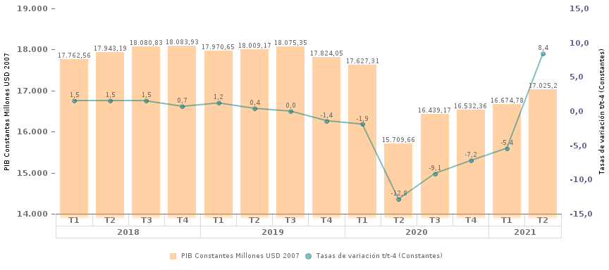
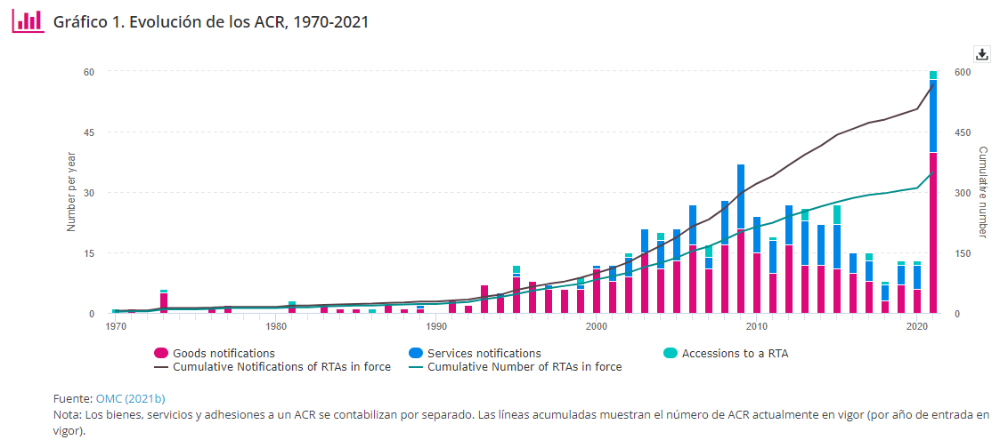

- #kanban
	-
	  

	  collapsed:: true
	  <a style="color:white ;font-size:20px;"  >    PIB    </a>
	    <a style="color:green; font-size:20px;" >   8%   </a> 
	  <a href="https://contenido.bce.fin.ec/documentos/Administracion/bi_tick_PIB_CNT.html">  🔗 </a>
	  

		- Análisis del PIB
		  collapsed:: true
			- {:height 325, :width 714}
		- Data del PIB
	-
	  

	  <a style="color:white ;font-size:20px;"  >    PIB Nominal    </a>
	    <a style="color:green; font-size:20px;" >   8%   </a> 
	  <a href="https://contenido.bce.fin.ec/documentos/Administracion/bi_tick_PIB_CNT.html">  🔗 </a>
	  

-
  

  id:: 61acef70-5919-4030-917b-11ed5b23c556
  <a style="color:white ;font-size:20px;"  >    PIB    </a>
    <a style="color:green; font-size:20px;" >   8%   </a> 
  <a href="https://contenido.bce.fin.ec/documentos/Administracion/bi_tick_PIB_CNT.html">  🔗 </a>
  

	-
-
  

  
 Nivel de Exportaciones 

    
8%
 
  <a href="https://www.w3schools.com/">Visit W3Schools.com!</a>
  

-
- Evolución de los tratados  comerciales internacionales
  collapsed:: true
	- {{renderer :linkpreview,https://sdgpulse.unctad.org/trade-barriers/}}
	- {:height 328, :width 714}
- Análisis Comparativo de Comercio exterior Ecuador
  collapsed:: true
	- {{renderer :linkpreview,https://www.centrosureditorial.com/index.php/revista/article/view/81/221}}
- Examen estadístico del comercio mundial 2021
  collapsed:: true
	- {{renderer :linkpreview,https://www.wto-ilibrary.org/trade-monitoring/examen-estadistico-del-comercio-mundial-2021_e724f894-es}}
	- Paginas para medir la competitividad del comercio internacional
		- {{renderer :linkpreview,https://www.cepal.org/sites/default/files/events/files/caso_02.pdf}}
		- Indices CEPAL
			- {{renderer :linkpreview,https://repositorio.cepal.org/bitstream/handle/11362/3690/S2008794_es.pdf}}
- Datos de Comercio Exterior
  collapsed:: true
	- {{renderer :linkpreview,https://www.trademap.org/Index.aspx}}
- Datos PIB anual
  collapsed:: true
	- {{renderer :linkpreview,https://datosmacro.expansion.com/pib/ecuador}}
- Papers Comercio Exterior
	- 
	- 
	- 
	- 
	- {{renderer :linkpreview,https://www.cato.org/economic-development-bulletin/debunking-protectionist-myths-free-trade-developing-world-prosperity}}
-