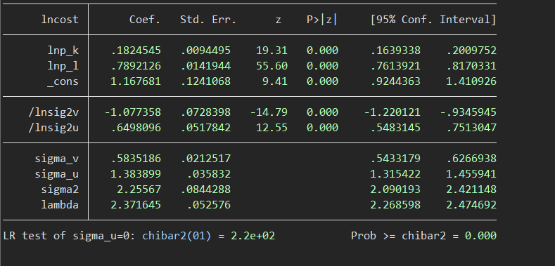
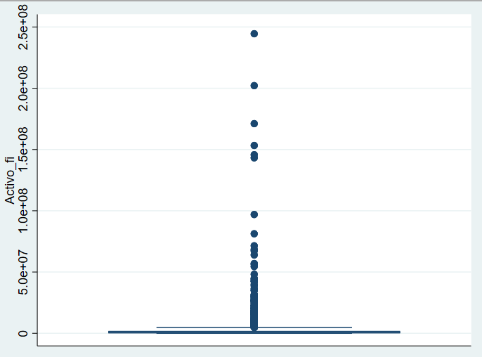
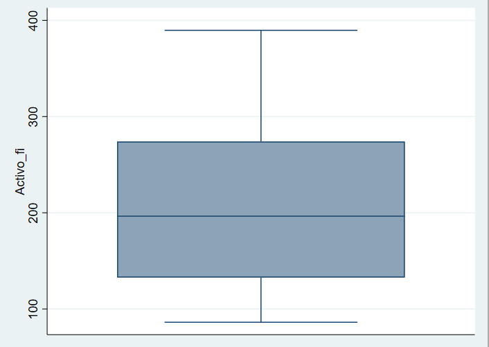
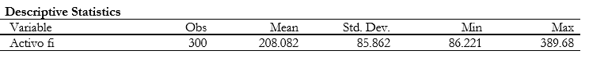
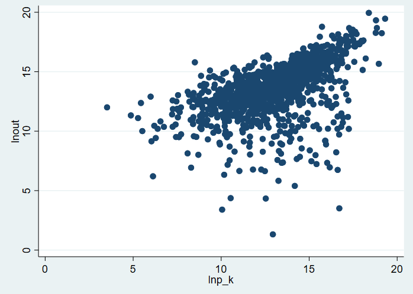

- Frontera de Producción
  id:: 61ee2013-ba01-4b4c-ba53-dc30f15e62e5
  collapsed:: true
	- La frontera de producción parte de la siguiente expresión
		-
		  $$
		  \ln \left(q_{i}\right)=\beta_{0}+\sum_{j=1}^{k} \beta_{j} \ln \left(z_{j i}\right)+\left(v_{i}\right)-u_{i}
		  $$
		- Donde:
			- $ln(q_i)$: Es el logaritmo del numero de unidades producidas por la empresa , medido en unidades
			- $ln(z_{ji})$_: Es el logaritmo del nivel de uso de los insumos, es decir cuanto se ha usado de capital, cuanto se ha usado de trabajo y ase sucesivamente con los demás [[Factores de Producción]] que se tomen en cuenta, por lo general que construyen índices de cantidades para estimar estas variables.
- Frontera de Costos
  id:: 61edfb56-65bd-400b-b36f-3815b0c8f671
	- Teoría
	  collapsed:: true
		- Expresión Matematica
			- La frontera de costo parte de la siguiente expresión
			  id:: 61ee1ef1-069d-4085-a8d8-5d61c255b089
			-
			  $$
			  \ln \left(c_{i}\right)=\beta_{0}+\beta_{q} \ln \left(q_{i}\right)+\sum_{j=1}^{k} \beta_{j} \ln \left(p_{j i}\right) \text { 㐲 } v_{i}+u_{i}
			  $$
			- Donde
				- $ln(c_i)$ : es el logaritmo del costo de la empresa medido en dólares
				- $ln(q_i)$: Es el logaritmo del numero de unidades producidas por la empresa , medido en unidades
				- $ln(p_{ji})$ : Es el logaritmo del precio de los insumos Capital, Trabajo, etc, medido en dólares a diferencia de la estimación de la ((61ee2013-ba01-4b4c-ba53-dc30f15e62e5))
		- Estimación
			- Interpretación de resultados
				-
				  $$
				  \lambda=\sigma_{u} / \sigma_{v}
				  $$
				- Si $\lambda$ es mayor a uno , esto quiere decir que la desviación estándar debido a la ineficiencia es mayor que la desviación estándar debido a un componente idiosincrático o aleatorio, es decir la ineficiencia se debe mas a términos internos de la empresa
				- Si $\lambda$ es menor a uno la ineficiencia de la empresa esta dada por un componente aleatorio
				- 
				- el sigma mu no mide directamente el parámetro de eficiencia, sino que tanto de costo mas esta añadiendo cada una de las empresas en su forma de producir
				- Cuando se estima la función de costo, no solamente tengo la eficiencia técnica sino también  tengo la eficiencia productiva, es decir la eficiencia técnica mas la asignativa
				- Mientras mayor sea el costo de eficiencia mas ineficiente soy, esto se da por que la empresa estaría produciendo de forma mas ineficiente , por lo tanto mas costosa, no lo esta haciendo al mínimo costo
	- Aplicación
		- Estimación de la Frontera de costos para el sector manufacturero de Ecuador
		  collapsed:: true
			- # 1. Datos
				- Los datos se obtuvieron de superintendencia de compañías, mismo que pertenece al sector manufacturero de Ecuador para el año 2017, los datos a utilizar son:
					- Costos: Como el total de costo de las empresas en el año
					- Ventas: El total de ventas que se genero en dólares en el año
					- Precio Laboral: Se tomo el sueldo junto con los salarios y demás remuneraciones
					- Precio del Capital: Se tomo el total de Activos fijos
				- La base de datos contaba inicialmente con un tota de 49829 empresas, misma de la cual se eliminaron aquellas empresas que no contaran con registro de las variables utilizadas para la estimación, quedando así un total 1202  observaciones,  de las cuales se filtro el sector manufacturero. Dentro de este sector se busco aquellas empresas que cuenten con un activo fijo similar, por lo cual se generaron 4 bloques de empresas según su valor de activo fijo, esto ya que en la industria manufacturera uno de los principales aspectos es su alta inversión en activos fijos necesarios para la generación de productos. Al realizar la división menciona se seleccionamos  aquellas empresas que consten con  el segundo 25% de empresas  según sus Activos fijos, esto ya que el primer bloque presenta empresas que tiene como activos fijos valores de  $30 o similares, haciendo poco valido este primer bloque. En las graficas 1 y 2 se puede observar el principal motivo de la generación de bloques, la gran diferenciación de activos fijos de las empresas.
				- {:height 360, :width 435}
				- {:height 282, :width 427}
				- Una vez definido el conjunto de datos, se puede comenzar a obtener simples estadísticas exploratorias del mismo, en la tabla 1 se evidencia esto. Los datos para el sector manufacturero del bloque 2 generado  cuenta con un numero de 30 empresas. Mismas que en su conjunto tienen un promedio de Activos fijos de 208 mil dólares dólares
				- 
				- Siendo la empresas con menor activos fijos  LOA Corporación y la de mayor valor de activo fijo Heladerías Confrunat, Como se puede apreciar, aquella de mayor activo fijo es una empresa que vende productos que requieren una gran cantidad de los mismo.
				- Procedemos a logaritmizar las variables que se usaran parar estimar la frontera de costos, permitiéndonos  esto una breve descripción de las relaciones entre las variables.
				- 
				- Se puede observar en la grafica anterior, que existe en general una relación directa entre el activo y las ventas, echo que se esperaba, sin embargo  como se puede observar en el grafico,  el valor de netas no siempre incrementa con mayores activos, lo que nos podría dar leve indicio de que empresas en el mismo sector por mas activos fijos tengan, no se genera mayor valor de venta, sin embargo esto no es para nada generalizable , ya que puede haber empresas que vendiendo menos ganen mas
			- # 1. Obtención de Datos
				- Los datos se obtuvieron de superintendencia de compañías para el año 2017, las cuentas que se seleccionaron con sus respectivos códigos fueron ; Costos con el código 7991 ;
			-
				-
			- # 2. Descripción de los datos
				-
			- # 3. Estimación de Frontera de Costos
				- Escogemos la estimación de modelo de función de costos, para esta estimación se seleccionó una distribución de tipo half-normal para el termino de eficiencia.
				-
				-
-