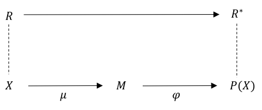

- Diseño de estructura de incentivos
- Diseño centrado en Incentivos
	- Diseño de Estructura de Incentivos  {{renderer :wordcount_masmdewch}}   ==Maximo de Palabras 3.500 – 4.000==
		- 
		- 
		- 
		- 
		- # 1. Introducción
		- La primera literatura económica solía consistir en modelos teóricos o estudios empíricos, pero en los últimos años una parte cada vez mayor de los estudios económicos utilizan experimentos para obtener información sobre el comportamiento económico. Uno de los principales aspectos de los experimentos económicos es el diseño de los incentivos en el experimento. Un enfoque común es que para motivar a los sujetos a tomar decisiones de acuerdo con sus creencias y comportamientos reales. Incentivar a los sujetos ha sido durante mucho tiempo un principio clave de la economía experimental aun así los economistas experimentales aún no han establecido una convención aceptada para pagar a los sujetos. Tal vez sea porque los distintos escenarios exigen mecanismos diferentes. O porque el mecanismo adecuado depende de la teoría que se ponga a prueba. Pero como menciona Azrieli (2018) nos encontramos con que la mayoría de los autores no intentan justificar el mecanismo de pago elegido en su manuscrito. Si la elección del mecanismo es deliberada, no se suele indicar su justificación.
		- # 2. Los incentivos ayudan a reclutar sujetos
		- Está ampliamente aceptado en la economía experimental que se paga a los sujetos por participar en los experimentos. Pagar a los sujetos ayuda gastos que puedan tener para acudir al experimento. Estudios anteriores muestran que el pago a los sujetos motiva la participación , en particular para los estudios que tienen dificultades para reclutar participantes . Además del dinero, también pueden utilizarse otros factores de motivación para reclutar sujetos de investigación .
		- Sin embargo, algunas pruebas sugieren que los incentivos financieros proporcionan una mejor motivación para la participación. Krawczyk (2011) lleva a cabo un experimento de campo en el que el investigador envía dos tipos de invitaciones. Una de las invitaciones hacía hincapié en las ventajas económicas de la participación, mientras que la otra hacía hincapié en las ventajas no económicas.. Si se comparan las tasas de inscripción de las recompensas monetarias y de las dos motivaciones, no hay ningún efecto de apelar a la voluntad de los sujetos de ayudar a la investigación sobre la inscripción.
		- Kerr et al (2012) descubren en experimentos de campo en zonas rurales de México y Tanzania que los pagos ayudan a aumentar la participación cuando la gente no está interesada, pero que la participación en las tareas comunales puede ser alta independientemente de los incentivos si las normas sociales que favorecen la participación están presentes.
		- # 3. Los incentivos basados en el rendimiento pueden motivar una toma de decisiones cuidadosa
		- Muchos economistas experimentales creen que pagar a los sujetos de una manera que depende de su rendimiento en un experimento de laboratorio, cuando se hace correctamente, incentiva la toma de decisiones cuidadosa. Ofrecer incentivos monetarios se percibe como un método de simulación de un entorno real, necesario para obtener resultados precisos y significativos en la economía experimental. Burke (1996) analizan la sensibilidad a los incentivos monetarios de las violaciones de la teoría de la utilidad esperada en un entorno. Loewenstein (1999) afirma que  no existe contribución a la validez  externa  ya que los incentivos no son la causa más significativa del comportamiento en la vida cotidiana.
		- Sin embargo, el uso de incentivos monetarios en un experimento probablemente aumenta la validez interna de los resultados. Los economistas experimentales suelen compensar a los participantes en relación con las elecciones que realizan y la teoría que se pone a prueba . Por lo tanto, los economistas experimentales suelen utilizar incentivos porque los consideran un requisito para garantizar la validez del experimento y poner a prueba la teoría económica.
		- # 4. ¿Siguen siendo útiles los experimentos sin incentivos basados en el rendimiento?
		- A pesar de las ventajas de los incentivos basados en el rendimiento, los experimentos   sin   dichos   incentivos   también   son   útiles   en   muchas   situaciones.  De  hecho,  en  psicología  este  tipo  de  experimentos  son  muy  comunes  y  muchos  de  ellos  no  pagan  a  los  sujetos  en  función  de  su  rendimiento, sino de una cantidad fija.
		- Hay  varios  argumentos  a  favor  de  aceptar  también  los  experimentos que carecen de incentivos basados en el rendimiento. Contextos  que  implican  un  horizonte  temporal  muy  largo  o  grandes cantidades de dinero son difíciles de estudiar con experimentos con  incentivos  reales por ejemplo decisiones d ahorro de jubilación. A mas de esto realizar un experimento sin incentivos puede tener algunas ventajas, con el echo de que la ciencia avance si la idea de un experimento que no se puedo llevar a cabo por falta de incentivos se llevara acabo sin estos, preferiblemente a no realizar ninguntipo de estudio. Otro beneficio de los experimentos sin incentivos es que no generan una respuesta artificial  por lo que no perjudica de gran manera a la validez  externa.
		- Ahora bien si hablamos de argumentos ligados con apoyar a los incentivos basados en rendimiento nos podemos plantear lo siguiente:
		- #+BEGIN_NOTE
		  Hacer preguntas  hipotéticas para obtener preferencias no proporciona incentivos para responder con la verdad
		  #+END_NOTE
		- Si  bien  esto  es  cierto,  los  sujetos  tampoco  suelen  tener  incentivos  para  mentir  sobre  sus preferencias
		- Si    la    decisión    requiere    un    esfuerzo    cognitivo    considerable,    la    importancia  de  ofrecer  incentivos  es  mayor;
		- Si  la  falta  de  incentivos  no  afecta  al  comportamiento  de  forma  sistemática  en  una  dirección,  sino  que  hace  que  el  comportamiento  sea  más  ruidoso,  esto  debería  hacer  más  difícil  mostrar  un  determinado  sesgo   u   otro   efecto   de   la   manipulación   experimental,   debido   al   comportamiento   más   ruidoso.   Si,   a   pesar   de   este   problema,   un   experimento    sin    incentivos    consigue    mostrar    un    efecto    de    la    manipulación,  sus  resultados  podrían  ser  tan  significativos  como  los  de  un experimento similar con incentivos.
		- Read(2005) sostiene  que  los  incentivos  afectan  al  comportamiento  a  través de su influencia  en uno o más de tres factores:
			- 1. Esfuerzo Cognitivo 
			   2. Enfoque Motivacional
			   3. Desencadenantes Emocionales
		- Sin embargo Read sostiene que no se necesitan incentivos monetarios para conseguir estos efectos. Sosteniendo así que no es necesario utilizar incentivos reales en la economía experimental.
		- # 5.Pagar por todas las rondas o sólo por una en los experimentos de varias rondas
		- Se plantea pagar por cada ronda o por una ronda seleccionada al azar o pagar un subconjunto de rondas.
			- Pago en cada ronda
				- EL pago es menor
			- Pago por una Ronda
				- El pago es mayor con una pequeña probabilidad de que cada ronda sea elegida
				- Este método puede reducir los efectos de la cobertura y simular un experimento de una ronda
				- Puede ayudar a evitar los efectos de la riqueza, la cobertura y las  consideraciones  de  quiebra.
				- Pagar  por  un  subconjunto  de  decisiones  es  al  menos  tan  eficaz  como  pagar  por  todas  las  decisiones y  puede  ser  incluso  más  eficaz.
		- Azrieli,ChambersyHealy(2018) afirman que no existe una convención entre los economistas sobre cómo pagar a los sujetos en experimentos con múltiples tareas. Sin embargo demuestran que ==ante preferencias monótonas, pagar por una elección elegida al azar es el único método apropiado==, recordando que la condición de preferencias monótonas requiere que si la apuesta A proporciona un pago preferente al de la apuesta B , entonces se elije A en lugar de B. Sin embargo cuando  se presenta  lo que se conoce como  la condición de "no complementariedad en la cima"  se ve justificada que se pague por cada decisión, recordando que esta condición requiere que si un sujeto elije  su objeto favorito y lo presentamos dentro de menús diferente y combinamos en un grupo debe favorecerse la elección de este grupo.
		- # 6.Pagar a todos los participantes o a un subconjunto de ellos
		- La elección del pago se puede dar entre rondas o entre participantes , esto debido al presupuesto, Algunos experimentos aleatorizan el pago, lo cual incrementa su valor para los que se benefician, Voslinsky (2021) propone que este método podría ser mas eficiente tanto para el experimentador como para los participantes. Por ejemplo :
			- #+BEGIN_NOTE
			  Es mejor realizar un experimento donde exista para cada participante la  probabilidad de 2% de recibir 100  dólares, en lugar de enviar a cada participante un cheque de 2 dólares.
			  #+END_NOTE
			- Por su parte Gajic et al. (2012) analizo la tasa de respuesta de una encuesta usando diferente  incentivos:
			- 1. Ningún Incentivo 
			  2. Incentivo en efectivo prepagado
			  3. Muchos premios de loterías bajos y 
			  4. Pocos premios de lotería elevados.
		- Donde se encontró que que la tasa mas alta de encuesta se dio en el grupo que se le presento pocos premios de loterías pero elevados
		- ==Anderson et al. (2019)  por su parte propone pagar   a   un   subconjunto  de  sujetos,  lo  que  permite  elevar  el  pago,  se  ajusta  al  presupuesto    y    hace    que    los    sujetos    consideren    seriamente    sus    elecciones. ya que demuestra que pagar a un subconjunto da lugar a una mayor aversión al riesgo en comparación con el pago a todos los sujetos==, con valores esperados equivalentes a la condición del "subconjunto"
		- # 7.Tipos de conversión de moneda experimental a dinero real
		- Davis (1993) plantea la no utilizar dinero nominal, unidad monetaria experimental, a menos que el investigador tenga alguna razón especifica para hacerlo. Davis plantea   la  posibilidad de que "un  filtro monetario pueda aumentar los incentivos" y sugieren  que  el  dinero  nominal  puede  "enmascarar  o  incluso  diluir  los  incentivos financieros".   Algunos estudios   anteriores   demostraron   experimentalmente   el   efecto   de   la   ilusión  del  dinero, relacionado con el dinero nominal.  Fehr yTyran  (2007)  diseñan  un  juego  de  precios  simétrico de n jugadores con  tres  equilibrios  de  Pareto  y  muestran  que  ==la  representación   de   los   pagos   en   términos   nominales   conduce   a   la   selección  del  equilibrio  ineficiente  de  Pareto,  pero  la  representación  de  los  pagos  en  términos  reales  da  lugar  a  elecciones  que  convergen  al  equilibrio eficiente de Pareto.==
		- Sin embargo en algunos casos el efecto de la ilusión del dinero puede ser una ventaja si hace que los incentivos parezcan mas altos y , cómo resultado, se puede reducir los costes experimentales
		- Wong y Ortmann  (2014)  abordan  las  ==ganancias  esperadas  desiguales==  en   el   laboratorio   y   describen   tres   problemas   relacionados   con   las ganancias   desiguales   en   el   laboratorio:
			- 1. Las preferencias sociales pueden confundir los resultados experimentales
			  2. Los bajos rendimientos marginales pueden dat lugar a problemas de motivación
			  3. Las bajas ganancias reales pueden ser consideradas como un engaño por los sujetos, y puede dar lugar a problemas de reputación para el laboratorio
		- Ante esto plantea que se puede pagar un numero variable de periodos dependiendo del papel al que los sujetos fueron asignados aleatoriamente. Esto quiere  decir que a los participantes con una mayor remuneración esperada por periodo se les paga por menos periodos  y a los participantes con una menor remuneración se le paga por mas periodos.
		- # 8.Incentivos no monetarios
		- En  los  experimentos  de  campo,  los  sujetos  pueden  tener  diversos tipos   de   incentivos,   según   el   entorno   en   el   que   se   desarrolle   el   experimento.  En  los  experimentos  de  laboratorio,  el  tipo  de  incentivos  estándar  en  la  economía  experimental  es  el  dinero  en  efectivo,  o  los  pagos equivalentes mediante una transferencia bancaria, un cheque, una aplicación  de  pago,  etc.  Cada  método  tiene  unos  costes  de  transacción  para  el  investigador  y,  a  veces,  para  el  participante.  Por  ejemplo,  el  efectivo   requiere   que   el   investigador   obtenga   muchos   billetes   y   monedas. Una transferencia bancaria o un cheque requiere dedicar algo de    tiempo    y    posiblemente    comisiones    bancarias.    Los    avances    tecnológicos  de  los  últimos  años  permiten  soluciones  eficaces  que  no  existían  en  el  pasado,  como  las  aplicaciones  de  pago  que  no  requieren  los datos bancarios del destinatario, sino sólo su número de teléfono.
		- Sin   embargo,   también   hay   otros   tipos   de   incentivos   que   pueden   utilizarse enexperimentos.   Un   sustituto   del   dinero   en   efectivo   como   forma   de   proporcionar  incentivos  financieros  es  una  tarjeta  regalo.  Si  la  tarjeta  regalo puede tener cualquier valor, es casi idéntica a la utilización de un pago monetario normal, excepto por sus usos más limitados. Si la tarjeta regalo sólo puede aceptar determinados valores redondos (por ejemplo, 5 dólares,10    dólares,    etc.),    se    hace    más    difícil    diseñar    los    in-    centivos experimentales  de  la  misma  manera  que  se  puede  hacer  con  los  pagos  en  efectivo,  debido  a  la  discontinuidad  en  las  posibles  cantidades  de  pago.  Si  todavía  es  posible  pagar  pequeñas  cantidades  en  efectivo,  una  solución puede ser una combinación en la que la tarjeta regalo tendrá el valor  más  cercano  posible  por  debajo  del  pago  requerido,  y  el  resto  se  pagará en efectivo.
		- Cuando  no  se  puede  utilizar  efectivo  en  absoluto,  puede  ser  útil  una  combinación de lotería y tarjetas regalo. Por ejemplo, ganar 23$ en este caso  podría  pagarse  con  una  tarjeta  regalo  de  20$  y  una  lotería  con  probabilidad de 0,3 para ganar otra tarjeta regalo de 10$.
		- Así mismo dentro de los incentivos no económicos encontramos un  que un incentivo para participar en un experimento puede ser la obtención de créditos para cumplir con  un  requisito de titulación par a estudiantes universitarios. Esto se puede llevar acabo con otro tipo de crédito académico el cual consiste en que los estudiantes obtengan unos puntos extra en la nota del curso  si participan en un experimento, al igual que en el caso anterior si el numero de puntos es fijo, esto incentiva la participación pero no el rendimiento especifico en el experimento, pero si el numero de puntos depende del rendimiento, puede imitar los incentivos de pago por rendimiento.
		- Voslinsky (2021) menciona sobre el comportamiento de los consumidores, que puede ser útil dejar que los participantes compren ciertos bienes con su dinero o con el  dinero que reciben por participar, y entonces por parte del pago por la participación serán los productos  con los que el participante se va. En esta misma dirección el uso de productos muestra eficiencia cuando se trata con niños en los que pagar dinero puede no ser lo suficientemente relevante apropiado o motivador para el niño.
		- # 9.Incentivos en los experimentos de campo
		- Una parte importante de la economía experimental utiliza experimentos de campo, En  los  experimentos  de  campo,  los  participantes  no  suelen  saber  que  forman parte de un experimento y no se les paga por su participación, lo que impide la posibilidad  de  pagarles  en  función  del  rendimiento..
		- Tanaka et al. (2018) realizan un experimento de campo en el cual estudian el efecto de diferentes incentivos  económicos así como la persuasión moral al momento de  no consumir un nivel elevado de energía y reducir a si su consumo  , los incentivos planteado son utilizados por los creadores de políticas a lo largo del tiempo. En este experimento se encontró que ==los incentivos económicos inducen afectos de tratamiento mas grandes, poca habituación (evita que ante un estímulo repetido, la respuesta es cada vez menos intensa ) y una formación de hábitos significativa, una frente a la persuasión moral.==
		- Por su parte Goetteetal (2019)  realizo un experimento de campo para motivar la conservación del agua, experimento en el cual se  proporciono información periódica  a diferentes hogares con incentivos de tipo:
			- Informativos 
			  Normativos 
			  Monetarios
		- Los resultados obtenidos por Goetteetal(2019) no muestran ninguna diferencia en el efecto del a través de los diferente incentivos.
		-
		- # 10. Formalización de la generación de incentivos
		- ## 10.1 Teoría del Valor inducido
		-
		- Partimos de la concepción de que la utilidad es una función monótona creciente de la recompensa monetaria $U(M), U'>0$ es decir dada  una elección sin  coste entre  dos alternativas  idénticas  salvo  que  la  primera rinde    más    del    medio    de    recompensa (normalmente  moneda)  que  la  segunda,  la primera   siempre   será   elegida   (preferida) sobre    la    segunda,    por    un individuo autónomo (Smith ,1973)
		-
		- (Smith 1976,  1982). propuso la teoría del valor inducido basándose en el enfoque del diseño de mecanismos, demostró  que  el  pago  a  los  sujetos  era  necesario  para  inducir  sus  preferencias. Además, eligiendo el tipo de cambio adecuado de los puntos ganados por el sujeto en el experimento a las recompensas en efectivo, un experimentador puede controlar la preferencia del sujeto, es decir, puede inducir cualquier función de utilidad que el experimentador  quiera  realizar  en  el  experimento.  En  otras  palabras,  sin  ningún  tipo  de  pago,  el  experimentador  no  está  seguro  de  tener  ningún  control  sobre  la  preferencia  del  sujeto.  Por  ejemplo,  si  diseña  un  experimento  para  probar  una  teoría asumiendo la neutralidad al riesgo en el laboratorio sin hacer ningún pago a los  sujetos  según  la  teoría  del  valor  inducido,  el  supuesto  de  neutralidad  al  riesgo  podría ser  violado  en  la  realidad  (normalmente  los  sujetos  tienen  aversión  al  riesgo).  Así mismo Smith plantea que el  control  de  las  preferencias  es  el  elemento  más  significativo  que  distingue  a  los  experimentos  de  laboratorio  de  otros  métodos  de  investigación  económica.  En  estos  experimentos,  es  muy  importante  poder  afirmar  que,  entre  dos  experimentos,  los  valores  individuales (o conceptos derivados, como  la  demanda  o  la  oferta)  difieren  o  no  difieren  de  una  manera  determinada.  Este  control  puede  ejercerse  utilizando  una  estructura  de  recompensas  y  un  sistema  de  derechos  de  propiedad  para  inducir  un  valor  monetario  prescrito en los resultados . (Smith,1982), en síntesis el núcleo de la teoría del valor inducido, introducida por Smith , que es fundamental en la metodología de la economía experimental, consiste en lograr el control experimental de las preferencias de los sujetos mediante un medio de recompensa, normalmente un pago monetario. Sin embargo  Una de las críticas ingenuas que se hacen a la teoría del valor inducido es que hace que el experimento económico carezca de sentido: si las preferencias de los sujetos están perfectamente controladas, entonces sus comportamientos coinciden perfectamente con la predicción teórica. Por lo tanto, hay no es necesario realizar el experimento. Para contrarrestar  esto revisamos a continuación la estructura básica de un modelo económico sobre el cual se estudia el control planteado anteriormente mediante incentivos.
		-
		  $$
		  x_{i}=f_{i}\left(u_{i}, e_{i}\right)
		  $$
		- Donde $x_i$ es la elección o acción del sujeto $i$. Si el numero de sujetos en un experimento es $n$, $X{x_1,....,x_n}$ se denomina el perfil de acción. Denotamos ahora $P(x_i)$ como la recompensa por la elección de $x_i$
		- - u es la función de utilidad del sujeto $i$ definida sobre el perfil de pagos $P(X)=\left(P\left(x_{1}\right), \ldots, P\left(x_{n}\right)\right)$
		- - $e_i$ es el conjunto de restricciones o entorno al que se enfrenta el sujeto $i$
		- -$f_i$ es el principio de decisión del sujeto
		- Pero el entorno experimental $e_{i}$ puede controlarse con relativa facilidad en el laboratorio (por ejemplo, dando la misma cantidad de presupuesto e información a los sujetos). La función de utilidad $u_{i}$ también puede controlarse según la teoría del valor inducido pagando recompensas monetarias reales en proporción al rendimiento del sujeto. Entonces, si el entorno $e_{i}$ y la función de utilidad $u$ iestán bien controlados en el laboratorio, el rendimiento del sujeto, los comportamientos de los sujetos son diferentes aunque el entorno $e_i$ y la función de utilidad $u_i$ estén bien controlados en el laboratorio por lo que las  únicas  fuentes  de  diferencia  en  el  comportamiento  del  sujeto  deben  estar  en  los  principios  de  toma  de  decisiones  de  los sujetos $f_i$. Por  lo  tanto,  el  objetivo  del  experimento  económico  es  averiguar  la  diferencia  en los principios de toma de decisiones $f_i$ entre los sujetos mediante el control del entorno $e_i$ y la función de utilidad $u_i$.
		- ## 10.2 Enfoque de diseño de mecanismos para varios sistemas de pago
		- Azrieli et al. (2016) estudian varios sistemas de pago mediante un enfoque de diseño de mecanismos. Consideran un experimento con múltiples tareas, es decir, el mismo sujeto participa en varias tareas. El experimento de elección individual donde cada sujeto tiene que elegir varios pares de lotería y el experimento de juego con interacción repetida son ejemplos.
		- Sólo el 23% de los autores justifican explícitamente su mecanismo dentro del manuscrito, y la mayoría lo hace sólo brevemente.
		- la idea más importante de este enfoque es que hay que distinguir cuidadosamente entre el conjunto de objetos de elección X y el conjunto de objetos de pago P(X)  en  un  experimento. Por  ejemplo,  si  los  sujetos  eligen  entre  loterías  simples  y  se utiliza  el  mecanismo  RPS,  entonces X es  un  conjunto  de  loterías  simples  y P(X)  es  un conjunto de loterías compuestas. Los sujetos anuncian elecciones de X, pero en realidad reciben   pagos   en P(X).   Por   tanto,   la   compatibilidad   de   los   incentivos   depende fundamentalmente de sus preferencias sobre P(X). Pero los autores diseñan experimentos para  conocer  las  preferencias  sobre X, por  lo  que  sus  teorías  e  hipótesis  rara  vez  se extienden  a P(X).  Cuando  no  lo  hacen,  no  podemos  evaluar  si  el  experimento  es  o  no compatible con los incentivos según los supuestos del autor.
		- El  marco  que  se  desarrolla  en este enfoque es  muy general.  En  primer  lugar,  no  se  asume  ninguna estructura sobre X. Podría incluir bienes de consumo, loterías objetivas, actos ambiguos, anuncios  de  preferencias  o  estrategias  en  un  juego.  En  segundo  lugar,  no  imponemos ninguna restricción sobre la forma en que los sujetos evalúan las apuestas; nuestro marco no requiere una utilidad esperada, ni siquiera que se asignen probabilidades subjetivas a las apuestas (Machina y Schmeidler, 1992).
		- Nuestro  primer  resultado  es  que  la  compatibilidad  de  incentivos  nunca es  gratuita: Ningún mecanismo es compatible con los incentivos si no se cumplen los supuestos de las preferencias sobre P(X). En otras palabras, para un mecanismo de pago dado, si todas las preferencias sobre P(X) son admisibles, el mecanismo no es compatible con los incentivos.
		- En segundo lugar, el mecanismo RPS es compatible con los incentivos si las preferencias sobre  P(X) satisfacen  una  condición  de  monotonicidad  (según  el  estado).
		- En tercer lugar, demostramos que elmecanismo de pago total es compatible con los incentivos si se cumple la condición de "no complementariedad en la cima" (NCaT) en  las  preferencias  sobre P(X).
		-
		- Azrieli en su teoría, D denota el conjunto de problemas de decisión, X el conjunto de alternativas, P(X) el conjunto de recompensas sobre X , R una relación de preferencia del sujeto sobre X , R* preferencia sobre P(X), M el conjunto de elecciones anunciadas, μ función de mensaje, y el φ sistema  de  pago. El funcionamiento de este sistema se observa en la ilustración 1
		- 
		- En  esta  forma,μ representa  la  elección  del  sujeto  de X  de  acuerdo  con  su  preferencia R sobre X . μ se llama veraz si  elige  un  elemento  máximo  en X . Entonces, el sistema de pago φ determina las recompensas P(X), que suele ser una lotería.  Así,  P(X) es  una  distribución  de  probabilidades  sobre  X .  El  sujeto  también tiene preferencia R* sobre P(X). Si R ∗corresponde a R, R* se llama una extensión de R o compatible con el incentivo.
		- Azrieli (2016)Propone así algunas proposiciones de este enfoque planteado
		- Proposición 1. Un sistema de incentivos aleatorio es compatible con los incentivos si se mantiene la monotonicidad.
		- Proposición 2  El sistema de pago total es compatible con los incentivos si se cumple Ncat.
		- # 10. Conclusión
		- A  medida  que  la  economía  experimental se  ha  convertido  en  un  campo  importante  de  la  eco-    nómica  y  el  número  de  experimentos  realizados  por  los  economistas  ha  crecido  considerablemente,  se  han  planteado  y  a  veces  estudiado  varias  cuestiones  relacionadas  con  el  diseño experimental de los incentivos. Ofrecer incentivos no siempre es sencillo.  Por  un  lado,  los  incentivos  no  deben  ser  demasiado  bajos  para  que no tengan sentido. Por otro lado, los incentivos demasiado elevados pueden   afectar   a   las decisiones   de   los   participantes   de   forma   no   deseada, y   también   pueden   agotar   el   presupuesto   rápidamente   sin   permitir  que  haya  suficientes  participantes.  Además,  el  diseño  de  los  incentivos  se  complica  aún  más  si  se  tienen  en  cuenta  las  actitudes  de  riesgo  que  pueden  influir  en  la  forma  en  que  los  incentivos  afectan  al  comportamiento,  el  deseo  de  que  los  incentivos  sean  justos  entre  los  participantes cuando hay diferentes tipos de agentes en el experimento, etc.  Estas  consideraciones  dan  lugar  a  un  debate  en  la  comunidad  experimental  sobre  las  mejores  prácticas  relacionadas  con  el  diseño  de  los incentivos.
	- 
	- 
	- # Historia
	  collapsed:: true
		- _En 1996, el Premio Nobel de Economía fue otorgado a William Vickrey y James Mirrlees por su trabajo en "La teoría económica de los incentivos bajo información asimétrica", que fue un tema central abordado por la teoría del diseño de mecanismos . La teoría del diseño de mecanismos fue un antecedente del diseño centrado en incentivos, y el 15 de octubre de 2007, Roger Myerson , Leonid Hurwicz y Eric Maskin recibieron el Premio Nobel de Economía de la Real Academia Sueca de Ciencias por sus contribuciones a esa teoría. \[3\]Leonid Hurwicz fue el fundador de la teoría del diseño de mecanismos, que es una rama de la economía que se ocupa de la teoría de juegos . En el diseño de mecanismos, los diseñadores intentan satisfacer los objetivos de diseño en conjuntos específicos de juegos estableciendo funciones de resultado y espacio de mensajes del juego. La idea de diseñar "mecanismos", o conjuntos de reglas de participación institucional, con el fin de lograr los objetivos del diseñador para un sistema, es un concepto central para ICD._ - [Diseño centrado en incentivos - Wikipedia](https://en.wikipedia.org/wiki/Incentive-centered\_design)
	- Definición Online
	  collapsed:: true
		- {{renderer :linkpreview,https://icdstuff.wordpress.com/2006/02/04/what-is-incentive-centered-design-icd/}}
	- Blockchain el diseño centrado en incentivos
	  collapsed:: true
		- Las redes descentralizadas como las cadenas de bloques tienen el potencial de resolver problemas complejos al incentivar a las personas a contribuir con sus conocimientos y habilidades especializados para lograr un objetivo común.[(KK Jain (@kk_ncnt, 2018)](https://medium.com/hackernoon/the-psychology-of-incentives-in-decentralized-networks-d029ddfa30ca)
		- En este caso en particular, el concepto de diseño de incentivo se tormna mas tecnico ya que _un diseño centrado en incentivos es aquel que alinea los incentivos de un individuo con las metas generales de un sistema o institución._ - [El éxito de los mercados de cadenas de bloques centrados en incentivos | de KK Jain \(@kk\_ncnt\) | HackerNoon.com | Medio](https://medium.com/hackernoon/the-success-of-incentive-centered-blockchain-markets-f7b63e998a31)
		- Esta lineación hacia un bien común genera algunos beneficios al instante:
			-   Una recompensa constante al usuario del sistema, lo cual atrae a nuevos usuarios
			-  Los datos del sistema ayudan a los diseñadores a recopilar datos e influir de mejor manera agregando o modificando dichos incentivos de ser esto necesario (KK Jain , 2018)
	- Marco General
		- ((61b8ad40-932c-40e8-b87d-050b79417f95))
		- ((61b8ad6a-0ae3-4188-b746-d99aafe347fe))
		- Donde en un subconjunto E existe una elección (elemento) dominante x >= y o x>y, donde el investigador tienen una lista exógena de problemas de decisión  ((61b8b387-c8c9-4052-9881-bdcd6c4b63e7))
		-
		  ----
		- ((61b8b628-c90c-4f7a-a05f-1ee2609901bc))
		- El sujeto tiene una relación de preferencia  $\geq$  sobre $X$. No hacemos ninguna suposición sobre  $\geq$ más que la completitud y la transitividad.
		- Las preferencias no tienen por qué ser "egoístas"  y  no  tienen  por  qué  ajustarse  a  ningún  modelo  teórico  de  decisión  como  la utilidad esperada.
		- Los elementos $\geq$-dominantes de cualquier conjunto $E ⊆X$ se denotan por
		- ((61b8b5e7-da08-4483-a11c-daf83f7339a8))
		- Que se lee como: Un elemento dominante del conjunto $E$ es igual a $x$ dado que $x$ pertenence al conjunto $E$ tal que para todo $y$ que pertenece a $E$  $x$ es mayor o igual a $y$
	- 
-