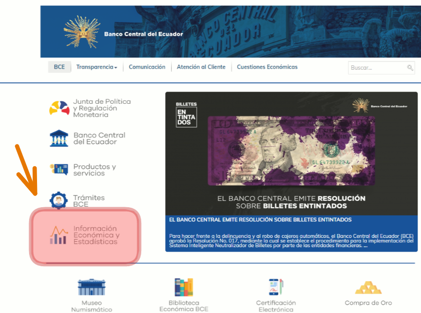
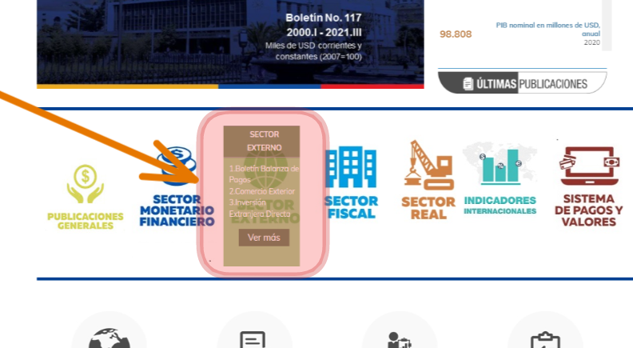
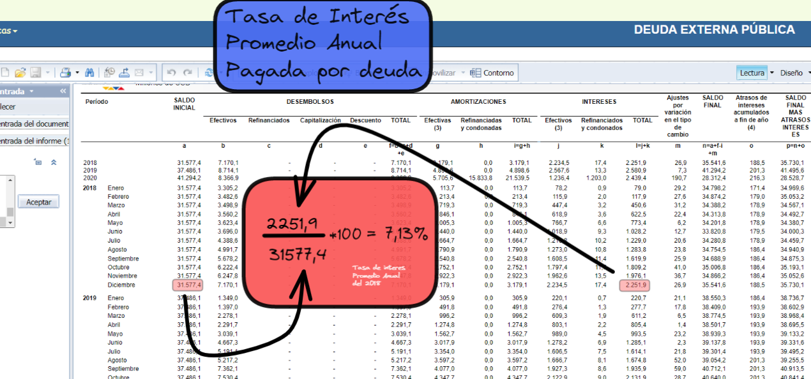
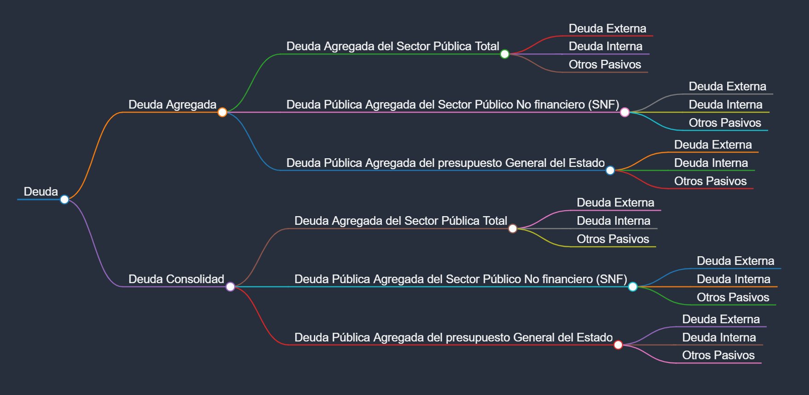
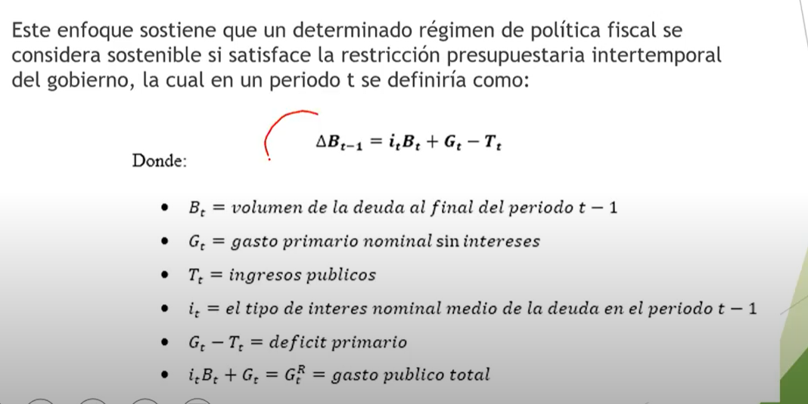
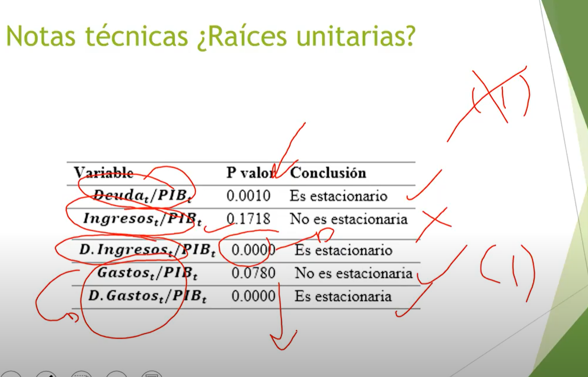

- # Videos
	- 2022
		- VideoClase- Deuda/Manejo de la Deuda/ Modelo Neoclásico-   [🔗](https://mail.google.com/mail/u/1/#search/bryan/FMfcgzGmtXFlVKgZSzQHzhFGHqnVPZTm)
		- VideoClase- Deuda/Manejo de la Deuda/ Modelo Neoclásico-
- Datos Sobre la Deuda en Ecuador
	- La época en la que Ecuador sufrió el mayor nivel de deuda ese el año 1999 he inicios de los 2000
- Siempre se interpreta como relación deuda PIB, no se puede interpretar solo la deuda en millones
- ¿Cómo obtener el promedio de la tasa de interés pagado anualmente por deuda ? ((61f5c0c2-caff-4093-b70f-5bf4fb6565aa))
	- Pasos Completos para acceder a la base de datos
		- Accedemos a  Banco Central de Ecuador  → [Banco Central 🔗](https://www.bce.fin.ec/)  #WebsFP
		- {:height 300, :width 499}
		- Accedemos al Sector Externo
		- {:height 319, :width 512}
		- Accedemos a la deuda Externa Pública
		- {:height 485, :width 528}
		- Listo :)
		-
		-
	- Pagina directa De la Siguiente Pagina https://contenido.bce.fin.ec/documentos/Administracion/bi_menuDeudaPublica.html
	- Se toman los datos de diciembre del total de interés pagado y se divide por el Saldo Inicial
	- 
- Datos de Deuda Ecuador
	- Deuda Agregada
		- Deuda  Agregada del Sector Pública Total
			- Deuda Externa
			- Deuda Interna
			- Otros Pasivos
		- Deuda  Pública Agregada  del Sector Público No financiero (SNF)
			- Deuda Externa
			- Deuda Interna
			- Otros Pasivos
		- Deuda Pública Agregada del presupuesto General del Estado
			- Deuda Externa
			- Deuda Interna
			- Otros Pasivos
	- Deuda Consolidad
		- Deuda  Agregada del Sector Pública Total
			- Deuda Externa
			- Deuda Interna
			- Otros Pasivos
		- Deuda  Pública Agregada  del Sector Público No financiero (SNF)
			- Deuda Externa
			- Deuda Interna
			- Otros Pasivos
		- Deuda Pública Agregada del presupuesto General del Estado
			- Deuda Externa
			- Deuda Interna
			- Otros Pasivos
	- ¿Cuándo es igual la deuda agregada y la deuda consolidada?
		- El nivel de deuda agregada y consolidada es el mismo cuando analizamos el endeudamiento externo
	- Grafico
		- {:height 455, :width 981}
- # Principales efectos de elevados niveles de deuda 🟡
	- Inflación
		- Cuando hay déficit la única fuente que se tiene en cuenta son los impuestos, esto genera problemas, lo que se llamo el ((61fc51b8-4f8d-48f6-8165-6aa1e0c1c16d))
	- Riesgo sobre los activos tangibles del sector público
- # ¿Cuales son las posturas ante el manejo de la deuda?
	- ## 1. {{cloze Postura de Lerner }}🟡
		- Esta  se basa {{cloze en que la [[Deuda Interna]] no genera ningún tipo de carga  tributaria  para la siguiente generación porque todas las generaciones tienen la misma capacidad de consumo}}
		- No genera deuda acumulativa para la población
		- ¿Cuándo menciona Lerner que la combinación de deuda y gasto beneficiaria a la generación siguiente?
			- Cuando los rendimiento marginales de inversión son mayores que el coste marginal de los fondos obtenidos en el extranjero , esto es, si los beneficios que yo obtengo por alguna obra que  hice con deuda externa es mayor que los costos, esto generara beneficios
		- ¿Cuándo Lerner se opondría a un nivel de endeudamiento de los países?
			- Cuándo yo pague mas interés que los beneficios futuros que voy a tener
			-
	- 2. {{cloze Modelo de generaciones Solapadas}} 🟡
		- Proponen que el endeudamiento se pasa de una generación a otra
		- Compara cuanto pagamos de impuestos , con las transferencias que recibimos del estado , como educación salud etc..
		- No solo se traslada la deuda , ósea se toma en cuenta esta , sino también compara el nivel de beneficios con el nivel de impuesto pagados , a diferencia del modelo ricardiano, esa diferencia ase que pague o no
	- 3. {{cloze  Modelo Neoclásico}} 🟡
		- Totalmente en contra del nivel de endeudamiento de un país
		- No importa si {{cloze un proyecto es financiado mediante impuestos, o mediante un prestamos. }}SE DETRAEN  o Contraer {{cloze RECURSOS DEL SECTOR PRIVADO}}
		- Exixste menos estock de capital privado, pero el stock de captal total auemntara
		- ¿Qué efectos provocaría el nivel de endeudamiento según este modelo?
			- Hipótesis del Efecto de expulsión:
				- Alteración del tipo de interés (Se generan mayores tipos de interés en la economía, aumentando así el precio del crédito , → Generando así menos inversión privada
	- 4. {{cloze Modelo ricardiano}} 🟡
		- Siempre las generaciones siguientes pagan el nivel de adeudamiento actual
		- Contrae siempre el ahorro privado, ya que el nivel de endeudamiento esta cubierto con este ahorro privado de la poblacón
		- El ahorro privado se  optine mediante
			- PIB - Impuestos pagados - consumo → Obtenemos cual seria el nivel de ingreso disponible ❓
		- # Equivalencia Ricardiana
			- La deuda publica es equivalente a impuestos de suma fija si no redistribuye recursos entre generaciones si no se distribuye  entre generaciones ❓   (Minuto 5:36 ((61f5c0c2-caff-4093-b70f-5bf4fb6565aa)) )
			-
	- 5. {{cloze Principio de Beneficio}}
		- Todos los sectores sociales que son beneficiaros de la deuda publica , son los que deben pagar el nivel de endeudamiento
	- 6. {{cloze Equidad Intergeneracional}}
		- El endeudamiento no es sostenible , si existe agotamiento de los recursos naturales
		- Transferencia de generaciones ricas a las generaciones pobres
	- 7. {{cloze Keinesiana}}
		- Cuando el desempleo es  elevado es necesario recurrir al déficit fiscal , ya que es un modo adecuado de estimular la demanda , esto se conoce como {{cloze hacienda funcional.}}
		- Cuando el desempleo es muy bajo, el endeudamiento puede causar inflación.
	- 8. {{cloze Exceso de Gradamen - Stiglits}}
		- Cuando se paga mas de lo que se debe en un impuesto
		- Caundo se aplican muchos impuestos, la emisión de deuda se haga en pagos pequeños a lo largo del tiempo
		- Con el fin de hacer frente a los intereses resultantes de la deuda
		- ¿Qué genera el exceso de Gravamen ?
			- Distorsiona la oferta de trabajo
		- ¿Cómo calculamos el exceso de Gravamen?
			- 
			- e = Elasticidad del trabajo ante los cambios  en el salario
			- w = nivel de salarios
			- L= Numero de Horas trabajadas  o de trabajo
			- t= tipo impositivo al cuadrado
		- Eficiente en Sentido de trabajo pero menos eficiente en sentido de capital
- Sostenibilidad fiscal del endeudamiento (Sostenibilidad de la deuda )
	- Tenemos que cubrir una cierta cantidad de dinero con el propósito de servir la deuda
	- Ese nivel de servicio de deuda se lo mide en el nivel presente y futuro de la inflación
	- Cuando existen niveles insostenibles de deuda, esto → me genera inflación en el futuro
	- ¿Qué pasa en una economía dolarizada?
		- Si se percibe un estado insolvente , esto afectara ala capacidad para conseguir financiamiento y
		- Determinara eventuales ==problemas de liquidez== en algún momento del tiempo
		- Generara recortes  en el gasto y aumentos de impuestos , para aumentar el ingreso
		- Afectando por ende a la Demanda de la actividad económica
	- ¿Cómo se analiza el tema de sostenibilidad?
		- Quintos (1995) menciona 2 condiciones del nivel de endeudamiento
			- Condición fuerte de endeudamiento  (existe sostenibilidad fiscal , sostenibilidad del nivel de endeudamiento )
				- Cuando existe estacionariedad del deficit fiscal, con esto existiría la condición fuerte de deuda
				- ¿Qué pasa cuando se da esta sostenibilidad fuerte ?
					- No existiría problemas en el futuro
					- No existe la necesidad de formular reformas fiscales de carácter estructural
			- Condición leve (Existe insostenibilidad de endeudamiento)
				- Si el deficit fiscal no es estacionario
				- ¿Qué pasa cuando existe sostenibilidad débil?
					- Implica problemas en el futuro
					- Efectos negativos sobre el crecimiento económico
					- Haciendo necesarias ciertas reformas fiscales , para incrementar el saldo presupuestario
						- Mas impuestos
						- Menos gasto publico en salud y educación
						- Venta de activos fijos del estado
			- ¿Cual es otra forma de probar un nivel débil de sostenibilidad e la deuda ?
				- Cuando el deficit fiscal , o las variables de deuda como tal tiene ordenes de cointegración mayores que uno
		- Restricción presupuestaria intertemporal
			- 
		- Revisión tecnica de sostenibilidad e la deuda
			- 
		- test de c
- Indicadores de Sostenibilidad Fiscal
	- Indicador de Blancheard (Indicador de patrimonio brecha ) (brecha de recaudación tributaria )
		- No indica cual es el nivel de carga tributaria  que necesitamos para dar sostenibilidad a nuestra finanzas
		- Si es negativo existe  insostenibilidad de la deuda, la recaudación como tributo es demasiado bajo para estabilizar la relación  deuda/PIB
	- Indicador de brecha primaria
		- Si esta brecha presenta Valore positivos, la Deuda no es sostenible ,
		- Si es negativo es sostenible
	- Indicador de Buiter
		- Cuanto tiene el estado valorizado en patrimonio en relación al PIB
		- Si es positivo no existe sostenibilidad fiscal
		- Si es negativo si existe sostenibilidad fiscal
- La deuda se incluye dentro del sector público no financiero SPNF
- Servicio de deuda , cuanto anualmente destino a pagar deuda
- EL valor presente de la deuda actual , cuanto yo actualmente tengo de deuda
-
-
-
-
-
-
-
-
-
-
-
-
-
-
-
-
-
-
-
-
-
-
-
-