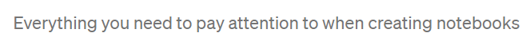

- {{renderer :toc_cuzhbnkbs}}
	- # 1. ENTENCES
		- Daily briefing #card
			- Sesión Informativa
			- [:audio {:controls true :src "G:/Mi unidad/Autosync/Logmy/NewLog/assets/Daily briefing.wav"}]
		- It was about time!  #card
		  collapsed:: true
			- ¡Era cuestión de tiempo!
		- No One  #card
		  collapsed:: true
			- Nadie
		- I'm looking forward #card
		  collapsed:: true
			- Estoy esperando
			-
			  <html>   <audio controls src="G:\Mi unidad\Autosync\Logmy\NewLog\Audios\1.wav"
			        style=" " >
			  </audio>
			  </html>
		- talked about by many #card
		  collapsed:: true
			- de lo que muchos hablan
			-
			  <html>   <audio controls src="G:\Mi unidad\Autosync\Logmy\NewLog\Audios\2.wav"
			        style=" " >
			  </audio>
			  </html>
		- run by many #card
		  collapsed:: true
			- Dirigido por muchos
			-
			  <html>   <audio controls src="G:\Mi unidad\Autosync\Logmy\NewLog\Audios\3.wav"
			        style=" " >
			  </audio>
			  </html>
		- the sooner #card
		  collapsed:: true
			- Cuanto antes
			-
			  <html>   <audio controls src="G:\Mi unidad\Autosync\Logmy\NewLog\Audios\4.wav"
			        style=" " >
			  </audio>
			  </html>
		- don't you make me blush #card
		  collapsed:: true
			- No me hagas sonrojar
			-
			  <html>   <audio controls src="G:\Mi unidad\Autosync\Logmy\NewLog\Audios\5.wav"
			        style=" " >
			  </audio>
			  </html>
		- was it like  #card
		  collapsed:: true
			- Fue como
			-
			  <html>   <audio controls src="G:\Mi unidad\Autosync\Logmy\NewLog\Audios\was it like.wav"
			        style=" " >
			  </audio>
			  </html>
		- there were times #card
		  collapsed:: true
			- Hubo momentos en los que
			-
			  <html>   <audio controls src="G:\Mi unidad\Autosync\Logmy\NewLog\Audios\there were times.wav"
			        style=" " >
			  </audio>
			  </html>
		- Everything you need to pay attention to #card
		  collapsed:: true
			- Todo a lo que debes prestar atención
			-
			  <html>   <audio controls src="G:\Mi unidad\Autosync\Logmy\NewLog\Audios\Everything you need to pay attention to.wav"
			        style=" " >
			  </audio>
			  </html>
			- 
		- eighth #card
			- Octavo
		-
		-
	- # 2. WORDS
	  collapsed:: true
		- Research #card
			- Investigar
		- queued #card
			- Puesto en cola
		- hiring #card
			- Contratación
		- improvements #card
			- Mejoras
		- tweak #card
			- Ajustar
			-
	- # 3 Gramatical
	  collapsed:: true
		- Negative in past
			- Allways use didn`t  for diferente persons , i , you , he she they
-