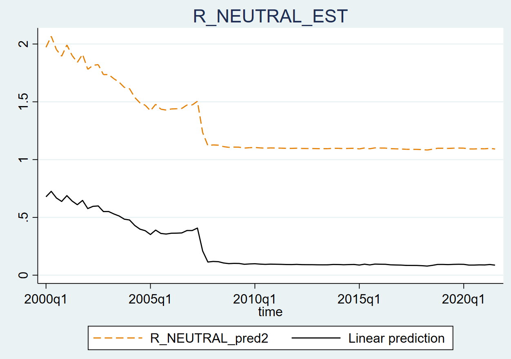
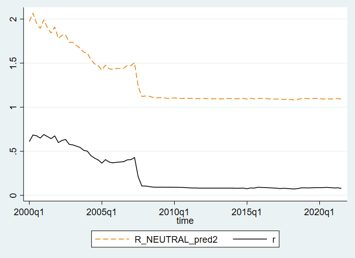
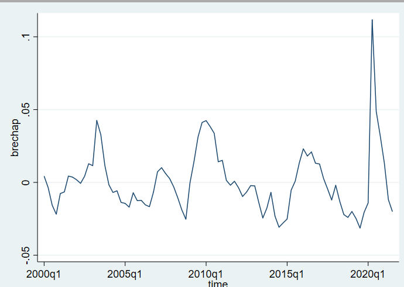
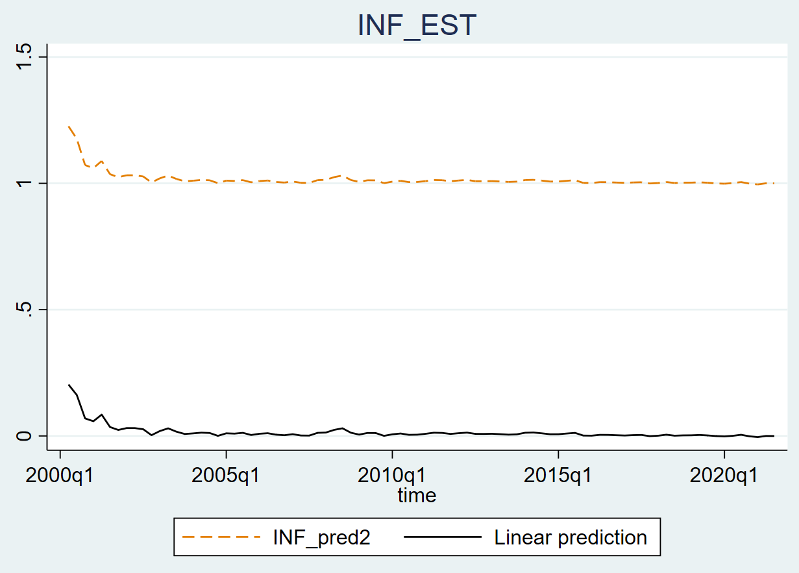
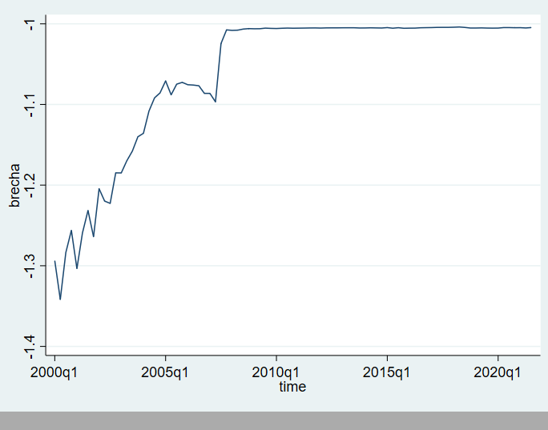

- Palabras Clave: [[Tasa de Interés Neutral]]
- Buscamos la tasa de interés que tiende a no disminuir ni aumentar los precios
- Se busca mantener la [[Tasa de interés]]  de mercado en linea  con la [[Tasa de Interés Neutral]] para controlar los ciclos económicos y así lograr estabilizar los precios
	- En [[Ecuador]] solo se puede estimar la [[Tasa de Interés Real Neutral]]
- Por  tanto  el  Banco  Central  debe  asumir  un  rol  activo  en  la  economía, aumentando  la  tasa  de  mercado  en  momentos  de  inflación  y  reduciéndola  en los  procesos  deflacionarios,  manteniendo  la  tasa  de  interés  de  mercado  en línea con la TIRN para controlar los ciclos económicos y lograr el objetivo de la estabilidad de precios.
  ls-type:: annotation
  hl-page:: 30
  id:: 6202aff6-7348-4e15-8cfd-b93b872c3c7d
- ((6202c88f-e5f6-49fa-8ee7-7e6ce09107b1))
-
- ((6202b7d4-c2db-4666-9320-965de42b33ed))
- Modelo
- ((6202c806-325e-49f9-abad-98bb94bbdbf1))
- ((6202c7da-83a2-4314-bea9-731859fbb0b8))
- # Relación [[Curva de Philips]] con la [[Regla de Taylor]]
- un aumento en la desocupación podría generar una reducción en la inflación en el mediano plazo, como lo establece la curva de Phillips. La reducción en la inflación implica una tasa de inte-rés neutral menor, como lo sugiere la regla de Taylor.
  hl-page:: 7
  ls-type:: annotation
  id:: 6202cc26-017c-45d3-9a11-f14a7c3bd7cb
- En otras palabras: la desocupación en un periodo es una variable predeterminada en el sistema de ecuaciones y en el siguiente periodo determina el nivel de in-flación (la curva de Phillips), lo que afecta a la brecha de inflación en la regla de Taylor. 
  ls-type:: annotation
  hl-page:: 7
  id:: 6202cd21-e3de-4e3d-a94c-f3e3341f4e14
- # [[Tasa de Interés Neutral]]
- ((6202cc7f-f7a0-463a-8251-fadf9e5d9103))
-
- $$r_t=r_t^*+0.39(\pi_t-\pi_t^*)+0.085(y_t-y_t^*)+0.2430$$
- $$r_t^*=0.91r_t-0.39(\pi_t-\pi_t^*)-0.085(y_t-y_t^*)+0.2430$$
- $$\pi_t=0.60\pi_{t-1}+0.14U_{t-1}-0.02diesel-0.07321pa_t-0.003$$
- Estas ecuaciones sugieren que, en un contexto de mayor desocupación, la inflación se aumenta  (0.14), lo cual provoca que la brecha de inflación aumente y la tasa de interés neutral tienda a decrecer, aunque también por la reducción en el crecimiento del pib.
-
- 
- {:height 531, :width 759}
- 
-
-
- La TIRN estimada permite construir la brecha de la tasa de interés, la
  que se convierte en una herramienta para analizar la instancia de política
  monetaria. Sin embargo en el caso ecuatoriano el análisis debe limitarse a los
  hechos que provocarían esas brechas y verificar si aquello influyó en la
  economía.
-
- Lo anterior se refiere, a que “la TIRN tiende a ser menor en aquellos países
  que poseen sólidos fundamentos económicos, marcos monetarios fuertes y
  mercados financieros desarrollados, enfrentando menos restricciones de
  liquidez y accediendo a capitales con bajos costos” (Magud y Tsounta, 2012),
- {:height 567, :width 780}
- Brecha tasas
- {:height 546, :width 686}