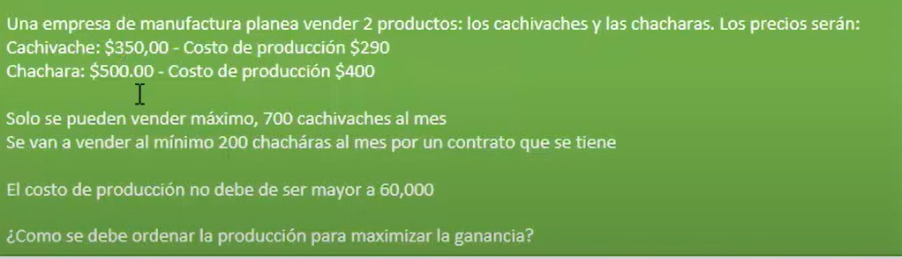

#  Manejo de lista de datos
- Filtro Avanzado
	- [Clase grabada](https://onedrive.live.com/?authkey=%21ACqdORu04Ug8foc&cid=D4C8613E4F1EC400&id=D4C8613E4F1EC400%2159015&parId=D4C8613E4F1EC400%2159009&o=OneUp)
- Tablas dinámicas
	- {{youtube https://www.youtube.com/watch?v=gsxCopOjGZo}}
- Gráficos dinámicos #yellow
	- {{youtube https://www.youtube.com/watch?v=ghyGNJKjPsQ}}
- Subtotales ⭐
	- {{youtube https://www.youtube.com/watch?v=oCeCgXzFHBw}}
- Reportes Consolidados
	- {{youtube https://www.youtube.com/watch?v=UPx7DB_F1lo}}
#  Análisis de Datos
- Tablas de una entrada y dos entradas
- Escenarios
	- {{youtube https://www.youtube.com/watch?v=YQ9wGXtr-9E}}
- Buscar Objetivos
	- {{youtube https://www.youtube.com/watch?v=XqxdjUk3DvU}}
- Solver
	- {{youtube https://www.youtube.com/watch?v=pDJxCG76BaM}}
		- 
		  id:: 61c23267-59db-4075-9ac3-d6f54c88b907
		-
	- {{youtube https://www.youtube.com/watch?v=XTX_5Kwg2DY}}
	- {{youtube https://www.youtube.com/watch?v=dLw8ZrWT8pc}}
-