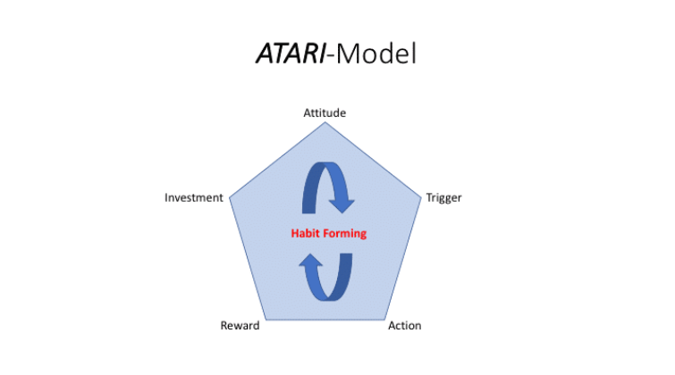
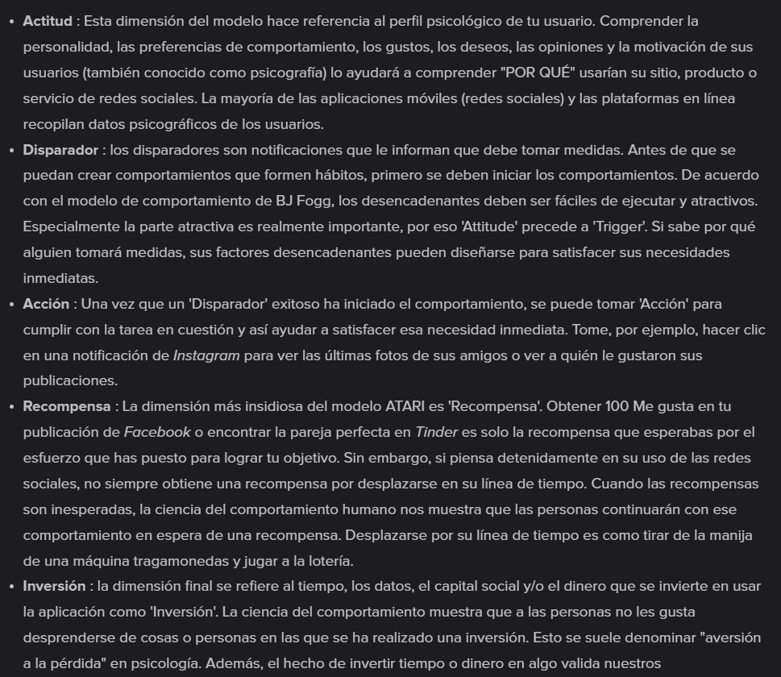

- # Diapos
  collapsed:: true
	- # Experimentos  en Linea: Influencia del Efecto Gratis en la adquisición de producto o servicios a través de Facebook.
	- ((138c2bdb-61d9-4329-b5d4-61f2413c97e1))
		- ==En este estuidio no experimetno , proposito analizar el cmportamiento==
		- En los últimos años la economía experimental y conductual han experimentado un auge en su implementación en diversas áreas tanto académicas, empresariales y tecnológicas, siendo esta ultima la que mas repercusiones y crecimiento
		- Sin embargo a sido poco estudiado los tipos de experimentos que pueden realizar negocios externos con la información de paga proporcionada por este tipo de grandes  empresas  tecnológicas.
	- # Objetivo
		- Realizar un experimento para determinar la existe de un cambia o no, en  el ratio de conversión de una publicación pagada en Facebook, debido a la modificación de información presentada a  dos grupos similares  de  usuarios de la red social.
	- ((06b6b343-4139-4975-9cf8-78b5f4bf7a21))
		- Las empresas no saben como enfrentarse a la cantidad masiva de usuarios en línea, ni cuales pueden ser los mejores mecanismos de presentación o acercamiento del producto o servicio a ofertar
- _"están diseñadas de manera que promueven la repetición de su uso", le dijo a CNN Carolina Vidal, profesora asistente de psiquiatría y ciencias del comportamiento, de la Facultad de Medicina en la Universidad Johns Hopkins._ - [¿Por qué son tan adictivas las redes sociales?](https://cnnespanol.cnn.com/lite/?article=1090860)
- _"La mayoría de las redes sociales tienen una característica común —el “like”— que refuerza el comportamiento de la persona que comparte el comentario o la foto, promoviendo su repetición. Los “likes” han demostrado ser equivalentes al refuerzo del dinero o recompensas sociales", dijo Vidal._ - [¿Por qué son tan adictivas las redes sociales?](https://cnnespanol.cnn.com/lite/?article=1090860)
- _La nota señalaba que la empresa hizo cosas como analizar "un montón de experimentos que dan a la gente una retroalimentación extra". En esos experimentos, a algunas publicaciones se les dio "un poco más de ‘me gusta’" y a otros "un poco más de comentarios". Los resultados se utilizaron para predecir cuántas publicaciones originales adicionales generaría la gente teniendo en cuenta el número de “me gusta”, comentarios y reacciones que habían recibido en publicaciones anteriores._ - [La ciencia detrás de las métricas de Facebook para la interacción de los usuarios](https://cnnespanol.cnn.com/2021/10/27/matematicas-news-feed-facebook-papers-trax/)
- _Más allá de eso, la decisión de centrarse en las interacciones sociales significativas fue el tipo de cambio que requeriría "miles de formas diferentes de probarlo", según Ethan Zuckerman, profesor asociado de la Universidad de Massachusetts en Amherst que estudia ==cómo los medios de comunicación pueden ser utilizados para dictar cambios sociales==._ - [La ciencia detrás de las métricas de Facebook para la interacción de los usuarios](https://cnnespanol.cnn.com/2021/10/27/matematicas-news-feed-facebook-papers-trax/)
- _La nota también señaló que, debido a esta tendencia, algunos editores pueden optar por capitalizar la negatividad. "Con los incentivos que creamos, algunos editores elegirán hacer lo correcto, mientras que otros tomarán el camino que maximiza las ganancias a expensas del bienestar de su audiencia", señaló el memo._ - [La ciencia detrás de las métricas de Facebook para la interacción de los usuarios](https://cnnespanol.cnn.com/2021/10/27/matematicas-news-feed-facebook-papers-trax/)
- _En Polonia, por ejemplo, la nota dice que el equipo de gestión de redes sociales de un partido estimó que sus publicaciones pasaron de ser mitad positivas y mitad negativas a ser 80% negativas debido al cambio de algoritmo. En España, según el documento, los partidos dijeron sentirse "atrapados en un ciclo ineludible de campaña negativa por las ==estructuras de incentivos de la plataforma"==._ - [La ciencia detrás de las métricas de Facebook para la interacción de los usuarios](https://cnnespanol.cnn.com/2021/10/27/matematicas-news-feed-facebook-papers-trax/)
-
- #+BEGIN_QUOTE
  Cuantas mas veces se comparte una publicación mas alcance tiene esta, y ya que es una publicación comentable, se repetira el cilo  , esa es una estructura de incentivos 
  #+END_QUOTE
- _Haugen, exgerente de producto de Facebook con experiencia en "gestión de productos algorítmicos", centra sus críticas principalmente en el algoritmo de la empresa diseñado para mostrar a los usuarios los contenidos con los que es más probable que participen._ - [Éxito de Facebook se basó en algoritmos. ¿Pueden también arreglarlos?](https://cnnespanol.cnn.com/2021/10/10/exito-facebook-algoritmos-arreglarlos-trax/)
-
- _Posteriormente, investigadores encontraron evidencia de que el acto de revelar informaciónacerca de uno mismo está conectado a las mismas regiones del cerebro que están vinculados a la recompensa. Esto podría ser una razón por la que algunas personas pueden ser adictos a publicar y compartir información en las redes sociales._ - [¿Por qué las redes sociales son tan adictivas? - MVS Noticias](https://mvsnoticias.com/noticias/mundo-geek/por-que-las-redes-sociales-son-tan-adictivas-763/)
-
- # Recompensas y publicar en redes sociales
  collapsed:: true
	- _lo que comparten también tiene un impacto directo en los hábitos de consumo o en las decisiones de compra._ - [Cosas del cerebro: Publicamos en redes sociales para conseguir una recompensa emocional](https://www.puromarketing.com/42/27266/cosas-cerebro-publicamos-redes-sociales-para-conseguir-recompensa.html)
	- _cuando publicamos ciertas cuestiones estamos buscando ciertas sensaciones concretas._ - [Cosas del cerebro: Publicamos en redes sociales para conseguir una recompensa emocional](https://www.puromarketing.com/42/27266/cosas-cerebro-publicamos-redes-sociales-para-conseguir-recompensa.html)
	- _Lo que publicamos lo hacemos porque queremos que los demás lo aprecien: con cada actualización en redes sociales buscamos gustar y los 'me gusta' o los retuits no son más que una suerte de bendición de los demás._ - [Cosas del cerebro: Publicamos en redes sociales para conseguir una recompensa emocional](https://www.puromarketing.com/42/27266/cosas-cerebro-publicamos-redes-sociales-para-conseguir-recompensa.html)
	- _Cuando sus actualizaciones reciben un montón de me gustas, se activa el nucleus accumbens, la parte del cerebro asociada a las recompensas y que es la misma que se pone en ebullición cuando nos damos placeres, como comer chocolate, o cuando ganamos dinero._ - [Cosas del cerebro: Publicamos en redes sociales para conseguir una recompensa emocional](https://www.puromarketing.com/42/27266/cosas-cerebro-publicamos-redes-sociales-para-conseguir-recompensa.html) Universidad de California
	- _ Conseguir muchos me gusta y muchas respuestas positivas hace que sintamos que hemos sido recompensados_ - [Cosas del cerebro: Publicamos en redes sociales para conseguir una recompensa emocional](https://www.puromarketing.com/42/27266/cosas-cerebro-publicamos-redes-sociales-para-conseguir-recompensa.html)
	- _Pero lo cierto es que el volumen de me gustas no solo cambia las propias emociones sino que también modifica la percepción de la realidad que les rodea._ - [Cosas del cerebro: Publicamos en redes sociales para conseguir una recompensa emocional](https://www.puromarketing.com/42/27266/cosas-cerebro-publicamos-redes-sociales-para-conseguir-recompensa.html)
	- _Cuando la foto ya había tenido éxito, lo más habitual es que ellos también optaran por dar a me gusta. Cuando no lo había tenido, la foto tampoco triunfaba con ellos._ - [Cosas del cerebro: Publicamos en redes sociales para conseguir una recompensa emocional](https://www.puromarketing.com/42/27266/cosas-cerebro-publicamos-redes-sociales-para-conseguir-recompensa.html)
	- _Lo que publicamos en redes sociales es, al final, una manera de hacernos sentir mejor._ - [Cosas del cerebro: Publicamos en redes sociales para conseguir una recompensa emocional](https://www.puromarketing.com/42/27266/cosas-cerebro-publicamos-redes-sociales-para-conseguir-recompensa.html)
	- _las redes sociales se mueve por los mismos mecanismos de búsqueda de recompensa que guían a los animales al momento de buscar más comida en experimentos de laboratorio._ - [Usamos las redes sociales como los animales buscan comida • Tendencias21](https://tendencias21.levante-emv.com/usamos-las-redes-sociales-como-los-animales-buscan-comida.html) Universidad de Nueva York, la Universidad de Boston, la Universidad de Zúrich y el Instituto Karolinska de Suecia
	- _la participación en las redes sociales está impulsada por principios similares a aquellos que motivan a los animales no humanos, como las ratas, a maximizar sus recompensas de alimentos durante un experimento. _ - [Usamos las redes sociales como los animales buscan comida • Tendencias21](https://tendencias21.levante-emv.com/usamos-las-redes-sociales-como-los-animales-buscan-comida.html)
	- _Estas “adicciones digitales” han llevado a muchos especialistas a plantear la hipótesis de un universo online que funciona como una ==“caja de experimentos”== para el ser humano contemporáneo: de acuerdo a esta concepción, viviríamos encerrados y participando en plataformas digitales en procura de recompensas sociales, que no serían otras que un “me gusta” o un comentario positivo._ - [Usamos las redes sociales como los animales buscan comida • Tendencias21](https://tendencias21.levante-emv.com/usamos-las-redes-sociales-como-los-animales-buscan-comida.html)
	- _ los científicos analizaron más de un millón de publicaciones en redes sociales realizadas por más de 4.000 usuarios. Hallaron que las personas organizaban en el tiempo sus publicaciones con el propósito de maximizar la cantidad de «me gusta» que recibían. Si un posteo lograba un número importante de adhesiones, volvían a publicar otro rápidamente. Si no obtenían éxito, elegían esperar un poco más hasta intentarlo nuevamente._ - [Usamos las redes sociales como los animales buscan comida • Tendencias21](https://tendencias21.levante-emv.com/usamos-las-redes-sociales-como-los-animales-buscan-comida.html)
	- _ los mecanismos conocidos de aprendizaje por recompensa. Se trata de un concepto psicológico que postula que las recompensas pueden impulsar y reforzar comportamientos._ - [Usamos las redes sociales como los animales buscan comida • Tendencias21](https://tendencias21.levante-emv.com/usamos-las-redes-sociales-como-los-animales-buscan-comida.html)
	- _ su estudio, publicado en la revista Nature Communications, los mecanismos de recompensa son los mismos que se emplean en los experimentos con roedores y otros animales: los ejemplares son estimulados a realizar una acción a partir del logro de una recompensa_ - [Usamos las redes sociales como los animales buscan comida • Tendencias21](https://tendencias21.levante-emv.com/usamos-las-redes-sociales-como-los-animales-buscan-comida.html)
	- _ay estudios que evidencian que en países de Latinoamérica hay una relación entre el alto consumo de redes sociales y baja productividad_ - [El precio de las Redes Sociales — Colectivo Millennial](https://www.colectivomillennial.com/blog/el-precio-de-las-redes-sociales)
	- _La primera razón por la que las redes sociales pueden ser tan adictivas está relacionada con el acrónimo más asociado con ellas: FOMO, o Miedo a perderse algo. _ - [¿Por qué somos tan adictos a las redes sociales?](https://welldoing.org/article/why-are-we-so-addicted-to-social-media)
	- _Más allá de las experiencias compartidas, las redes sociales nos atraen por la forma en que nos permiten crear y responder a los objetos sociales. Un objeto social es un objeto que adquiere significado a través de la forma en que se usa. El empresario de Internet Jyri Engestrom vinculó el éxito de las redes sociales clave a la forma en que extienden el concepto de sociabilidad más allá de las personas a los objetos sociales. Las personas no solo se conectan entre sí; se conectan a través de un objeto compartido, en torno al cual se generan las conversaciones de las redes sociales. Las fotos en Flickr o Instagram, o los videos en YouTube son todos ejemplos de objetos sociales cuyo valor radica en la forma en que los usuarios interactúan con ellos, particularmente porque son generados por los usuarios y, por lo tanto, no tienen un valor intrínseco propio. _ - [¿Por qué somos tan adictos a las redes sociales?](https://welldoing.org/article/why-are-we-so-addicted-to-social-media)
	- _El psiquiatra suizo Eric Berne desarrolló el concepto de 'ictus'. Definió el ictus como la “unidad fundamental de la acción social”. Así como los niños quieren contacto físico \("caricias"\), los adultos necesitan compromiso, y estos caricias pueden ser simbólicas, verbales o incluso digitales, además de físicas. Una caricia física puede ser un abrazo, una caricia verbal una conversación o incluso un saludo rápido. Los golpes pueden ser incondicionales \("Creo que eres genial"\) o condicionales \("Creo que eres genial, aunque no cuando no estamos de acuerdo en política"\). Pueden ser positivos o negativos. Tal es lo que Berne describió como nuestra 'hambre de reconocimiento' que incluso un golpe negativo es mejor que ningún reconocimiento en absoluto, y esto se extiende a nuestra vida en línea. _ - [¿Por qué somos tan adictos a las redes sociales?](https://welldoing.org/article/why-are-we-so-addicted-to-social-media)
	- _Usando el modelo ATARI de formación de hábitos, explicaré los pasos comunes utilizados por los desarrolladores de aplicaciones, los hackers de crecimiento y los creadores de juegos móviles para inducir comportamientos de formación de hábitos en sus usuarios._ - [¿Por qué las redes sociales son adictivas?](https://www.hult.edu/blog/why-social-media-is-addictive/)
	- 
	- 
	- _El miedo a perderse algo \(FOMO, por sus siglas en inglés\) es un gran impulsor del uso de las redes sociales,_ - [Psicología de las Redes Sociales: ¿Qué nos hace adictos? - Aprende UX](https://www.keepitusable.com/blog/psychology-of-social-networks-what-makes-us-addicted/)
	- _Tenemos un cerebro diseñado para la colaboración, el compromiso, la moderación, la comprensión y la gestión del lugar de uno en alianzas cambiantes. Nos damos cuenta cuando otros están haciendo algo que nos excluye. Desencadenará algunas respuestas de supervivencia primitivas. Las personas menores de 30 años aún se encuentran en el período en el que están estableciendo su propia vida, desarrollando identidades personales y profesionales, volviéndose viables económicamente \(creando alianzas\), etc. Su enfoque será necesariamente social._ - [Psicología de las Redes Sociales: ¿Qué nos hace adictos? - Aprende UX](https://www.keepitusable.com/blog/psychology-of-social-networks-what-makes-us-addicted/)
	- _Conocer la resonancia de un medio nos ayuda a comprender su impacto específico en nuestra cultura en general y en los usuarios individuales._ - [Why Social Media Are So Addictive | Mind Matters](https://mindmatters.ai/2019/07/why-social-media-are-so-addictive/)
	- _la resonancia de las redes sociales es el rendimiento._ - [Why Social Media Are So Addictive | Mind Matters](https://mindmatters.ai/2019/07/why-social-media-are-so-addictive/)
	- _recibir comentarios positivos sobre su desempeño en lugar de en el contacto y la discusión con los demás. _ - [Why Social Media Are So Addictive | Mind Matters](https://mindmatters.ai/2019/07/why-social-media-are-so-addictive/)
	- _Si bien muchos otros elementos promueven la adicción a las redes sociales, la tendencia hacia el rendimiento es probablemente un factor._ - [Why Social Media Are So Addictive | Mind Matters](https://mindmatters.ai/2019/07/why-social-media-are-so-addictive/)
	- _el desempeño del usuario se compara directamente con el desempeño de otros a través del botón "me gusta" y otras formas de aprobación social. _ - [Why Social Media Are So Addictive | Mind Matters](https://mindmatters.ai/2019/07/why-social-media-are-so-addictive/)
	- _Una de las características psicológicas clave en el uso habitual de las redes sociales es la imprevisibilidad y la aleatoriedad de lo que sucede dentro de las plataformas de redes sociales. _ - [Why Is Social Media So Addictive?](https://gizmodo.com/why-is-social-media-so-addictive-1841261494)
	- _ Las recompensas, que pueden ser fisiológicas, psicológicas y/o sociales, pueden ser poco frecuentes, pero incluso la anticipación de una de estas recompensas puede ser psicológica y/o fisiológicamente placentera._ - [Why Is Social Media So Addictive?](https://gizmodo.com/why-is-social-media-so-addictive-1841261494)
	- _Los usuarios habituales de las redes sociales nunca saben si su próximo mensaje o notificación será el que los haga sentir realmente bien. _ - [Why Is Social Media So Addictive?](https://gizmodo.com/why-is-social-media-so-addictive-1841261494)
	- _==Las recompensas aleatorias hacen que las personas respondan durante más tiempo.==_ - [Why Is Social Media So Addictive?](https://gizmodo.com/why-is-social-media-so-addictive-1841261494)
	- _Las recompensas son intermitentes e impredecibles: nunca sabemos cuándo iniciamos sesión si obtuvimos más Me gusta, comentarios o seguidores._ - [¿Por qué las redes sociales son tan adictivas?](https://gizmodo.com/why-is-social-media-so-addictive-1841261494)
	- _Es bien sabido que las recompensas intermitentes e impredecibles son las más adictivas:_ - [¿Por qué las redes sociales son tan adictivas?](https://gizmodo.com/why-is-social-media-so-addictive-1841261494)
	- _La anticipación mientras se carga la aplicación aumenta la emoción y la naturaleza adictiva._ - [¿Por qué las redes sociales son tan adictivas?](https://gizmodo.com/why-is-social-media-so-addictive-1841261494)
	- _Las características como las rachas en Snapchat juegan con nuestro deseo de no defraudar a otras personas \(y romper una racha\)_ - [¿Por qué las redes sociales son tan adictivas?](https://gizmodo.com/why-is-social-media-so-addictive-1841261494)
	- _ así como con la idea de que cuanto más tiempo e inversión hayamos puesto en algo \(conocido como costos irrecuperables\), más inversión tendremos para mantener en marcha._ - [¿Por qué las redes sociales son tan adictivas?](https://gizmodo.com/why-is-social-media-so-addictive-1841261494)
	- _ herramientas comunes de psicología del comportamiento para captar la atención de los usuarios y tratar de atraerlos para que pasen más tiempo en sus sitios web/aplicaciones. Los ejemplos incluyen los intentos de hacer que el uso de dichos sitios sea más fácil, repetitivo y automático \(p. ej., no es necesario iniciar sesión cuando se utiliza una aplicación, desplazamiento infinito, reproducción continua automática de videos\), _ - [¿Por qué las redes sociales son tan adictivas?](https://gizmodo.com/why-is-social-media-so-addictive-1841261494)
	- _empleando mecanismos que brindan recompensas inmediatas, como "me gusta" en un horario desconocido \(que se asemeja al programa de recompensa variable que FB Skinner usó con sus palomas\), y creando motivaciones internas para mantener a uno comprometido con el sitio, a través del uso de funciones como "rachas" en Snapchat._ - [¿Por qué las redes sociales son tan adictivas?](https://gizmodo.com/why-is-social-media-so-addictive-1841261494)
- # Scroll infinito
	- _los desarrolladores crean intencionalmente funciones para ser adictivas, como me gusta, notificaciones y la opción de actualización, que nos hacen volver a sus aplicaciones._ - [Por qué el pergamino infinito es tan adictivo | de Grant Collins | Colectivo UX](https://uxdesign.cc/why-the-infinite-scroll-is-so-addictive-9928367019c5)
	- _El desplazamiento infinito es solo otra de estas características de diseño adictivas, como notificaciones y me gusta._ - [Por qué el pergamino infinito es tan adictivo | de Grant Collins | Colectivo UX](https://uxdesign.cc/why-the-infinite-scroll-is-so-addictive-9928367019c5)
	- _El desplazamiento infinito es solo otra de estas características de diseño adictivas, como notificaciones y me gusta._ - [Por qué el pergamino infinito es tan adictivo | de Grant Collins | Colectivo UX](https://uxdesign.cc/why-the-infinite-scroll-is-so-addictive-9928367019c5)
	- _Estos gustos se traducen en última instancia en tres de los reforzadores más poderosos: atención, aprobación y afecto de otras personas._ - [Por qué el pergamino infinito es tan adictivo | de Grant Collins | Colectivo UX](https://uxdesign.cc/why-the-infinite-scroll-is-so-addictive-9928367019c5)
	- _En el condicionamiento operante, el comportamiento se fortalece con el refuerzo o se debilita con el castigo._ - [Por qué el pergamino infinito es tan adictivo | de Grant Collins | Colectivo UX](https://uxdesign.cc/why-the-infinite-scroll-is-so-addictive-9928367019c5)
	- _el refuerzo de los me gusta fortalece el comportamiento de publicación._ - [Por qué el pergamino infinito es tan adictivo | de Grant Collins | Colectivo UX](https://uxdesign.cc/why-the-infinite-scroll-is-so-addictive-9928367019c5)
	- _Skinner formuló varios tipos de programas de refuerzo , que son patrones predecibles o aleatorios de comportamiento posterior al refuerzo. Entre estos se encuentra el programa de reforzamiento de razón variable, en el que el reforzamiento sigue a una conducta de manera intermitente, solo una parte del tiempo._ - [Por qué el pergamino infinito es tan adictivo | de Grant Collins | Colectivo UX](https://uxdesign.cc/why-the-infinite-scroll-is-so-addictive-9928367019c5)
	- _ Las conductas reforzadas por una proporción variable son las menos susceptibles de extinción _ - [Por qué el pergamino infinito es tan adictivo | de Grant Collins | Colectivo UX](https://uxdesign.cc/why-the-infinite-scroll-is-so-addictive-9928367019c5)
	- Esto se debe a que cuando alguien realiza un comportamiento reforzado por una proporción variable, no sabe si recibirá o no el refuerzo. Pero saben que es posible . Por lo tanto, siguen repitiendo el comportamiento con la esperanza de ser reforzado.
	- _Cuando te sientas a jugar, no sabes si vas a ganar o no, pero sabes que es posible que puedas. Y es esa posibilidad de refuerzo la que te hace volver al juego una y otra vez._ - [Por qué el pergamino infinito es tan adictivo | de Grant Collins | Colectivo UX](https://uxdesign.cc/why-the-infinite-scroll-is-so-addictive-9928367019c5)
	- _Esta es la razón por la que los diseñadores no quieren que sus juegos sean demasiado fáciles o demasiado difíciles; en ambos casos, los jugadores pronto dejarán de jugar. _ - [Por qué el pergamino infinito es tan adictivo | de Grant Collins | Colectivo UX](https://uxdesign.cc/why-the-infinite-scroll-is-so-addictive-9928367019c5)
	- _“Cuando sacamos nuestro teléfono de nuestro bolsillo, estamos jugando en una máquina tragamonedas para ver qué notificaciones hemos recibido. Cuando deslizamos el dedo hacia abajo para desplazarnos por el feed de Instagram, estamos jugando en una máquina tragamonedas para ver qué foto sigue”._ - [Por qué el pergamino infinito es tan adictivo | de Grant Collins | Colectivo UX](https://uxdesign.cc/why-the-infinite-scroll-is-so-addictive-9928367019c5)
	- _"Si desea maximizar la adicción", dice Harris, "todo lo que los diseñadores de tecnología deben hacer es vincular la acción de un usuario \(como tirar de una palanca\) con una recompensa variable"._ - [Por qué el pergamino infinito es tan adictivo | de Grant Collins | Colectivo UX](https://uxdesign.cc/why-the-infinite-scroll-is-so-addictive-9928367019c5)
	- _Ya sabes, como estas barras de progreso que se llenan lentamente. Creemos que realmente nos muestran “progreso”. De hecho, rara vez lo hacen, a menudo lo simulan solo para consolarnos._ - [Nuestros cerebros se meten con nosotros. Aquí se explica cómo emplear esto en el diseño de UX | de Alec Vishmidt | Colectivo UX](https://uxdesign.cc/our-brains-mess-with-us-heres-how-to-employ-this-in-ux-design-f4f2aa761c5a)
- # Adciionales -Ilusión de Control-Control del Experimento en linea
	- _Nos ponemos nerviosos cuando el sistema con el que interactuamos, ya sea una aplicación o un sitio web, no responde rápidamente.  Y sabes por que? Eso es porque no sentimos que lo controlamos. _ - [Trucos mentales en diseño UX: ilusión de control | de Alec Vishmidt | Trinetix | Medio](https://medium.com/trinetix/mental-tricks-in-ux-design-illusion-of-control-d144cfebb9f5)
	- Pero muy a menudo nos enfrentamos a restricciones técnicas: Internet lento, datos extensos, complejidad computacional.
	- _Esa sensación percibida de control del sistema provocará la satisfacción del usuario. También sentirán cierto grado de comodidad, incluso a pesar de que no pueden influir en el proceso._ - [Trucos mentales en diseño UX: ilusión de control | de Alec Vishmidt | Trinetix | Medio](https://medium.com/trinetix/mental-tricks-in-ux-design-illusion-of-control-d144cfebb9f5)
	- BONIFICACIÓN: ¿No puede evocar la ilusión de control? esto es lo que debes hacer
	  Sí, a veces sucede. En este caso, una experiencia de usuario positiva radica en contrarrestar los efectos negativos causados ​​por la expectativa. Entonces, ¿cómo lograr eso? Considere los siguientes pasos:
	- _Diseña una animación llamativa. Puede quitar la atención del usuario con algunos efectos visualmente agradables. De esa manera, cambia el enfoque de la expectativa a otra cosa. La animación resuelve el caso de la mejor manera posible para este fin. Aquí hay un ejemplo: _ - [Trucos mentales en diseño UX: ilusión de control | de Alec Vishmidt | Trinetix | Medio](https://medium.com/trinetix/mental-tricks-in-ux-design-illusion-of-control-d144cfebb9f5)
- # Experimentos  en Linea - Influencia del Efecto Gratis en la adquisición producto o servicios a través de Facebook.   {{renderer :wordcount_bqvuhong}} Maximo ==4000== Palabras
  collapsed:: true
	- # Introducción  {{renderer :wordcount_bqvuhong}}
	  id:: 138c2bdb-61d9-4329-b5d4-61f2413c97e1
		- En los últimos años la economía experimental y conductual han experimentado un auge en su implementación en diversas áreas tanto académicas, empresariales y tecnológicas, siendo esta ultima la que mas repercusiones y crecimiento a tenido  en el día a día de las personas  desde  inicios de la década de los dos mil. Este crecimiento a tenido como consecuencia una generación de gran cantidad de datos recopilados de usuarios de todo el mundo y aquellas empresas de tecnológicas que mejor han sabido analizar y entender comercialmente dichos datos , son las que mayor cobertura y ganancia económica han generado.
		- Sin embargo no solo basta con analizar datos, empresas como Google, Amazon o eBay requieren de mecanismos de optimización de tiempos, entregas, precios, subastas, preferencias, incentivos al consumidor y al productor  y demás áreas ligadas directamente al campo económico tradicional así como campos mas actuales como la economía experimental neuro economía y economía del comportamiento. Ahora bien, el compendio de una gran cantidad de datos, junto con la búsqueda constante de la mejora de los servicios digitales , a llevado a las grades tecnológicas a liderar con problemas a la hora de determinar si  un producto esta o no funcionando en el mercado, y si lo hace , que lo esta causando. Una de las soluciones a las que mas se recuren para solucionar el problema mencionado, es la realización de experimentos, dichos experimentos se sirven de las extensas bases de datos de usuarios y el conocimiento de sus características y comportamiento para generar resultados útiles para fines comerciales. Sin embargo a sido poco estudiado los tipos de experimentos que pueden realizar negocios externos con la información de paga proporcionada por este tipo de grandes  empresas  tecnológicas. Es por ello que en este trabajo se busca realizar un experimento mediante la plataforma de publicidad de Facebook, usando un diseño de bloqueo aleatorio, realizando una modificación a la publicidad que se distribuirá a un grupo de control y tratamiento específicamente seleccionados entre los usuarios de Facebook.
	- ## Objetivo:
		- Ante los hechos planteados   el objetivo de este trabajo es realizar un experimento para determinar la existe de un cambia o no, en  el ratio de conversión de una publicación pagada en Facebook, debido a la modificación de información presentada a  dos grupos similares  de  usuarios de la red social.
	- ## Problema:
	  id:: 06b6b343-4139-4975-9cf8-78b5f4bf7a21
		- Las empresas cada día buscan alternativas en la red a los medios tradicionales de venta y publicidad, sin embargo la gran mayoría de estas, no saben como enfrentarse a la cantidad masiva de usuarios en línea, ni cuales pueden ser los mejores mecanismos de presentación o acercamiento del producto o servicio a ofertar
	- ## Hipótesis:
	  id:: 461b16dc-cf31-426d-ab47-110b797bf697
		- Existe la posibilidad de conocer la mejor estrategia de alcance de un producto o servicio  a través de un experimento mediante el Servicio de publicidad  de  Facebook.
	- # Revisión de la Literatura:
	- https://hbr.org/2017/06/a-refresher-on-ab-testing
	- # Diseño Experimental
		- ## Asignación aleatoria del tratamiento
		- ## Población del experimento
		- ## Identificación Mediante aleatorización
			- En la tabla 1 se presentan las variables aleatorizadas y la justificación de esta decisión
			- |Variable|Aleatorización| Justiicación|
			  |Ubicación|Cuenca-Ecuador| La ubicación puede mostrar diversos contrastes sociales por lo que la aleatorización de esta puede reducir el impacto de los mismo|
			- La variable ubicación se aleatorizo debido a que el producto requiere un alcance a nivel de ciudad,
			- ### Reglas de asignación de aleatorización
				- Las reglas de aleatorización fueron ....T
				  id:: 61cde762-2b52-442b-8d3c-a057592f124f
		- ## Identificación Mediante variables de control
			- En este apartado en la tabla 2 seleccionamos  las variables que se pretenden controlar con el fin de eliminar o neutralizar sus efectos en la variable dependiente.
			- #+BEGIN_CENTER
			  Tabla 1 Variables de control
			  #+END_CENTER 
			  |Variable|Control|Justificación de Control|
			  |Genero|Femenino|Es el segmento de mercado de mayor consumo, por lo que puede mostrar mayor interés que el sexo opuesto (Anexo 1)|
			  |Edad |De entre 23-27 años|El servicio esta dirigido a este nicho, por lo que pueden mostrar mayor interés que otro rango de edad(Anexo 2)| 
			  |Fecha|Del 13 al 17  de Enero|Los primeros días de la semana muestra una tendencia de mayor captación de clientes en este mercado(Anexo 3)|
			  |Hora |18:00 pm|Es el segmento del día en que la población objetivo muestra mayor presencia en al red estudiada (Anexo 4)| 
			  Fuente: Autores 
			  Elaboración Autores
		- ## Entorno
		- ## Instituciones
		- ## Confusores
			- Detectamos las variables que pueden generar ruido dentro de nuestro experimento debilitando su inferencia
	- # Aplicación y Análisis
	- # Discusión
		- ## Validez interna
			- Debe responder la pregunta clave: ¿Se observará el mismo comportamiento fuera del entorno experimental?
		- ## Validez Externa
			- Debe responder la pregunta clave: ¿ Es el comportamiento observado inducido por el ambiente de decisión que replica un modelo?
	- # Conclusión
	- # Bibliografía
		- Como los economistas utilizan el test A/B
		- ⭐ https://www.forbes.com/sites/quora/2016/04/05/how-do-academic-economists-use-ab-testing/?sh=181d4d0c1dec
		- https://www.ugr.es/~ugr_unt/Material%20M%F3dulo%201/variables.pdf
		- https://www.theatlantic.com/technology/archive/2014/06/everything-we-know-about-facebooks-secret-mood-manipulation-experiment/373648/
		- https://www.pnas.org/content/111/24/8788.full
		- https://hbr.org/2017/06/a-refresher-on-ab-testing
		- https://hbr.org/2016/03/a-refresher-on-randomized-controlled-experiments?ab=at_art_art_1x1
		- Mertricas en pruebas A/B
		- https://www.microsoft.com/en-us/research/group/experimentation-platform-exp/articles/beyond-power-analysis-metric-sensitivity-in-a-b-tests/
		- Funcionamiento del Test
		- https://www.optimizely.com/optimization-glossary/ab-testing/
		- Relación con la ciencia de datos
		- https://towardsdatascience.com/data-science-you-need-to-know-a-b-testing-f2f12aff619a
		- Real Business
		- https://blog.hubspot.com/marketing/a-b-testing-experiments-examples
		- https://ideas.repec.org/a/aea/aecrev/v108y2018i7p1820-59.html
		- https://web.stanford.edu/~jdlevin/Papers/PriceSearch.pdf
	- # Anexos
	- Un área que ha atraído recientemente una nueva atención pero que todavía tiene muchas preguntas abiertas es el área de la realización de experimentos en un entorno online o de red. Es posible que desee estudiar la influencia de los compañeros entre los estudiantes o los miembros de una red social como Facebook. O bien, los vendedores pueden competir entre sí en un sitio web de comercio electrónico, y los productos \(o consultas de los usuarios\) donde sus productos aparecen junto pueden considerarse como un vínculo indirecto entre los vendedores. En ese entorno, es posible que deseemos realizar experimentos que afecten a los vendedores y evaluar sus resultados._ - [How Do Academic Economists Use A/B Testing?](https://www.forbes.com/sites/quora/2016/04/05/how-do-academic-economists-use-ab-testing/?sh=181d4d0c1dec)
	- ebay
	-
	-
- [[Comments]]
  collapsed:: true
	- [[Dec 30th, 2021]]
		- ((61cde762-2b52-442b-8d3c-a057592f124f))
			- Buscar cuales son las reglas de aleatorización que usa Facebook para mostrar loa anuncios
			- ((61cdea9b-8f72-4d77-9ced-65643815a334))
- Bibliografía
	- Recompensas , me gustas y ratones
	- https://www.nature.com/articles/s41467-020-19607-x
	- Control
		- https://medium.com/trinetix/mental-tricks-in-ux-design-illusion-of-control-d144cfebb9f5
		- https://uxdesign.cc/our-brains-mess-with-us-heres-how-to-employ-this-in-ux-design-f4f2aa761c5a
	- Programa de refor