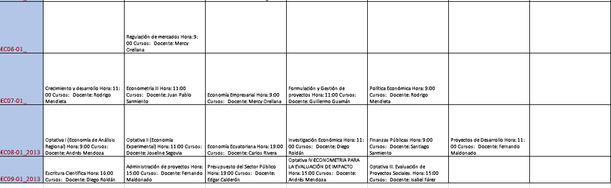

- 
- |Lunes [[Jan 31st, 2022]] | Martes [[Feb 1st, 2022]] |  Miércoles [[Feb 2nd, 2022]] |  Jueves [[Feb 3rd, 2022]] |  Viernes [[Feb 4th, 2022]] |
  |  Análisis  | Regulación    |  Economía Empresarial    |  Opta IV  |  Finanzas Públicas  |
  | Opta 1  |  Opta II   |   Economía Ecuatoriana  |   |   |
- 
- |Lunes [Feb 1st 2022]] | Martes [[Feb 1st, 2022]] |  Miércoles [[Feb 2nd, 2022]] |  Jueves [[Feb 3rd, 2022]] |  Viernes [[Feb 4th, 2022]] |
  |    | Regulación    |     |    |  Finanzas Públicas  |
  |    |    |     |   |   |