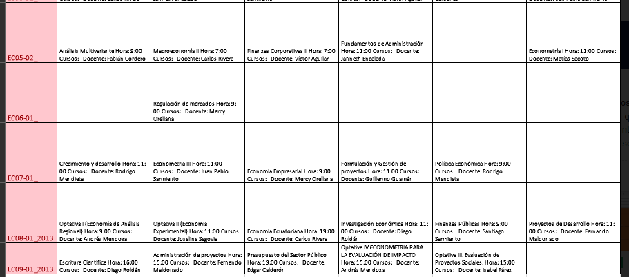

- # Finales
	- |Lunes [[Jan 31st, 2022]] | Martes [[Feb 1st, 2022]] |  Miércoles [[Feb 2nd, 2022]] |  Jueves [[Feb 3rd, 2022]] |  Viernes [[Feb 4th, 2022]] |
	  |  Análisis  | Regulación    |  Economía Empresarial    |  Opta IV  |  Finanzas Públicas  |
	  | Opta 1  |  Opta II   |   Economía Ecuatoriana  |   |   |
	- 
- DONE  1. Escritura
- # Lunes
	- DONE 2. Análisis Multivariante
- # Martes
	- TODO 2. Opta II
- # Miércoles
	- TODO 3. Informática
- # Jueves
	- TODO 4. Regulación
- # Viernes
	- TODO 5. Opta I
	- TODO 6. Opta IV
- # Lunes
	- TODO 6. Eco. Empresarial
	- TODO 7. Finanzas Públicas
- # Martes
- TODO 6. Economía Ecuatoriana
-
-