- {{renderer :todomaster-RmluYW56YXMgUPpibGljYXM=}}
  id:: 620716d8-26c4-43af-b7cd-e77b077f78b8
- # TODO  Economía del Sector Público   🟡
  collapsed:: true
  Se parte de dos tipos de análisis, el [[Análisis Positivo]]  y el [[Análisis Normativo]]
	- ## Análisis Positivo 🟡
	  Se parte de algo empírico y técnicamente comprobado para la toma de decisiones, usa [[Encuestas]], [[Experimentos]], [[Econometría]], [[Investigación Empírica]] , desde esta base se parte a los objetivos de la política fiscal:
		- Objetivos de la [[Política Fiscal]] 🟢
		  collapsed:: true
			- ¿Cuáles son los objetivos de la política fiscal?
			  collapsed:: true
				- Según el tiempo se dividen en 3: 🟢
					- Objetivo A corto plazo 🟢
					  collapsed:: true
						- Estabilizar la economía y el ciclo a través del [[Saldo Presupuestario]] .
					- Objetivo A Largo plazo 🟢
					  collapsed:: true
						- Incrementar el crecimiento del país mediante I+D, educación  y del ingreso incentivos al ahorro
					- Objetivo  Simultaneo 🟢
					  collapsed:: true
						- Equidad y redistribución de la renta
		- Todos los recursos presupuestarios o [[Saldo Presupuestario]] se asignan en función de qué tipo de política  se esta evidenciando, estas tipos de políticas son :
			- Política Fiscal Expansiva #red 😎
			  collapsed:: true
				- ¿Qué es una política expansiva?
				  collapsed:: true
					- Es una [[Política]] que se lleva acabo en situaciones de [[Crecimiento Económico]]  y cuando existen altos niveles de paro , es por esto que el gobierno debera aplicar una política expansiva con la finalidad {{cloze de aumentar el  }} [[Gasto Agregado]],  para aumentar la {{cloze renta efectiva}} y así disminuir {{cloze los niveles de paro.}}
					- Esta política expansiva  puede ser de cinco tipos o vías de aplicación.
						-  Reducción de los [[Impuestos]]
						  collapsed:: true
							- Consiguiendo un impacto positivo sobre el [[Consumo]]
						-  Aumento de los [[Gasto del Gobierno]]
						  collapsed:: true
							- Desplazando al alza el [[Gasto Agregado]] , sobre todo a través de obra pública, con la finalidad de incrementar el empleo
						-  Estímulos a la [[Inversión Privada]]
						  collapsed:: true
							- A través de bonificaciones o exenciones fiscales, con la finalidad de provocar aumentos en la [[Demanda Agregada]], estas extensiones tienen que tener como finalidad la reducción del desempleo.
						-  Incentivos fiscales
						  collapsed:: true
							- Para estimular la demanda de los no residente (mayores [[Exportaciones Netas]])
			- Política Fiscal Contractiva #red
			  collapsed:: true
				- ¿ Que es una política fiscal Contractiva?
					- Es aquella que se da en situaciones inflacionistas🧐 {:height 24, :width 24} *Si se tienen una alta inflación esto quiere decir que según la [[Curva de Philips]]  el Empleo será menor, por lo que la política contractiva se aplica cuando existe poco desempleo*🧐, provocada esta por un exceso de [[Demanda Agregada]] . En este caso sería [[Política Fiscal Contractiva]]  procediendo de forma contraria para reducir el [[Gasto Agregado]] .
					- Acciones:
					  collapsed:: true
						- 1. Reducción del  los [[Impuestos]]
						- 2. Reducción del [[Gasto Público]]
						- 3. Se actúa en post de desalientar la [[Inversión Privada]]
						- 4. Se reducirían las [[Exportaciones Netas]]
		- Finanzas Públicas #red
		  collapsed:: true
			- ¿ Que son las finanzas públicas? #red
			  collapsed:: true
				- Es una rama de la economía que se encarga de analizar la {{cloze obtención}}, {{cloze gestión}} y {{cloze administración de fondos}} .
			- ¿Cuál es el objetivo de las finanzas públicas? #red
			  collapsed:: true
				- Fomento de la {{cloze plena ocupación}} y el {{cloze control de la }} [[Demanda Agregada]]
			- ¿Cómo interviene el estado en las fianzas públicas? #red
			  collapsed:: true
				- Su intervención se da a través de la {{cloze  variación}} del [[Gasto Público]] y de los [[Impuestos]].
			- ¿ Cuales son las funciones de las finanzas Públicas? #red
			  collapsed:: true
				-  Formular la [[Política Fiscal]] y financiera de corto, mediano y lago plazo en función de la [[Política Económica]] y social del [[Gobierno]].
				- Proponer al organismo Ejecutivo, la [[Política Presupuestaria]] y las normas para su ejecución, {{cloze dirigiendo}}, {{cloze coordinando }}y {{cloze consolidando}} la formulación del proyecto del [[PGE]] de Ingresos y Egresos del Estado. ([[Deuda Pública]])
				-  Proponer al [[SRI]], las {{cloze  normas para la desconcentración}} en la percepción de ingresos y  la {{cloze programación del flujo de ingresos}} provenientes de la {{cloze recaudación}} de los [[Impuestos]] .
				-   {{cloze Transferir }}a los organismos y entidades del Estado los {{cloze recursos financieros asignados }}en sus respectivos presupuestos asignados por la [[COOTAD]] , de acuerdo con {{cloze la captación de los ingresos}}.
				-   Evaluar la {{cloze ejecución}} del [[Presupuesto General del Estado]] de {{cloze ingresos}} y {{cloze egresos}} del Estado y {{cloze proponer}} al Ejecutivo {{cloze medidas correctivas de su competencia}}.
				-  {{cloze Cierre contable}} y {{cloze liquidar}} el [[PGE]] de ingresos y egresos
				-  Consolidar el {{cloze registro de los bienes}} que contribuyen [[Activos]] del [[Estado]] y {{cloze llevar la }} [[Contabilidad Patrimonial]] correspondiente.
				-  Definir con base en la [[Política Económica]] para la ((6201acf6-7a52-4e9f-ae52-ca700803d367)) , {{cloze priorización}} , ((6201acf6-022b-45b5-9141-ecde55c7ef32)) y {{cloze selección}} de proyectos de inversión y programas a ser ejecutados con recursos internos, financiamiento y cooperatividad para la formulación,
			- ¿Qué es el [[Gasto Público]] ? #red
			  collapsed:: true
				- Es al [[Inversión]] que realiza el [[Estado]] en {{cloze distintos proyectos de interés Social }}, para poder concretar las inversiones, es decir mantener el [[Gasto Público]] se {{cloze debe asegurar el recaudo}} de [[Impuestos]]
			- ¿ Que estimula el gasto Público ?  #red
			  collapsed:: true
				- El {{cloze consumó}} y el {{cloze Empleo}}
	- ## Análisis Normativo 🟡
	  collapsed:: true
	  Entra en Juego lo que se conoce como [[Economía del Bienestar]], la cual, en resumen, realiza un análisis de la deseabilidad social de situaciones económicas alternativas, Para implantar este tipo de normativas , este tipo de economía se basan en la Teoría de la [[Caja de Edgeworth ]]  que hace uso de las [[Curvas de Indiferencias]]
		- Economía del bienestar
		  collapsed:: true
			- ¿ Que hace la economía del bienestar? #Red
			  collapsed:: true
				- Análisis de la {{cloze deseabilidad }} social de situaciones  económicas alternativas, se da el uso de [[Curvas de Indiferencia]]
			- ¿Qué es la [[Caja de Edgeworth ]] ?
			  collapsed:: true
				- ((6207e853-e41c-4ff4-85da-04385cc67972))
				- ((6207f6e6-e3df-43c1-bd0c-6e8035f1d64c))
				- Como se encontraba la relación de Eficiencia en la [[caja de edgeworth]] de dos individuos
					- Las  RMS Tienen que ser Iguales
				- Condición de Eficiencia de Intercambio
					- RMS = RMS
					- ¿Que es la RMS?
						- Relación de Insumos en el caso de Empresas, y relación de Bienes en ek caso de Individuos
				- Eficiencia en la Producción
					- RMS= RMST
						- ¿Qué es RMST?
							- La relación de los precios de los factores (Salario y renta )
				- ### Curva de Contrato
				- ((619cf6b7-2835-4ed1-a3cd-6c24b8ac674f))
				- ¿Cual es el limitando de las Curvas de Contrato?
				  background-color:: #264c9b
					- Solo permite hacer el análisis de 2 bienes  o servicios o sectores en
			- ¿Qué resume las preferencias sociales?
			  collapsed:: true
			  background-color:: #978626
				- Una función de bienestar social resume las preferencias sociales en relación con la utilidad de cada uno de su componentes.
				- ¿Qué encuentra la función de bienestar Social?
				  collapsed:: true
					- Máximo de Bienestar Social
					  id:: 6201acf7-892d-410e-b05e-de6008bb2bfb
		- En este tipo de análisis las fianzas públicas pueden buscar ser eficientes en el sentido de Pareto, encontrando un optimo ( ((6201acf7-892d-410e-b05e-de6008bb2bfb)) ) que sacrifica recursos de un sector para asignarlos a otros sector, o las fianzas públicas pueden buscar la mejora en el sentido de Pareto, encontrar un optimo que NO sacrifica recursos de un sector para mejorar otro, sino que los recursos son optimados mediante una mejor recaudación de ingreosos (Es preciso mencionar que la eficiencia se encuentra cuando. La relación de precios = Relacionde Costos MArginales , o lo que es lo mismo  → RMS=RSMT)
		- ### Función de utilidad
		- ((6207fb47-d363-43c7-9355-d7181e3c5a1e))
		- La función de Utilidad nos permite compara la utilidad de dos individuos,  Esta función nos permite conocer si se esta siendo eficiente, esta función tiene una relación inversa, ya que al aumentar la utilidad de un individuo o ciudad , disminuye la utilidad del otro.
		- En el Punto $H$ Se Esta ciendo Ineficiente, desperdicio recursos disponibles
		- En el Punto $L$ , Fuera de mis posibilidades, por lo Cual el Gobierno debe endeudarse
		- ### Teoremas Fundamentales de la Economía
		- {{embed ((619cf53b-fce0-40c3-b7e3-02e285fcfc34))}}
	- ## Ventajas absolutas y ventajas comparativas 🟡
	  collapsed:: true
		- Ventajas Absolutas →  [[Adam Smith]]
		  collapsed:: true
			- Por cantidad , siempre es mejor mayor
			- Por precio siempre es mejor menor
		- Ventajas Comparativas → [[David Ricardo]]
		  collapsed:: true
			- Por coste o factor :
			  collapsed:: true
				- Se divide  la primera columna por la segunda para obtener la primera celda y se escoge de esa columna la que menor sea
			- Por cantidad :
			  collapsed:: true
				- Divido la columna de alada por la columna que deseo encontrar y obtengo la celda de la columna que busco, de ogual forma elijo en la columna la que menor sea
		- Se toman en cuenta los [[Costos de Oportunidad]]
		- #[[Ejercicios Numéricos]]  [[Ventajas Comparativas]]
			- 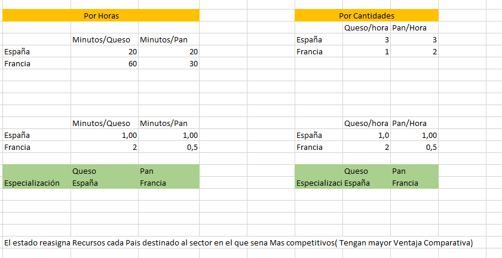{:height 163, :width 300}
			- Situación Inicial del Comercio al igualar la Producción
				- Para esto debemos obtener la [[Frontera de Posibilidades de Producción]] de Cada Individuo o país, En el caso de las ventajas comparativas de dos productos , se debe encontrar la [[Ecuación de la recta conociendo dos puntos]]  donde esos 2 puntos serán los máximos de producción de cada sujeto o país , es decir cuando consumo 0 de un producto y el máximo (0, maxi) y el otro punto es el máximo de producción del otro bien (max,0)
				- ((62082254-db3a-43dc-9e02-ac119ba95c05)) #ecuación
				- TODO Situación Inicial del Comercio y Resultados del Beneficio económico (Minuto 1:17 [Clase 1](https://drive.google.com/drive/u/1/folders/1HLDI-ohR65Evt3BmWr_TSQhJw0sdXEjS)) #Revisar
	- # Fallas del mercado 🟡
	  collapsed:: true
	  Mediante las Fianzas Públicas, y la asignación de recursos , se trata de corregir los fallos de mercado.
		- ¿Cuáles son las fallas del mercado?
		  collapsed:: true
			- Poder de mercado ([[Monopolio]])
			  collapsed:: true
				- Monopolio
				  collapsed:: true
					- {{embed ((619d1fd5-eb00-418b-b85e-5d724d64e93f))}}
				- Vendo mas y cobra más.
				- Genera Perdida Social
				- #[[Ejercicios Numéricos]] [[Monopolio]]
					- #ecuación ((6201acf7-9e58-4b90-a0fd-de03b7155bf3)) → Optimo del Monopolio
						- ((6201acf7-ffd6-4e93-a0c0-ceccd113e49e))
					- #ecuación ((6208340b-93aa-4cb6-bc32-b9869770ade4)) → Índice de Lerner
					-
				-
			- Información Incompleta
			  collapsed:: true
				- Riesgo Moral
				  collapsed:: true
					- Como cambio mi comportamiento ante el pago de un acontecimiento en especifico(Cuidao menos mi cas acuando tengo un seguro anti robos)
					- La parte cuyas acciones no se observan pueden influir en la probabilidad o en la magnitud relacionado con un acontecimiento.
				- Selección adversa
				  collapsed:: true
					- Se venden productos de diferente calidad a un mismo precio, debido a la información asimétrica, vendiendo así muchos productos de baja calidad  y  pocos de alta calidad.
					- Escondo información para obterner mejores precios o servicios
				-
			- Externalidades
			  collapsed:: true
				- En producción
					- Positiva
					  collapsed:: true
						- {{youtube https://www.youtube.com/watch?v=LNI04miAEgQ}}
					- Negativa
					  collapsed:: true
						- {{youtube https://www.youtube.com/watch?v=ZAlxvWNnMY8&t=277s}}
				- En Consumo
				  collapsed:: true
					- Negativa
					  collapsed:: true
						- {{youtube https://www.youtube.com/watch?v=_JZ1CpzHDcg}}
						- {{youtube-timestamp 119}}  La curva de Consumo se desplaza hacia la izquierda
					- Positiva
					  collapsed:: true
						- {{youtube https://www.youtube.com/watch?v=JP-9nQr3mek}}
						- {{youtube-timestamp 183}}  Movimiento de la Curva de beneficio, hacia la derecha
				- ¿ Como se corrigen la externalidades negativas?
					- Mediante Tasas o Normas
				- ¿Cómo se fomentan las externalidades positivas ?
					- Ejemplo becas
			- Bienes Públicos
			  collapsed:: true
				- No- Exclusivos
				  collapsed:: true
					- No se pude excluir a ningún consumidor de su consumo
				- No-Rivales
				  collapsed:: true
					- El consumo del bien no reduce la cantidad disponible de consumo para otros consumidores
				- Sin Embargo dentro del [[Sector Público]] Existen problemas Como:
					- Free Rider (Problema del Parasito {:height 36, :width 40} )
					  collapsed:: true
						- Polizón , aprovecha los bienes públicos sin pagar por ellos
					- Problema de Sobreutilización de un [[Bien Público]]
					- Sobre Uso o Sobredimensionamiento de un [[Bien Público]]
						- Ejemplo el seguro Social +
			- Bienes Privados Suministrados por el Estado
			  collapsed:: true
				- ¿Por que hay  [[Bienes privados]] Suministrados por el Estado?
				- Por que el [[Cmg]] de suministrar a más personas es alto , Ej. Educación; Salud
				- Por que en ese producto o servicio existe una [[Perdida de Eficiencia]] por exceso de [[Consumo]]
				- Por que existe una se puede dar una sub utilización de un bien publico, ^{ }ando asi los costos de trnasaccion , debido a que no uso ese bien
				- ((619d2ea5-50c4-466d-a141-8258ac5d065d))
				- ¿Como se encuentra la cantidad eficiente  (o Valor de eficiencia) de un bien público ?
					- Cuadno el precio ( 0 [[Función  de Demanda Inversa]] ) es igual al [[Cmg]]
				- ((620842c1-8fdf-49c8-b751-e767a5a70768))
				- #[[Ejercicios Numéricos]] Encontrar la perdida por exceso de demanda
					- #ecuación $$P= $$[[Cmg]]
					-
				- #+BEGIN_NOTE
				  Ahora bien, Como suministro esto bienes privados suministrados por el estado  ⬇️⬇️
				  #+END_NOTE
			- ### Como se provisionan los Bienes privados suministrados por el [[Estado]]
			  Existen 3 Formas
				-   Provisión Uniforme
					- Se da la misma cantidad de bienes y servicios a todas las personas
					- 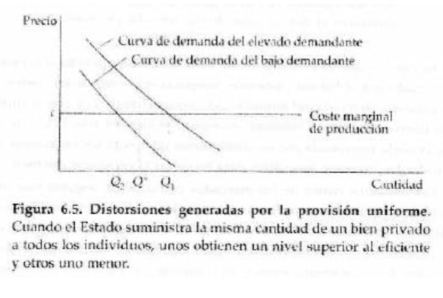
					- Ejemplos; salud - Precios del Diesel
					- ¿Qué distorsión genera la provisión uniforme?
						- Unos obtienen un nivel del bien superior al eficiente y otros un  nivel menor al eficeinte
					- #+BEGIN_NOTE
					  Como se vio, existen ineficiencias a la hora de promover o provisionar estos vienen públicos, por lo cual se conocen métodos para controlar o racionalizar  dichos bienes ⬇️⬇️⬇️
					  #+END_NOTE
				- Mecanismos para racionalizar los bienes Públicos
				  collapsed:: true
					- Tasa de Uso
						- Se paga por el uso o beneficio del [[Bien Público]]
						- Ventajas
							- Los que se benefician soportan los costos
						- Desventajas
							- Provocan Subconsumo
							- La administración de sistemas de precios aumenta los costos de transacción
					- Precio Uniforme
						- Precio uniforma
						- Ventajas:
							- Ahorra costes de transacción
						- Desventajas:
							- Unos consumen poco y otros consumen en exceso
							- Sin embargo aquellos cuya demanda es alta pueden complementar el cosumo público, ^{ }ando los costes totales de trasacción
					- Colas
						- Acceso al bien publico según tiempos de espera . ejem; Seguridad social
						- Ventajas:
							- Los bienes no se asignan necesariamente a los mas ricos
						- Desventajas
							- Provoca ineficiencia en el acceso al consumo de ese bien, criterio de asignación, perdida de tiempo
					- ¿Cuándo se hace cargo el estado?
					  collapsed:: true
						- Cuando los costos de transacción son bastante elevados , es mejor que el estado suministre ese Bien
			- ### Como se optimizan el bien Publico
				- La Entrega de un bien publico se optimiza cuando
					- #+BEGIN_CENTER
					  Curva de Demanda Total= Costo Marginal
					  #+END_CENTER
					- ¿ Como se calcula la ((6208584f-8ada-4cb3-9d1c-a0af22d9d69c)) ?
						- ((62085866-557a-4476-8e66-4179fc54fcb0)) #ecuación #[[Ejercicios Numéricos]]
	- # Elección Pública
		- mediante la elección Pública (Los votos de las personas) Se obtiene  un mecanismo que nos permite conocer cual será la forma de asignar recursos (si se vota a alguien de derecha o si se vota a alguin de izquierda) acuerdo a un presupuesto.
		- #+BEGIN_NOTE
		  Es decir cuando votamos por un candidato, estamos decidiendo cual será la prioridad del [[Gasto Público]] 
		  #+END_NOTE
		- 🧐Sabiendo que el voto de los ciudadanos brinda ese poder de gasto, ¿Qué debe hacer el agente publico?
			- Averiguar cuáles son las preferencias de aquellas  personas en cuyo nombre  se toma la decisión
		- Ahora bien , ¿Que influye en esas preferencias individuales por los bienes públicos que debe conocer el agente publico? .
			- Diferencias por gustos y preferencias
			- Diferencias entre rentas e impuestos
		- ¿Que dice [[Stiglitz]] sobre las personas mas ricas?
			- ***Personas mas ricas tienen rentas mas altas, normalmente prefieren gastar mas en todo***, sin embargo esto es debatible
			- Cuando el estado gasta más en [[Bienes Públicos]], las personas más ricas a menudo tienen que pagar una parte relativamente grande del [[Coste adicional]], ya que esos costos son cubiertos a través de [[Impuestos]]
				- Estos impuestos que cubren el costo adicional del gasto publico, se los conoce tambien como [[Precio en Impuestos]] o lo que es lo mismo [[Impuestos]],
					- #+BEGIN_NOTE
					  Ahora, bien para que nos sirve conocer este [[Precio en Impuestos]] o [[Impuestos]] , Nos sirve para conocer la [[Deuda Tributaria del Individuo]] ⬇️⬇️⬇️
					  #+END_NOTE
					- ¿Que provocan un Precio en impuestos más alto en los ricos?:
						- Los ricos apuestan a que se gaste menos en bienes públicos, ya que como son los que mas impuesto pagan, se les genera mayor deuda tributaria
		- ### Deuda Tributaria del individuo
			- Esta deuda parte del [[Precio en Impuestos]] , y el gasto público , ya que
				- id:: 62086fe5-f0ca-43f9-95c0-9e90f3037419
				  #+BEGIN_CENTER
				  Deuda tributaria del Individuo= [[Precio en Impuesto]] * [[Gasto Público]] #ecuación
				  #+END_CENTER
			- Sin embargo  existen otros mecanismos para que se pague la deuda tributaria:
				- Tributación Uniforme
					- Todos Pagan Igual independientemente de la renta
					- Partimos de
					- $$\text{Precio en Impuesto}=1/N$$
					  $$ \text{Gasto Público} = G$$
					- Y recordando que
						- ((62086fe5-f0ca-43f9-95c0-9e90f3037419))
						- 👁️ 👁️  La única diferencia es que usaremos el  Gasto público Per-capita
						- ((62087388-b460-4140-a952-9836e3008eae))
							- $$g= \frac{G}{N}$$
							- Donde
								- $G$ : Es el Gasto Publico Total
								- $N$ : Población Total
						-
					- $$\text{Deuda tributaria}=  \frac{1}{N} \frac{G}{N} \\[0.5cm]
					  \text{Deuda tributaria}=  \frac{G}{N ^{ 2}}$$
					- Ejemplo : Tributación uniforme
						- El IVA
					- #### Preferencia en el nivel de gasto en bienes Públicos
						- Solo se tienen efecto renta,
						- Los ricos Prefieren un nivel de [[Gasto Público]] Mas Alto
						- ((62088007-cae3-4b3a-a50e-2ee6746143f3))
						- ¿ Pero por que prefieren un gasto publico mayor?
							- Esto se deben a que van a obtener un nivel de utilidad mayor , por lo que la Utilidad depende del gasto publico
							- ((62088150-0958-4d17-baff-a3b5f0392386))
							- Los ricos prefieren mas gasto publico, que todos , después le siguen la clase media , y despues la clase pobre, ya que al pagar más , se va at ener acceso a mas y de mejor calidad
				- Tributación Proporcional
				  collapsed:: true
				  id:: 6201acf7-5558-4d58-89d3-3c3faebd66e2
					- Todos pagan el mismo porcentaje de la renta que tengan
					- id:: 6201acf7-be50-4d7a-8a48-d2673b685a4f
					  $$Renta \,Total : N\overline Y$$
					- Donde $\overline Y$ es la renta promedio de los individuos de la poblacion
					- $$Ingreso \, Total \, del \, Estado : tN  \overline Y \\$$
					- $$Gasto \, Total \, del \, Estado : tN \overline Y \\$$
					- Se supone que el ingreso es igual al gasto
					- $$Tipo \, impositivo: \frac{G}{N \overline Y}$$
					- Multiplicamos el tipo impositivo antes encontrado que se representa con $t$ por la renta que tienen esos individuos $$Y_i$$
					- $$Deuda\,  tributaria: \, t Y_i=\frac{GY_i}{N \overline Y}$$ #ecuación
					- #### Como es la preferecniad del Nivel de gasto en bienes públicos, bajo la tarifación proporcional
						-
						- Pobres tienen precio en impuestos mas bajo, por lo que su nivel de gasto publico es mas alto
						- Efecto sustitución(Precio en impuestos más bajo) es mayor al efecto renta
						- Personas pobres desean mas bienes púbicos que los ricos
						- ((62087f22-d109-4f16-8985-f0d16573c61a))
				- Tributación Progresiva
				  collapsed:: true
				  id:: 6201acf7-af8f-4e3b-83dd-6693ddd8e241
					- la deda tributaria aumenta mas que proporcionalmente,
					- Ej.
					- Si  mi renta es de 1000 → pago 100 ;
					- Si mi renta es de 2000 → pago 220: → No 200 que seria proporcional al incremento
			-
		- ## Encontrar el Nivel optimo de consumo de bines privados y biens publicos
			- ((6201acf7-71bf-4b19-8940-0e48b97f6c9f))
			- ((6201acf7-6194-4d7c-abf8-2023d1d238ab))
	- ---
	- TODO Repasar Bien desde aqui
	- Problema de agregación de preferencias
	  collapsed:: true
		- Es difícil averiguar cual es la preferencia por un bien publico de cada persona, por  lo que se toma en consideración son las decisiones colectivas
		- Las personas prefieren un bien público dependiendo de su nivel de renta así como del sistema impositivo
		- Ante esto se presentan algunos modos de elección que representan a al colectividad
		-   Elección por mayoría
			- La paradoja del voto , no se lleva a acabo dentro de un mismo grupo
	- Teorema de Imposibilidad de Arrow
	  collapsed:: true
		- Que propone un mecanismo de política ideal posee 4 caracteristicas
			-   Transitividad
			-  Decisiones no dictatoriales
			-  Independencia de opciones relevantes
			-  Dominio no restringido
	- Preferencias unimodales
	  collapsed:: true
		- Existe cuando existe un máximo preferido
	- Votante Mediano #yellow
	  collapsed:: true
		- Toma en consideración las preferencias en promedio que tienen los individuos
		- menor beneficio , pero también menor costo
	- Equilibrio de Lindhal
	  collapsed:: true
		- En bienes Públicos el equilibrio es la intersección de la demanda agregada y el CMg
		- Es eficiente en el sentido de Pareto
		- Problema
			- Información oculta por parte de los consumidores
	- Economía del sector Público
- # TODO   Ingresos Fiscales  🟡
	- Videos
		- Antiguos
			- Parte 1- 31 de Marzo
			- Parte 2-  [8 De abril_Unidad_2_ingreoss](https://drive.google.com/drive/u/1/folders/1HLDI-ohR65Evt3BmWr_TSQhJw0sdXEjS)
	- #  El [[Sector Público]]
	  :LOGBOOK:
	  CLOCK: [2022-02-01 Tue 14:39:02]--[2022-02-01 Tue 14:39:03] =>  00:00:01
	  CLOCK: [2022-02-01 Tue 14:39:04]--[2022-02-03 Thu 17:05:34] =>  50:26:30
	  :END:
		- ¿ Que es el Sector Público?
			- El sector público lo conforman los ministerios y otras instituciones del Estado, como el Ministerio de Salud y la Secretaría Nacional de Gestión de Riesgos;
			- Los Gobiernos Autónomos Descentralizados.
			- Los niveles de Gobierno o GADS como lo son las {{cloze Prefecturas}}, {{cloze Municipios}} y {{cloze Juntas Parroquiales Rurales}};
			- Empresas Públicas: como Petroecuador o las empresas municipales de obras públicas;
			- Banca pública, como el [[Banco Central]] del Ecuador y la Corporación Financiera Nacional; las instituciones de la Seguridad Social, entre otros.
		- #+BEGIN_NOTE
		  Para analizar el sector Público, este se dividir en dos , el sector publico financiero y el sector publico no financiero. 
		  #+END_NOTE
		- ### Sector Publico Finaicero
			- Bancos o instituciones financiera públicas. Banco central , La CFN
		- ## Sector Público no financiero
			- Son las entidades que conforman el [[PGE]]
				- ((62090a9c-a388-43f6-8280-2fa2e497d2b8))
					- Ejecutiva
					- Legislativa
					- Judicial
					- Electoral
					- Transparencia y Control Social
				- [[Gobiernos Autónomos Descentralizados]]
				- Universidades públicas
				- Empresas públicas
				- Empresas que conforman la Seguridad Social
		- # Presupuesto General [[PGE]]
			- ¿ Que es el [[PGE]] ?
				- Es la {{cloze Estimación de los recursos financiero}} de un país; es decir , aquí están los ingresos estatales proveniente de la venta de petróleo, recaudación de [[Impuestos]]
				- El PGE también incluye el [[Gasto Público]], el gasto que el estado realiza para el funcionamiento de sus instituciones y la dotación de servicios y el {{cloze financiamiento público}} obtenido de gobiernos y otros organismos de ejecución de proyectos de inversión.
				- Todos los ingresos recaudados se destinaran para cubrir la obligaciones contraídas por la prestación de bienes y servicios públicos .
				- #+BEGIN_NOTE
				  Toda la generación de ingresos esta legalmente constituida, es decir todo ingreso tiene su propósito, esto se refleja en la [[Constitución]] 
				  #+END_NOTE
		- ## Constitución y Finanzas Públicas
			- Articulo 280,- Todo ingreso debe estar validado o vinculado en el [[Plan Nacional de Desarrollo]]
			- Articulo 285; Describe los objetivos de la  [[Política Fiscal]]
			- Articulo 286: Como deben ser las [[Finanzas Públicas]]
		- ## Ley orgánica de Finanzas Publicas
			- Dentro de Esta ley, tenemos dos clasificaciones de los ingresos:
				- ## Ingresos Permanentes
					- Cabe mencionar que no [[Ingresos Permanentes]] se financiarán [[Egresos Permanentes]] (Articulo 286), excepto en salud o justicia de que estos ingresos puedan provenir de gastos no permanentes
					- ¿ Que son los ingresos permanentes?
						- Son los ingresos públicos que el estado a través de sus entidades, instituciones y organismos públicos reciben de manera continua, periódica y previsible.
						- La generación de ingresos permanentes no ocasiona la disminución de la riqueza nacional. Por ello, los ingresos permanentes no pueden provenir de la enajenación, degradación o venta de activos públicos de ningún tipo o del [[Endeudamiento Público]].
						- Un ejemplo de estos ingresos son
							- El [[IVA]]
							- El [[ICe]]
							- [[Impuesto a la Renta]]
							- [[ISD]]
							- Tasas Aduaneras
					- Listado de Ingresos Permanentes
				- ## Ingresos No permanentes
					-
	- # [[Curva de Laffer]]
		- ((62092565-130d-4132-b8b3-fdd419f54c1e))
		- Optimo de la [[Curva de Laffer]]
			- ((62092deb-d2a7-435b-b24f-465ed831cae1))
			- ((62092d38-2846-4a01-84d8-3b51ab2e7ace))
			- Interpretación Resultados Curva de lafer
			- ((62092e06-4dc9-401a-9a78-a0a4acd97963))
		- [[draws/2022-02-07-08-22-54.excalidraw]]
		- Se plante hasta cuando puede el gobierno aumentar su nivel de recaudación
		- ¿Cuándo el gobierno de un país decide aumentar su capacidad de recaudación que puede hacer ?
			- Se opta por aumentar los  impuestos que se puede dar por dos modos
				- Aumentando el numero de Ciudaddanos que tributan
				- Subiendo el tipo impositivo medio
				- ¿Pero que ecos hacen dudar de esta logica de incrementar los impuestos?
					- 1. Los impuestos como desestabilizadores directos
						- El aumento del [[Impuestos]] ➡️produce descenso de la renta disponible ➡️ a sus  vez de la producción ➡️ reduciendo la base imponible sobre la que se aplica el impuesto
					- 2. Como estabilizadores automáticos
						- Un disminución de tipo impositivo ➡️ provoca aumento de  las rentass, del consumo, de la producción y finamlemtne una mayor recaudación
					- EN los dos casos anteriores, entran en juego dos fueras que se contraponenen,
						- [[Efecto Renta]]
						- [[Efecto Sustitución]]
			- Endeudarse
	- # Efecto Olivera- Tanzi
	  id:: 61fc51b8-4f8d-48f6-8165-6aa1e0c1c16d
		- Analiza cual es el efecto que tiene la inflación, sobre la recaudación impositiva real
		- Es un circulo vicioso
		- Efecto Olivera Tanci
			- $$
			  \tau_{t}=\frac{T_{t}}{P_{t}}=\frac{\bar{\tau}_{t-n}}{(1+\pi)^{n}}
			  $$
			- ((62093c31-d7d5-481e-aa9a-cf49849a6ccd))
			- Para el Rezago se distinguen dos tipos de Rezagos
				- El rezago legal:  Previsto en las disposiciones legales del un país
				- El  rezago Informal: Se da cuando el pago se realiza luego de vencido el plazo legal
		- background-color:: #978626
		  #+BEGIN_CENTER
		  [[#red]]==Ciclo del Efecto olivera Tanzi==
		  #+END_CENTER
		- El aumento del deficit fiscal provoca ➡️ un alza en la inflación, la que a su ➡️ vez reduce el valor de la recaudación tributaria ➡️  Lo que as su vez aumenta el deficit fiscal  y se repite el ciclo 🔁
		  background-color:: #264c9b
		- ### Traslación del efecto Oliveratanzi a los consumidores
		- ((62093c9e-fc68-4671-9b69-d7f66f7a3f39))
		- 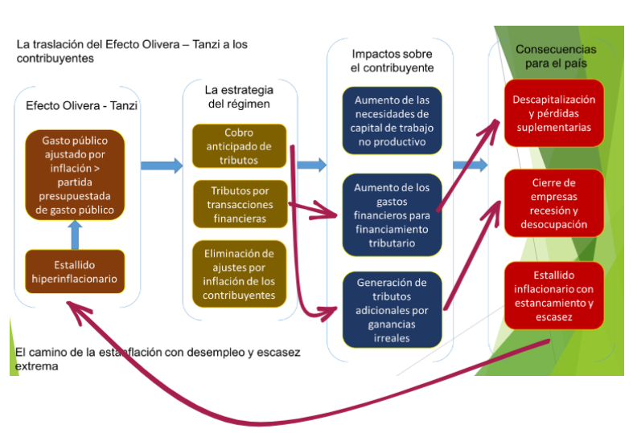{:height 466, :width 450}
		-
- # TODO Unidad 3 
	- Videos 🎞️
		- Parte 1 - [21 de Abril](https://drive.google.com/drive/u/1/folders/1HLDI-ohR65Evt3BmWr_TSQhJw0sdXEjS)
			- 
		- Parte 2 - [24 de Abril](https://drive.google.com/drive/u/1/folders/1HLDI-ohR65Evt3BmWr_TSQhJw0sdXEjS)
			- 
	- ¿ Que es el [[Gasto Público]] ?
		- Se entiende como todas las {{cloze  transferencias}} y {{cloze transacciones}} para adquirir {{cloze bienes}} y {{cloze servicios}} por parte del estado y para la prestación de {{cloze subsidios}} y {{cloze transferencias}}
	- ¿Cual es el objetivo del [[Gasto Público]] ?
		- Satisfacer las {{cloze necesidades de sus habitantes}}, el {{cloze consumo público}} y para contribuir a la {{cloze redistribución de la riqueza}}
	- #+BEGIN_NOTE
	  Ok, ya sabemos que es el gasto publico y sus objetivos, sin embargo este gasto publico se rige ante una [[Política de Gasto]] , que determinara como se llevara a cabo dicho gasto publico según esa tenencia de política.
	  #+END_NOTE
	- Ejemplo de Una Política de gasto
		- Cambio de la matriz productiva
	- #+BEGIN_NOTE
	  Sin embargo esa politica de gasto , debe cumplir ciertas normativas que se indican en diferentes códigos ⬇️⬇️⬇️
	  #+END_NOTE
	- ##  ¿En que se Fundamenta el Gasto Público?
		- Se fundamenta en lo que estipula en el [[Código Orgánico de Planificación y Fianzas Públicas]]
		- En La [[Ley orgánica de Servicios Públicos]]
		- Resoluciones del [[Ministerio de Trabajo]]
		- La Asignación para gastos de la [[PGE]]
		-
	- ¿ Como se financian los Gastos ?
		- ¿Los gastos Permanentes?
			- Con Ingresos permanentes, sine embargo existen excepciones plasmadas en la constitución.
	- ## Como Se clasifican El Gasto Público
		- Criterios Macroeconómicos
			- Gasto de Capital o Inversión:
				- Para mantener o mejorar la capacidad productiva del país, sobre todo infraestructuras
		- Criterios Económicos
			- Gasto Corriente o de consumo
				- Destinados a proporcionar servicios públicos (sanidad, justicia, educación, defensa, etc), salarios de funcionarios y compra de bienes y servicios
		- Transferencias o gastos sin contraprestaciones
			- Dinero que el Estado cede a las empresas y familias que lo necesitan, como el subsidio de desempleo, las pensiones, etc, Debe ser También Temporal , ósea  residual.
			- Entra todo lo que subsidios
		-
	- ## ¿ Que es el Resultado Fiscal?
		- #+BEGIN_CENTER
		  [[#red]]==Resultado Fiscal Global = Ingresos Totales - Gastos Totales==
		  #+END_CENTER
		- ¿Cual es la diferencia con él resultado Fiscal Primario?
			- No se consideran los intereses que el estado tiene que pagar por una deuda
			- #+BEGIN_CENTER
			  [[#red]]==Resultado Fiscal Primario = Ingresos Totales - Gastos Totales- Intereses Por pago de Deuda==
			  #+END_CENTER
		- 💹 Datos de los Resultados fiscales Globales y Primario Para ecuador
			- ((6201acf7-321b-4f9d-b852-e7fa9af7cc33))
				- https://www.bce.fin.ec/index.php/informacioneconomica/sector-fiscal
				- {:height 91, :width 318}
	- ## Gasto Permanente(Egreso Permanente) y Gasto  no Permanente  (Egreso No Permanente)
	- Lo que mas pesa son los ingresos por recaudación mas que los petroleros
	- ## Formas de Intervención del Estado
		- Producción Pública
		- Producción Privada con Impuestos y Subvenciones destinadas a fomentar las actividades
		- Producción privada con regulación estata
	- ## La importancia de determinados rasgos en el diseño del programa
		- [[draws/2022-02-13-16-35-28.excalidraw]]
		- ((62097a2b-0718-484a-8f72-6dd14df9d797))
	- ## Consecuencias de la Eficiencia del Gasto Público
		- Efecto Sustitución
			- Siempre que e programa publico reduce el precio de una mercancía el consumidor sustituye bienes que consume por el mas barato , Genera ineficiencia en el mercado
			- Ejemplo: El estado paga el 30% en alimentos
			- Solo incrementa el consumo de un bien especifico
			- ((62097bc7-794d-4e83-9df2-ec978c181b7f))
		- Efecto renta
			- Ayudas que facilitan el bienestar pero no alteran los precios a los que pueden comprar las diferentes mercancías tiene un efecto renta Modifican su estructura de gastos.
			- El efecto renta cambia por completo mi restricción presupuestaria
			- Incrementa el consumo de todo los bienes en general
			- El eefecto sustitución cambia ell precio del bien , los reduce
			- ((62097ba2-749f-48ad-b9e6-3347bd39cc9e))
	- ## Consecuencias distributivas (Incidencia) , Consecuencias de una subvención
	- Se expande mi demanda
		- En el corto plazo una subencion puede alterar mas el precio que la cantidad
	- En el largo plazo un subvención  se altera mas la cantidad que el precio
	- # Control del Gasto publico
		- Asamblea
		- Contraloria general del estado
	- # Vurva de Armey
		- Tamaño del sector publico(Por gasto público()()) frente al crecimiento economico
		- [[draws/2022-02-07-08-19-30.excalidraw]]
			-
	- Anlizar el gasto pero desglosado por solo un tipo de gasto a la vez
	- DIferenciación entre un proyecto publico y un privado
		- Privado genera utilidad , Publico no la busca
		-
	- # Precios Sombra y Precios de Mercado
		-
		- Los precios sombra hacia referencia a los verdaderos costos que tiene la producción de un bien o servicio incluyendo los costos  sociales
		-
	- # Tasa Social de Descuento
		- Refleja los beneficios medios que un inversor puede generar por un proyecto
		- ¿Cuales son los puntos de vista de la tasa social de descuento?
			- a) Refleja la tasa de preferencia temporal de los consumidores
			- b) refleja el coste de oportunidad del
			- c) Puede no reflear ninguno de los dos
	- # Cuestiones claves en la medición de los beneficios de un proyecto
		- 1. Medición del excedente del consumidor
		- 2. Medición de los beneficios no pecuniarios
			- Valoraciñon del tiempo
			- Valoracion de la vida
			- Valoracion del medioambiente
		- 3. Valoración de los bienes comerciados en presenca de un fallio del mercad
			- Utilizacion de los precios sombra para medis los costos sociales  marfinanales cuando los precios de mercado no los miden excantamente
		- 4. Valoración del consumo(de la producciñon ) en diferentes fechas
			- Elecciñon de la tasa de descuento correcta
		- 5. Valoración del riesgo
		- 6. Valoracion de las consideraciones distributivas
			- ¿Como deben compararse loe efectos producidos en diferentes grupos?
- # TODO Unidad 4   
  collapsed:: true
	- 1. Introducción
	- collapsed:: true
	  2. Incidencia tributaria
		- ¿ En que consiste la incidencia  tributaria?
			- Consiste en saber quien paga verdaderamente la carga de impuestos
			- ¿ Que se entiende por cargas de impuestos?
				- Se refiere a la proporción de impuesto que paga cada lado del mercado mas la proporción de la pérdida de eficiencia que soporta cada uno de ellos, esto  esta formada por dos componentes:
					- La carga tributaria o directa
						- La carga tributaria o carga directa del impuesto es la proporción de impuesto pagado por cada  lado del mercado, consumidores y productores.
						- Corresponde al monto del impuesto cancelado por los contribuyentes o recaudación total
					- Carga excesiva o ineficiencia o perdida neta de bienestar social del impuesto
						- Es la perdida de eficiencia esta perdida de eficiencia  es una perdida de bienestar que incurre los agentes económicos al pagar un impuesto.
						- Esta peridida de eficiencia se genera al modificar la asignacoion de recursos (originalmente perfecta)
			- ¿Cuales son los componenestes de la carga total?
			  collapsed:: true
				- Carga directa
				  collapsed:: true
					- La cargad directa es el total de impuestos recaudados por el gobierno que pagan los contribuyentes , se representa normalmente como porcentaje o fracción  del [[PIB]]
					-
				- Carga indirecta
				  collapsed:: true
					- Incluye la  perdida de eficiencia o carga excesiva que puede generar el impuesto , incluyendo a esto los gastos administrativos por recaudación y fiscalización, costos de cumplimiento de impuestos, costos de cambiar de sistema tributario, la elusión y la evasión.
				- La medición de los costos indirectos es complicado, por eso solo se observa la carga directa y ,la carga excesiva del impuesto
			- ¿Es lo mismo carga  que cargas ?
			  collapsed:: true
				- No, por las diferencias de arriba
			- ¿Cuál es la representación grafica de las cargas?
			  collapsed:: true
				- ((61af5b06-6e31-4a79-929c-8d7c382096a5))
				-
			- ¿Cuales son los tipos de incidencia?
			  collapsed:: true
				- Incidencia estatutaria
				  collapsed:: true
					- Es la obligación legal de un impuesto  referente a la persona que fue fijada por la ley para pagar el impuesto
					- ¿Cómo es la grafica de oferta y demanda cuando se impone   un ==impuesto unitario== con incidencia estatutaria sobre los oferentes?
					  collapsed:: true
						- ((61b8847b-e4e2-4b5d-a56e-9bc4d9901f5c))
					- ¿Cómo es la grafica de oferta y demanda cuando se impone  un ==impuesto ad-Valorem== con incidencia tributaria sobre los oferentes?
					  collapsed:: true
						- ((61b88570-f9fd-484c-be48-f5e94a3f0348))
				- incidencia económica
				  collapsed:: true
					- Consiste en determinar quien paga realmente las cargas  que colocan los  impuestos en la práctica.
					- ¿Puede la ley establecer la incidencia económica?
					  collapsed:: true
						- No, por que esta se deriva de la elasticidad de oferta y demanda que se presenten en los mercados en los cuales se impone un impuesto
				-
				-
			-
	- 3. Incidencia Estatutaria u Obligatoria #yellow
	- 4. Incidencia Económica #yellow
	- 5 Incidencia Estatutaria vs Incidencia Económica
	  collapsed:: true
		- 5.1 Análisis de equilibrio parcial de la incidencia económica de un impuesto
		  collapsed:: true
			- Solo se analiza el mercado de consumo final donde se aplico el impuesto
			- En el equilibrio parcial no se toman en cuenta las repercusiones del impuesto en otros mercados , esto es solo presenta efectos de primer orden
			- Se trabajara sobre un ((61cc5e98-483c-4861-9139-50b87270d4c7))
			- Se trabaja en una ((61cc6014-667c-436c-9e54-53710f78e213))
		- ¿ Cuales son las formas de aplicación de la tasa de impuestos a la proucción o al consumo?
		  collapsed:: true
			- Forma Unitaria ( $T$ )
				- Se establece que la tasa de impuesto sea una cierta cantidad de unidades monetarias por unidad de producto. _Ej: cobrar $200 por cajetilla de cigarrillo_
			- Forma ad-Valorem ( $t$ )
			  collapsed:: true
				- Es la Aplicación de una tasa impositiva porcentual _ Ej: El IVA en Chile es $$t=19%$$ _
				- ¿Qué soluciona la esta forma de tributación?
					- Efecto deterioro
						- Que era producido por la inflación  produciendo un deterioro en la recaudación tributaria del estado
					- Reducción de las unidades de fabricación
						- Con al intención de reducir el monto total de impuestos a pagar
		- 5.1.1 Incidencia estatutaria sobre los consumidores
		  collapsed:: true
			- Unitaria
			  collapsed:: true
				- 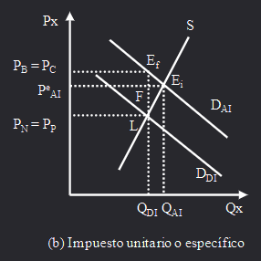
			- Ad-Valorem
			  collapsed:: true
				- 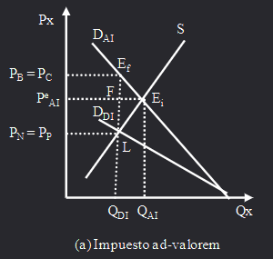
		- 5.1.2 Incidencia estatutaria sobre los oferentes
		  collapsed:: true
			- Unitario
				- 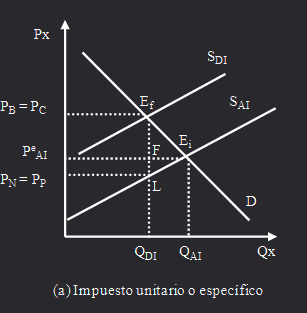
			- Ad-Valorem
			  collapsed:: true
				- 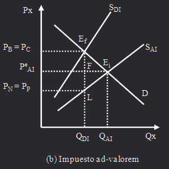
			-
		- 5.1.3 Equivalencia impositiva entre gravar el consumo o la producción
		  collapsed:: true
			- ((61d8a06a-90af-4eba-9669-394a09d8da77))
			-
	-   Determinantes de la incidencia económica de un impuesto
	  collapsed:: true
		- ¿Cuales son los principales determinantes de quien paga la carga de impuestos?
			- Elasticidades precio de la función demanda
			  collapsed:: true
				- Es un indicador que mide el grado de ==sensibilidad== o de respuesta de la ==cantidad== consumida de un bien o servicios por los consumidores ==ante variaciones== en el precio de compra del producto
				- ¿Qué pasa cuando tenemos  una función de demanda infinitamente inelástica?
				  collapsed:: true
					- Primero...
					  collapsed:: true
						- La carga del impuesto solo tiene el componente carga directa y no carga excesiva
					- Segundo...
					  collapsed:: true
						- La incidencia económica del impuesto recae totalmente sobre los sumadores, incluso si la ley dice que el impuesto lo pagan los oferentes , incidencia estatutaria
					- Tercero..
					  collapsed:: true
						- La cantidad demanda es la misma antes y despues de aplicar el impuesto
						- ¿Por que razón los consumidores no alteran su consumo?
							- Simple, ellos obtienen de esa cantidad una ganancia o excedente agregado infinitamente grande o necesario, como lo producen los bienes de consumo básico, bienes o servicios que satisfacen urgencias , vicios , bienes que no tienen sustitutos
					- Cuarto...
					  collapsed:: true
						- No habrá perdida de eficiencia o carga excesiva colocada por el impuesto
					- Quinto...
					  collapsed:: true
						- Los oferentes reciben el mismo precio que  ingresaban con y sin impuestos , esto debido a que aunque aumente el precio, este aumento es debido al impuesto por lo que se va al gobierno y no a las empresas oferentes
					- Sexto...
					  collapsed:: true
						- El precio para los consumidores subió exactamente en la magnitud de la tas de impuestos, demostrando asi que ellos son los que soportan la incidencia económica del impuesto.
			- Elasticidades precio de la función oferta
			- ¿Cuándo la incidencia económica del impuesto recae totalmente sobre los consumidores?
			  collapsed:: true
				- Cuando se presenta una demanda perfectamente inelástica
			- ¿Cuál es el principal determinante de la elasticidad precio de la oferta?
				- EL tiempo
				- ¿por que ?
				  collapsed:: true
					- ((61d8a8f7-d73e-42c6-8a20-fa5f25484e33))
					- ((61d8a90f-c99c-4e7b-8749-991df2071164))
					- ((61d8a947-474a-4144-a285-4912bf531e60))
				- ¿Y en la demanda ?
				  collapsed:: true
					- ((61d8ab35-795c-445a-a695-dc8043e06e62))
					-
				- En conclusión
					- ((61d8ab35-795c-445a-a695-dc8043e06e62))
		- Reglas de Incidencia Económica
			-   Mientras mas inelástica sea la función demandada de precios, mayor será la proporción de las cargas del impuesto soportadas por los consumidores y viceversa
			-  Mientras  más  elástica  es  la función  demanda  precio,  mayor  será  la  proporción  de  las cargas del  impuesto pagadas por los oferentes, y viceversa”.
			-   “Mientras  más inelástica sea la función oferta precio, mayor será la proporción de  las cargas del impuesto soportadas por los oferentes, y viceversa”.
			- ((61d8ab35-795c-445a-a695-dc8043e06e62))
			-  ((61d8a972-549f-4f52-9737-fc2cb200f88c))
			- LA REGLA DEFINITIVA ES
				- ((61d8a9df-9019-4bdc-ac4c-22c59a13574a))
	-  . Ecuación Fundamental de la Incidencia Económica de un impuesto
	-   INCIDENCIA TRIBUTARIADE UN ==IMPUESTO== APLICADO EN ==MERCADOS DE FACTORES PRODUCTIVOS== ((61d33803-a468-41bb-922c-ac8ccc5532c9))
	  collapsed:: true
		- ¿Por que Analizar esta Sección?
			- Existe una relación entre el mercado de factores y el mercado de consumo , por lo cual puede afectar el uno en el otro
			- Recordar la función de oferta y demanda
	- Incidencia tributaria a trevés del ciclo de vida [ 📜​](61aac79f-6a8f-4c0b-8c59-f3c81744c385) #yellow
	  collapsed:: true
		- ¿En que consiste el enfoque de la incidencia tributaria en  el ciclo de vida? #yellow
			- >Consiste en 📏 el 🤑 recibidos por los contribuyentes  a lo ⌛ y 🕵️‍♂️, la carga tributaria que los afecto a lo largo de la misma.
		- ¿En que consiste el enfoque anual? #yellow
			- Consiste en medir la base del impuesto en un año calendario
			- ¿Caso Chile?
				- El impuesto a la renta en Chile se aplica en un horizonte de tiempo anual, en abril, sin embargo a este se le puede ir contribuyendo mensualmente y con retenciones del 10
				- % de los honorarios
		- ¿Cuales son las diferencias entre el ingreso anual y el ingreso a través del ciclo de vida? #yellow
			- Primero ... #yellow
				- ¿Cómo evolucionan los ingresos según la teoría del ⌛  a través del tiempo?
				  collapsed:: true
					- Primeras etapas de vida → Ingresos bajos o ceo
					- Después del sistema educacional →  Crecen y se estabilizan por un tiempo
					- Etapa de jubilación → Ingresos bajos
					- ¿ Que nos lleva  a pensar esto ?
					  collapsed:: true
						- Es nos lleva a pensar que existe una diferencia entre el ingreso anual e ingreso del ciclo de vida
			- Segundo... #yellow
			  collapsed:: true
				- La 💣 del 💰en el caso de.. #yellow
				  collapsed:: true
					- Trabajadores independientes , que trabajan una epoca y otra no
					- El caso de los despidos
			- Tercero... #yellow
			  collapsed:: true
				- Ligado a la capacidad de pago, es erróneo pensar que la visión del ingreso del ciclo de vida  mide mejor la capacidad de pago  que la perspectiva del ingreso anual
				- Sistema tributario equitativo horizontalmete
				  collapsed:: true
					- Se paga impuestos similares sobre su ciclo de vida
				- Sistema tributario equitativo verticalmente
				  collapsed:: true
					- Pagan impuestos mas altos los ingresos mas altos del ciclo de vida
				- ¿Por que deberían estar preocupados los hacedores d política?
				  collapsed:: true
					- Por la equidad de corto y de largo plazo
			- Cuarta... #yellow
			  collapsed:: true
				- Que es lo que se incluye en el ingreso
					- En la perspectiva Anual
					  collapsed:: true
						- Sueldos y salarios
						- Remuneración Empresarial
						- Ingresos de Capital : Intereses dividendos y ganancias de capital
					- Ingreso a través del ciclo de vida
					  collapsed:: true
						- No requiere los ingresos de capital
						- Solo incluye los regalos realizados , Herencias  e ingresos laborales
						- ¿Por que no incluir los ingresos de capital?
						  collapsed:: true
							- El ingreso de capital no refleja diferentes niveles de bienestar , sino diferentes  decisiones de cuando consumir
							- Sin embargo la carga tributaria  a través del ciclo de vida no es  independiente del capital , misma carga que será afectada por las decisiones de consumo y ahorro, desde que los ingresos de capital están incluidos en la base del impuesto al ingreso
			- Quinta... #yellow
			  id:: 61b2a946-48d5-4940-8ca7-3d38316cb2e9
			  collapsed:: true
				- Los datos del ingreso anual son de fácil obtención , los datos del ingreso del ciclo de vida no lo son
			- ¿Qué pasa si el ingreso es igual en todos los individuos a lo largo del ciclo de vida? #green
			  collapsed:: true
				- El individuo quedaría situado en la misma franja de ingreso y la comparación del ciclo de vida con el ingreso anual carecería de relevancia
		- ¿Qué conclusiones se extraen de la incidencia tributaria a través del ciclo de vida? #yellow
		  collapsed:: true
			- Primera... #yellow
			  collapsed:: true
				- Se requiere gran cantidad de datos de ingresos a través del ciclo de vida
			- Segunda... #yellow
			  collapsed:: true
				- Los individuos cambian de decil de ingresos  de acuerdo a su ciclo de vida
			- Tercera... #yellow
			  collapsed:: true
				- El impuesto sobre el 💰 personal y el 💰 de las corporaciones parece menos progresivo a través del ciclo de vida.
				- Los impuestos al consumo aparecen menos regresivos sobre la base del ciclo de vida
			- Cuarta... #yellow
			  collapsed:: true
				- La incidencia tributaria sobre el ciclo de vida , resulto similar a la incidencia anual en EEUU
		- ¿Cómo los economistas han analizado la incidencia tributaria?
		  collapsed:: true
			- Tres aproximaciones basicas
			- Primera... #yellow
			  collapsed:: true
				- Análisis de equilibrio parcial #yellow
				  collapsed:: true
					- Es el modelo mas simple
					- Incidencia en el contexto de un único mercado
					- Es limitado debido a que no toma en cuenta la incidencia en el resto de mercados
			- Segunda... #yellow
			  collapsed:: true
				- Análisis estático de equilibrio general
				  collapsed:: true
					- Toma en cuenta los demás mercados , así como los efectos de los impuestos en los mercados relacionados  con el mercado grabado.
					- Su limitación es el supuesto de que la oferta total de  factores productivos  es fijas
			- Tercera.... #yellow
			  collapsed:: true
				- Análisis dinámico de equilibrio general
				  collapsed:: true
					- Desarrollado a través del modelo neoclásicos de crecimiento
					- La tributación de ingresos de capital disminuye el ahorro, disminuyendo asi la razón capital/ trabajo de equilibrio , como consecuencia cae la productividad del trabajo y disminuyen los salarios, lo que muestra que el impuesto se ha trasladado desde el capital al trabajo
			- Ciclo de vida de generaciones traslapadas #yellow
			  collapsed:: true
				- La incidencia tributaria depende  de como los ingresos impositivos son distribuidos a través de generaciones
				- Ej: Si el ingreso de impuestos al capital es para personas mayores , el ahorro disminuye , esto genera lo que vimos antes , por lo cual la carga del impuesto es traslapada desde el capital al trabajo.
				- En cambio si los ingresos de impuestos sobre el capital van a los jovenes , el ahorro aumenta, así como la relación capital-trabajo, aumentando los salarios y cae el retorno de capital
		- ¿Cómo se han realizado los análisis empíricos de incidencia tributaria? #yellow
		  collapsed:: true
			- Desde la traslación de las cargas de impuestos que dependen de las elasticidades precio de la demanda y de la oferta
			- Los estudio comienza con supuestos de como actúa la incidencia  de los impuestos  y se asigna la carga tributaria a diferentes grupos de ingresos hasta agotar el ingreso total.
		- Conclusión #yellow
		  collapsed:: true
			- La incidencia tributaria sobre el ciclo de vida analiza mi evolución de ingresos con respecto a mi edad  y al final se observa que existe un gran sesgo hacia los estratos mas bajos de la distribución de ingresos e impacta mucho la evolución de la temporalidad en la cual una persona se encuentre para fijar ese nivel de ingresos acumulados
	- [[Ley de plusvalía 2016 (Derogada)]]
	- En el cortisimo plazo → Toda la incidencia economica del impuesto recae sobre los consumidores
	- En el Corto Plazo  → Empieza a reacer sobre los productores y disminuye sobre los consumidores
	- En el largo plazo → Se traslada en mayor medida a los productores y se reducen en los consumidores
	- Movimiento de trsalacion impositiva de delante hacia atras
	- # Reglas de Incidencia tributaria Gruber (2007)
		- Primera regla → El lado del mercado es irrelevante
		- Segunda regla → El lado del mercado con mayor inelasticiadad soporta mas los impuestos , el lado mas elastico los evita
		- Tercera → La incidencia tributaria es acerca de los precios, no de las cantidades
			- Ya que en su gran mayoría se aplica esta incidencia en los precios mas no en las cantidades
	- # Presión fiscal
		- Recaudaciñon Fiscal /PIB
		- Factores Macroeconómicos
			- Bajos niveles de presion fiscal si no existe crecito
		- Factores Institucionales (Eficiencia y corrupción )
			- Corrupción baja presión fiscal
		- Factores Sociales
		- 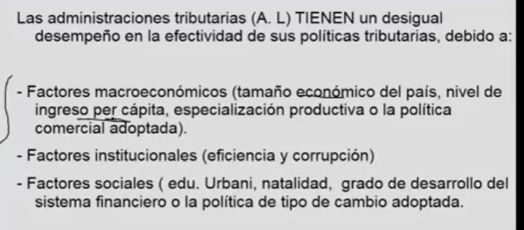
- # TODO Unidad 5 
	- Cuando se aplica un impuesto a bines de consumo que no son basico se produce un exceso de gradamen , aplicamos un impuesto mas de la utilidad que se le puede dar
	- Efecto
		- Restriccio en el consumo
		- Resrticcion de su nivel de inferecnia
		- Restrciion de su nivel de bienstar
	- El déficit fiscal se ha vuelto un problema estructural en el ecuador desde el año 2010
	- La deuda es una variable acumulativa (de stock) #yellow
	- El déficit es una variable de flujo
	- # Principios que cumple el IVA
		- Neutralidad
		- Neutralidad Internacional
		- Universalida
		-
	- # Ley de Plusvalia
		- https://www.sri.gob.ec/ley-organica-especulacion-sobre-valor-de-las-tierras
- # TODO Unidad 6  🎞️
	- [[Endeudamiento]]
- # TODO Unidad 7  🎞️
	- [[Ciclo Presupuestario]]
-
- # Paginas Para Datos
	- PGE (Proformas Presupuestarias** (Justificativos))
		- https://www.finanzas.gob.ec/justificativos/
		- Proformas Aceptadas
			- https://www.finanzas.gob.ec/proformas-aprobadas/
	- Datos SRI (Datos Recaudación Impuestos)
		- https://www.sri.gob.ec/estadisticas-generales-de-recaudacion-sri
	- Datos Deuda (Agregada, Consolidada Intera Externa, Porcentaje del PIB)
		- https://www.finanzas.gob.ec/https-wwwdeuda-publica-nueva-metodologia/
	- Ingresos y Egresos → Deficit
		- Video
			- {:height 227, :width 234}
		- Pagina (Excel)
		  id:: 6201acf7-321b-4f9d-b852-e7fa9af7cc33
			- https://www.bce.fin.ec/index.php/informacioneconomica/sector-fiscal
			- {:height 91, :width 318}
	- TODO de donde obtengo datos del IPI
		- ((62093d72-2210-49ae-95af-2ddec5a64a2a))
		  id:: 62093d75-ab00-4614-a65d-695b32a0e771
-
-
-
- Deficit Primario -- Desceunta los intereses por deuda publica
- 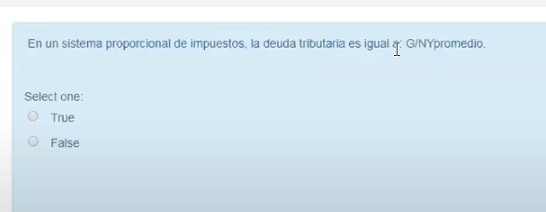
- Falso
- 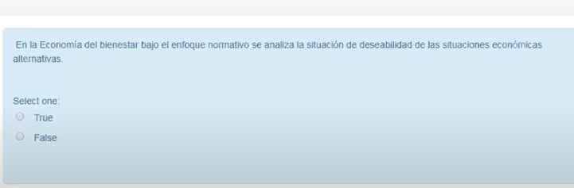
- Verdadera
-
- 
- Falso
- 
- Falso
-
-
-
-
- 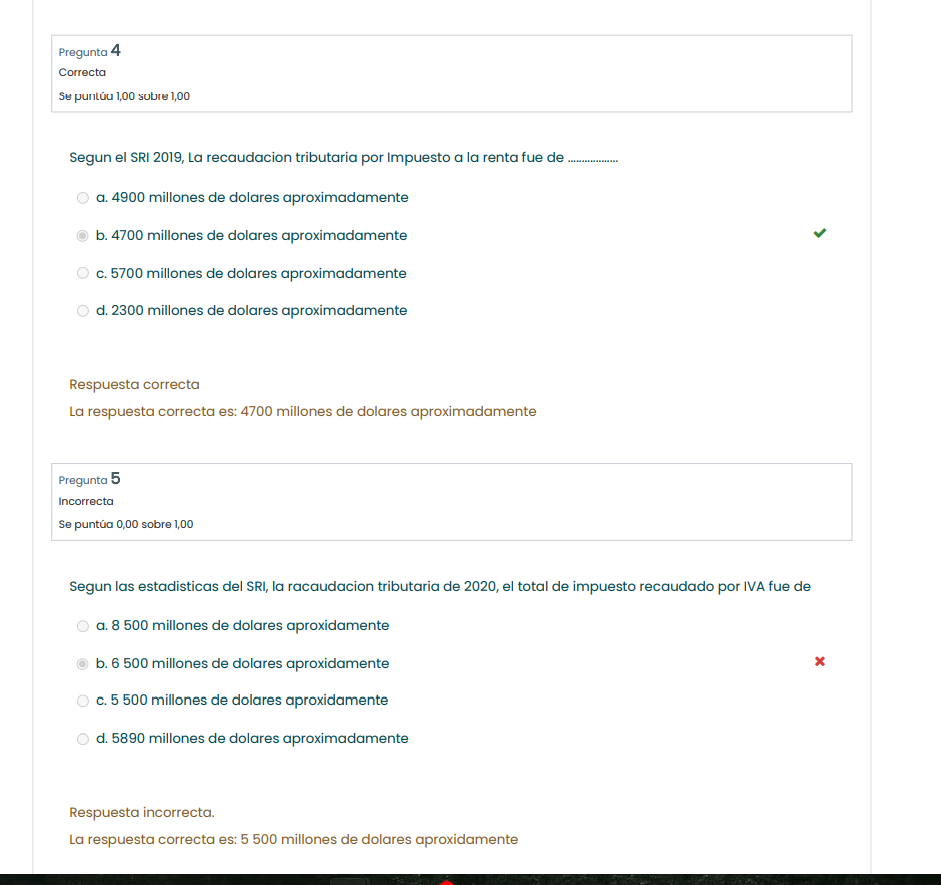{:height 290, :width 780}
-
- # Video 2022
- TODO Video 17 de Enero:
  id:: 61f5c0c2-caff-4093-b70f-5bf4fb6565aa
	- Deuda desde el banco central [[Ejercicio Búsqueda de datos ]] [[Ejercicios Numéricos]]  Prte 1 del [[Endeudamiento]]
	- https://mail.google.com/mail/u/0/?pli=1#search/bryan/FMfcgzGmtXFlVKgZSzQHzhFGHqnVPZTm?projector=1
		-
- DONE Video 10 de Enero  Repasos: 1
	- Datos del Ministerio de Fianzas  → [VIDEO 🔗](https://mail.google.com/mail/u/1/#search/bryan/FMfcgzGmtXBKPjSmwxthkgGBJlBFbbCQ)
	  id:: 61fc4844-90a6-4cea-b368-ccc0dea295c8
-
- # Videos Pasados
	- Videos
	  collapsed:: true
		- DONE 29 de Mayo (Introducción incidencia economica)
		  collapsed:: true
			- https://drive.google.com/drive/u/1/folders/1HLDI-ohR65Evt3BmWr_TSQhJw0sdXEjS
			- Propiedades deseables de los impuestos
			  collapsed:: true
				- Generalidad
				- Progresividad
				- Eficiencia
				- Simplicidad
				- Administrativa
				- Irretroactividad, (No puedo cobrar un impuesto nuevo como de años anteriores)
				- equidad transparencia
				- Suficiencia recaudatoria
			- Tabla de impuestos a la renta 2019
			  collapsed:: true
				- 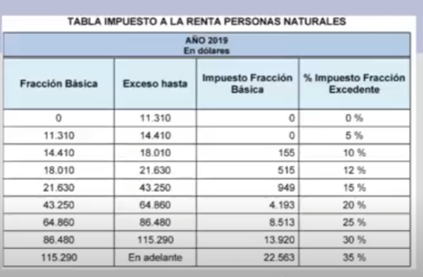
			- Tabla de Impuesto a la renta 2007
			  collapsed:: true
				- 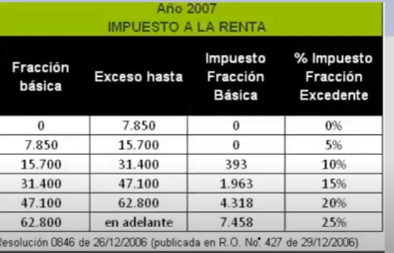
			- Carga directa - El total pagada por productores y por consumidores
				- [[draws/2022-01-18-22-36-24.excalidraw]]
			- Calcular las cargar (Carga total tributaria) (Calcular la carga total tributaria)
				- 
					- 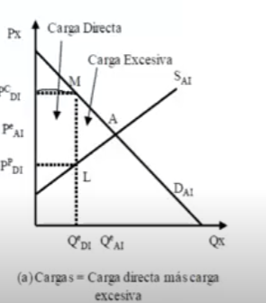
			- Mientras mas inelastica la curva de demanda pagan mas los consumidores o productores
			- 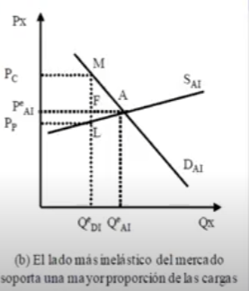
			- La incidencia hacia atrás es cuando la incidencia económica recae sobre los productores del bien gravado
			- La incidencia hacia Adelante. Cuando la incidencia recae hacia los consumidores : invierten consumen produucen arriesgan trabajan
			- Traslación total:
				-
				-
				- Todo el impuesto recae sobre los productores o todo el impuesto recae sobre los consumidores
			- Traslación parcial:
			- Cuándo los dos agentes económicos soportan la carga tributaria
			-
		- DONE 2 de junio
		  collapsed:: true
			- Paga mas impuesto el lado del mercado mas inelástico
			- El mercado inmobiliario es mas  inelástico en los oferentes, y mas elástico en los demandantes por lo que un impuesto inmobiliario recae en los oferentes o curva de oferta
			- Pago de impuestos en el tiempo
			  collapsed:: true
				- Lado de la demanda-Precio (movimiento de traslación impositiva de delante hacia atrás)
				  collapsed:: true
					- En el cortísimo plazo toda la incidencia económica del impuesto recae sobre los consumidores, la función de demanda es completamente inelástica, no varia la producción, no existe perdida de eficiencia o carga excesiva
					- Se comienza a repartir los impuestos entre productor y consumidor, se genera perdida de eficiencia y carga excesiva
					- En el largo plazo la incidencia recae en los oferente y un poco en los cosumidores , la perdida de eficiencia o carga excesiva es aun mayot
			- Reglas de la incidencia tributaria
			  collapsed:: true
				- Primera
				  collapsed:: true
					- No importa el lado del mercado sobre el cual el impuesto es colocado
				- Segunda ´
				  collapsed:: true
					- El lado inelástico soporta los impuestos, el lado elástico los evita
				- Tercera
				  collapsed:: true
					- La incidencia tributaria es acerca de los precios no de las cantidades, ya que generalmente la incidencia no se aplica sobre cantidades sino sobre precios
				-
			- Ecuación fundamental de la incidencia económica de un impuesto
				- 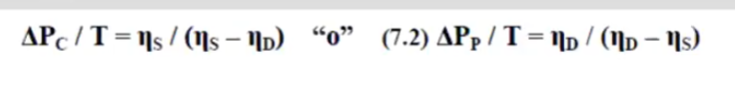
		- DONE # 5 de junio
		  collapsed:: true
			- Que es la presión fiscal = Total de impuestos recaudados / PIB o tambien recaudación fiscal /PIB
			- ¿Cuales son los factores macroeconómicos de la presión fiscal  ( son 4 )?
			  collapsed:: true
				- Tamaño economico del pais,
				  collapsed:: true
					- bajo nivel de crecimiento genera baja presion fiscal
				- nivel de ingresos per cápita
				- ,Especialización productiva
				- la política comercial adoptada
			- ¿Cuales son los factores instituciones de la presión fiscal  ?
			  collapsed:: true
				- (eficiencia y corrupción)
				- Si existe una alta corrupción los paises tiene  baja presion fiscal
			- ¿Cuales son los factores sociales de la presión fiscal?
			  collapsed:: true
				- Educación
				- Urbanidad
				- Natalidad
				- Grado de desarollo del sistema fianciero
				- Política de tipo de cambio adoptada
			- ¿Cómo es la presión fisca  en américa  latina?
			  collapsed:: true
				- La presión fiscal en america  latina es baja
				- A que se debe ?
					- Se debe muchas veces a al ineficiencia en la recaudación fiscal
			- ¿Cuales on otros determinantes que afectan la presión fiscal ?
			  collapsed:: true
				- El endudamiento público , el cual afecta negativamente sobre la presión fiscal
				- La especialización productiva afecta de manera positiva
				- En america latina , se afecta por cambios reformar tributarias presión constante
				- Posibles varaibles instrumentales que solucionen la endogenidad , division religiosa y etnica
			- Es importante mejorar los niveles de recaudación tributaria, ya que esto permite disminuir la desigualdad
		- DONE 9 de junio
		  collapsed:: true
			- https://rr2---sn-cvb7ln7e.c.drive.google.com/videoplayback?expire=1642443619&ei=I3vlYdeNLY2Vhwbxl57ABw&ip=200.55.237.84&cp=QVRJVEVfUlZPSlhPOjBHWnN1Z1A1bVF4NDQzaW9rRUUzQ1VPa2FLOFBqYjRxNjB2YWU4NnZ1VFE&id=a68aa67db386e54d&itag=18&source=webdrive&requiressl=yes&mh=s-&mm=32&mn=sn-cvb7ln7e&ms=su&mv=m&mvi=2&pl=24&ttl=transient&susc=dr&driveid=1nAkeP3Y4ks4fNKdXklKxwLRNh19sXgGt&app=explorer&mime=video/mp4&vprv=1&prv=1&dur=4995.520&lmt=1591801982429661&mt=1642428745&sparams=expire,ei,ip,cp,id,itag,source,requiressl,ttl,susc,driveid,app,mime,vprv,prv,dur,lmt&sig=AOq0QJ8wRQIgJqP4kvSJgjYjHUDQs9f6n0POZz0IWL_pxCU3IArPV94CIQCPfPYn2ZlBAcu-C5yRdSfQ5uiWIH5OfukdqeQsJ6RqVA==&lsparams=mh,mm,mn,ms,mv,mvi,pl&lsig=AG3C_xAwQwIgPsvdXa1hAKY96c7nIgKWuBRdTZM17EmPD_7g8u4gNZUCH0O_pDKFksrbIl1XVdjqjL8Pnigvu1F52wjfFPkO5_0=&cpn=Wu-ApAJgXYT89p3n&c=WEB_EMBEDDED_PLAYER&cver=1.20220112.01.00
			- Si un pais grande importa este puede afectar al precio interncaionañ
			- Aranncel En una economia pequeña
			  collapsed:: true
				- 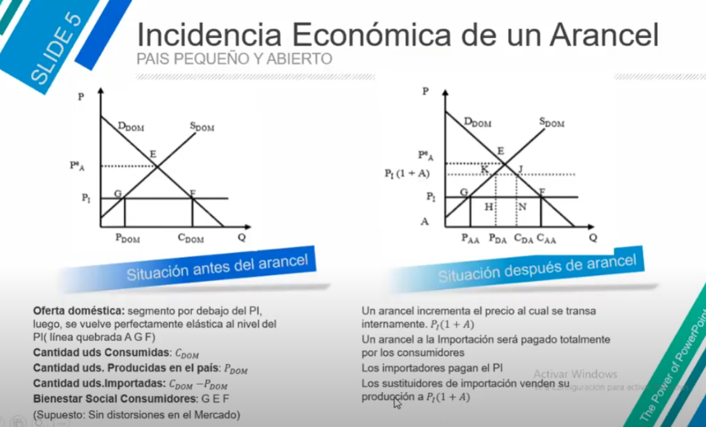
				- Un arancel es pagado totalmente por los consumidores
		-
		- Efecto cascada y ley de plusvalia y Grandeç
			- https://rr4---sn-cvb7ln7z.c.drive.google.com/videoplayback?expire=1642443088&ei=EHnlYajrH5-H_9EPtf6R-AY&ip=200.55.237.84&cp=QVRJVEVfUlBWSVhPOjBHWnNvbk81bVF4NDQzY3ZqRUUzQ1VPa3VSN1BqYjRxNjBwaGQ4NnZ1VFE&id=b63295126ccc436e&itag=22&source=webdrive&requiressl=yes&mh=6G&mm=32&mn=sn-cvb7ln7z&ms=su&mv=u&mvi=4&pl=24&ttl=transient&susc=dr&driveid=12lNBE0cQ0ASDhJPkIoPn485KxxRvijoi&app=explorer&mime=video/mp4&vprv=1&prv=1&dur=3081.009&lmt=1595368462407088&mt=1642428058&sparams=expire,ei,ip,cp,id,itag,source,requiressl,ttl,susc,driveid,app,mime,vprv,prv,dur,lmt&sig=AOq0QJ8wRgIhAPO6Uskm6Nx55EJxLj78S2WHOlpcy5clzgCzV6AUM3ZvAiEArTj_PTHRL0D1YWjeFzpoH1QN9B5jxXwZWQz3HzC6iG4=&lsparams=mh,mm,mn,ms,mv,mvi,pl&lsig=AG3C_xAwRgIhALgvqL4HGyL3Wlj2TMaXVaanZSXeUek1qxq0ZB_Osa8FAiEAqmkSLKG9ypFFKDxMPAUgkBjwGgOcbwnf-arK07HtAas=&cpn=mpuB8Gzpo_W0AalM&c=WEB_EMBEDDED_PLAYER&cver=1.20220112.01.00
		-
-
- {{query videos}}
-
- Activos Financieros y Pasivos Fiancieros ((61f5c0c2-caff-4093-b70f-5bf4fb6565aa))
- Impuestos indirectos
  collapsed:: true
	- Impuesto al consumo
- Principios del IVA
	- Neutralidad
		- No debe afectar a la competitividad empresaria
	- Principio de Neutralidad Internacional
		- No se afecta a la competitividad internacional , el exportador puede pedir devoluciñon del IVA de sus compras, Facilitando a que el producto salga libre de impuestos
	- Universalidad
		- Grava tods y cada una de las opweraciones eonomicas realizadas en su ambito territorial
		-
- ---
- Rev
  collapsed:: true
	- ¿Por que la incidencia tributaria se grafica como un rectángulo debajo del precio que incluye el impuesto  y por encima  de precio sin impuesto?
		- Esto es debido a que por cada unidad consumida se va a pagar el precio con impuesto.
		- [[draws/2021-12-14-07-12-42.excalidraw]]
		- [[Excel]]
- {{renderer :kanban_txvnhl}}
	- data
		- test image
			- 
		- test
			- 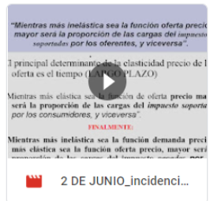
		- Unidad 4 Incidencia tributaria Parte 4/4
			- 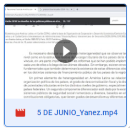
		- Unidad 3 - Gasto publico Parte 3/4
			- 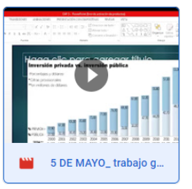
- {{renderer :kanban_ofecpas}}
	- Data
		- Unidad 2 ingreso Parte 3/4
			- 
		- Unidad 3 Gatos Parte 2/3
			- 
		- Unidad 3 Gasto parte 3/3
			- 
-
-
- Falta
	- 