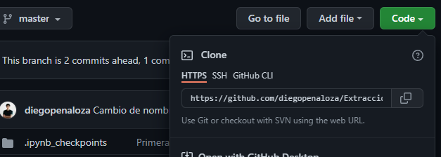

- Hacer push en un repositorio ya creado
	- collapsed:: true
	  ```git
	  git init
	  ```
	- collapsed:: true
	  ```git
	  git add .
	  ```
	- collapsed:: true
	  ```git
	  git commit -m 'mi primer commit'
	  ```
	- Copiamos el URL del repositorio
	- 
	- collapsed:: true
	  ```git
	  git remote add origin https://github.com/aqui-tu-repo.git
	  ```
	- Ahora elegimos la branch a la cual queremos enviar nuestro codigo
	- collapsed:: true
	  ```git
	  git push -u origin master
	  ```
	- Ref:
	  collapsed:: true
		- https://desarrolloweb.com/articulos/crear-repositorio-git-codigo.html