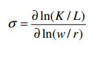

- Economía cerrada 
  id:: 61cc6014-667c-436c-9e54-53710f78e213
  collapsed:: true
  Autarquía
- Producto Interno Bruto
  collapsed:: true
	- PIB
	  id:: 61ce53c1-3a17-4185-8dd8-ce5872390123
- Es así que la elasticidad de sustitución (σ) entre capital y trabajo se define como el efecto de un cambio en los precios relativos de los factores sobre la utilización relativa de ambos, manteniendo constante el nivel de producción.
- 
- Elasticidad empleo-Producto $$(\eta_{LY})$$
	- entendida como el grado en que cambia la demanda de trabajo al cambiar el nivel de producción
	  suponiendo todo lo demás constante [Microsoft Word - Elasticidades de la demanda laboral.doc](https://www.bcu.gub.uy/Comunicaciones/Jornadas%20de%20Economa/iees03j3591009.pdf)
	- La teoría asume una relación positiva entre estas dos variables, ya que el trabajo es contratado como factor productivo para la producción de otros bienes.
- Elasticidad empleo costo laboral $$(|eta_{LL})$$
	-
	  $$\eta_{LL}=-(1-s_L)\sigma$$
	- Esta es siempre negativa y depende de la elasticidad de sustitución entre capital y trabajo y del
	  peso relativo del factor trabajo en la actividad productiva
- Elasticidad demanda de trabajo
	- Cuanto más fácil sea sustituir capital por trabajo ante variaciones en los precios relativos de ambos factores, más elástica será la demanda de trabajo ante cambios en el precio del mismo
- Elasticidad precio cruzada $$(\eta_{LK})$$
	- , las variaciones del precio del capital influyen sobre la demanda laboral
	-
	  $$\eta_{LK}=(1-S_L)\sigma$$