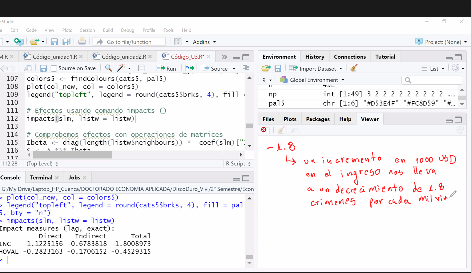

- Indice de Moran
	- 
	- En el Eje x la varaible estandarizadad
	- y en Y el promedio de la variable x de los vecinos
		- 
		- Por lo que los cuadrante s I y III , contienen o muestran un comportamiento de los suje sde autocorelación espacial positiva
		- Los cuadrante  II y IV muestran Autocorrelación espacial negativo
		- La pendiente de ajueste lineal es positiva
		- En el test de Moran La Ho es que no existe Auto Correlación Espacial y la H1 es que existe Autocorrelación espacial
- 
- ((61ee9699-92a9-4d6a-8a30-8425ea32dd3f))
- 
- Matriz de Contigüidad de primer orden
- {:height 226, :width 348}
- Normalizamos la matriz
- {:height 155, :width 292}
- que es arte de la ecuacion
	- 
	- ((61ee9510-a304-45dd-b7d4-65b4f4449bc1))
	- 
-
- Rezago espacial
- ((61ee9a4e-918d-42ed-802d-27d16dcc4bad))
- ((61ee9a52-1560-4a57-b5ad-55db2fb6f01c))
-
-
- 
- 
- <object data="G:/Mi unidad/Autosync/Logmy/NewLog/assets/Regional.pdf" type="application/pdf" width="100%" height="800px"></object>
	-
	- 
	- 
- <object data="G:/Mi unidad/Autosync/Logmy/NewLog/assets/Regional.pdf " type="application/pdf" width="100%" height="800px"></object>
- 
- 