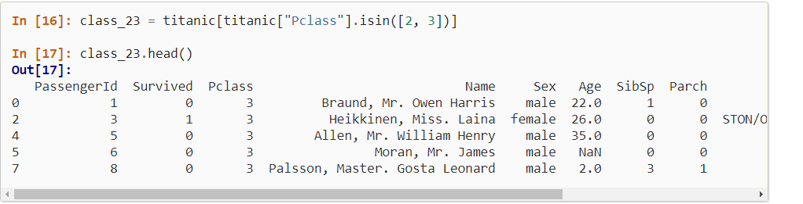
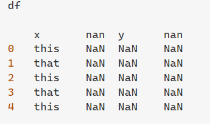
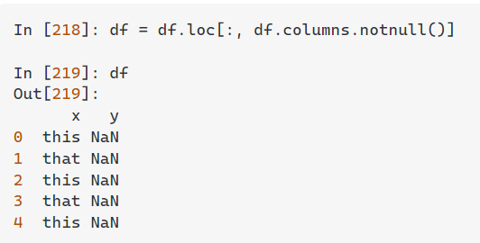

- Crear dataframe en Pandas
	- ```python
	  import pandas as pd
	  data = {'spike-2': [1,2,3], 'hey spke': [4,5,6], 'spiked-in': [7,8,9], 'no': [10,11,12]}
	  df = pd.DataFrame(data)
	  ```
- ¿Cómo cargamos datos .sav  , datos de SPSS?
	- Importar datos SPSS a Pandas
	- ```python
	  ```
- Importar datos csv
	- ```python
	  df = pd.read_csv("ejemplo.csv")
	  ```
- Crear Index en Daaframe Pnadas
- ```python
  df = pd.DataFrame(data, index =['position1', 'position2', 'position3', 'position4'])  
  ```
- https://www.javatpoint.com/how-to-create-a-dataframes-in-python
- Importar Excel en Pandas
	- ```python
	  df = pd.read_excel('example.xlsx', sheet_name='example')
	  ```
- Convertir dataframe pandas en excel
	- ```python
	  df.to_excel('example.xlsx', sheet_name='example')
	  ```
	- {{renderer :linkpreview,https://www.analyticslane.com/2018/07/30/guardar-y-leer-archivos-excel-en-python/}}
- Columnas
	-
	- Cambiar nombres de columnas
	- ```python
	  df.columns = df.columns.str.replace(', '')
	  ```
	- Poner nombre de columnas
	- ```python
	  df.columns = ['V', 'W', 'X', 'Y', 'Z']
	  ```
	- https://stackoverflow.com/questions/11346283/renaming-column-names-in-pandas
	- Ordenar Columnas Short columns
	- ```python
	  result = df.sort(['A', 'B'], ascending=[1, 0])
	  sorted_df = df.sort_values(by=['Column_name'], ascending=True)
	  
	  ```
	- https://pandas.pydata.org/pandas-docs/version/0.19/generated/pandas.DataFrame.sort.html
	- Seleccionar valores de una columna  con condicionales
	-
	- ```python
	  df[(df.col1 == 'something1') | (df.col2 == 'something1')]
	  ```
	- https://stackoverflow.com/questions/37663931/selecting-columns-with-condition-on-pandas-dataframe
	- ```python
	  df.loc[df['A'] > 2, 'B'] = new_val
	  ```
	- https://www.it-swarm-es.com/es/python/como-lidiar-con-settingwithcopywarning-en-pandas/1044277694/
	- ```python
	  df.loc[(df.a < 0), 'a'] = 0
	  ```
	- ```stata
	  df.loc[df["gender"] == "male", "gender"] = 1
	  ```
	- https://www.geeksforgeeks.org/how-to-replace-values-in-column-based-on-condition-in-pandas/
- Buscar Valores  mediante expresiones regulares
- ```python
  df.filter(regex=("d.*"))
  ```
- https://intellipaat.com/community/28342/how-to-select-columns-from-dataframe-by-regex
-
- Optener Promedio de Columna pandas
- ```python
   df["weight"].mean()
  ```
- https://stackoverflow.com/questions/31037298/pandas-get-column-average-mean
- Seleccionar algunas columnas de dataframe pandas
	- ```python
	  df['Fruit Total']= df.iloc[:, -4:-1].sum(axis=1)
	  ```
	- https://stackoverflow.com/questions/42063716/pandas-sum-up-multiple-columns-into-one-column-without-last-column
- ((61b659d4-74eb-40c9-9bfd-0f741c201c32))
- Obtener Lista de nombres de columnas pandas
	- ```Python
	  list(data.columns)
	  ```
	- https://www.geeksforgeeks.org/how-to-get-column-names-in-pandas-dataframe/
- Conocer el formato de un a columna pandas
	- Tipo de Columna Pandas
	- ```python
	  df['DataFrame Column'].dtypes
	  ```
	- https://datatofish.com/data-type-pandas-dataframe/
- Combinar Dataframe Pandas
	- ```python
	  frames = [df1, df2, df3]
	  result = pd.concat(frames)
	  ```
	- 
	- https://pandas.pydata.org/pandas-docs/stable/user_guide/merging.html
- Importar csv en python pandas
	- ```python
	  import pandas as pd
	  df = pd.read_csv('./world-happiness-report-2019.csv')
	  ```
	- https://pretagteam.com/question/finding-all-regex-matches-from-a-pandas-dataframe-column
- Elegir valores de una columna pandas
	- ```python
	  df.loc[:, df.columns.str.match('^d')]
	  ```
	- https://stackoverflow.com/questions/30808430/how-to-select-columns-from-dataframe-by-regex
- Crear rango de tiempo en pandas
	- Crear Columna de tiempo pandas
	- ```python
	  ```
	- https://catriscode.com/2021/02/27/creating-time-range-in-python/
	- https://stackoverflow.com/questions/34915828/pandas-date-range-to-generate-monthly-data-at-beginning-of-the-month
- Extraer nombre de columnas Pandas como lista, opterner nombre de Columnas pandas
	- ```python
	  df.columns
	  ```
	- Link
	  collapsed:: true
		- [https://cmdlinetips.com/2020/04/how-to-get-column-names-as-list-in-pandas/#:~:text=We%20can%20get%20the%20names,using%20Pandas%20method%20%E2%80%9Ccolumns%E2%80%9D.&text=Pandas'%20columns%20method%20returns%20the%20names%20as%20Pandas%20Index%20object.&text=We%20can%20convert%20the%20Pandas,using%20the%20tolist()%20method.&text=And%20now%20we%20have%20Pandas'%20dataframe%20column%20names%20as%20a%20list](https://datatofish.com/list-column-names-pandas-dataframe/)
- Contar numero de NAN pandas, contar valores faltantes Pandas
	- ```Python
	  df.isna().sum()
	  ```
	- {{renderer :linkpreview,https://stackoverflow.com/questions/26266362/how-to-count-the-nan-values-in-a-column-in-pandas-dataframe}}
- Rellenar valores faltantes con promedio de columna en pandas,  Fill NaN whit average in data frame pandas
	- ```python
	  df.fillna(df.mean())
	  ```
	- {{renderer :linkpreview,https://stackoverflow.com/questions/18689823/pandas-dataframe-replace-nan-values-with-average-of-columns}}
- Seleccionar lista de elementos en columna pandas
	- ```python
	  class_23 = titanic[titanic["Pclass"].isin([2, 3])]
	  ```
	- 
	- {{renderer :linkpreview,https://pandas.pydata.org/docs/getting_started/intro_tutorials/03_subset_data.html}}
- Eliminar columnas que contengan NaN pandas
	- ```python
	  df.dropna(axis='columns')
	  ```
	- {{renderer :linkpreview,https://www.codegrepper.com/code-examples/python/pandas+drop+if+all+columns+are+nan}}
- Eliminar columnas sin nombre
	- Eliminar columnas con NaN
	- 
	- ```python
	   df = df.loc[:, df.columns.notnull()]
	  ```
	- 
	- ```python
	  https://stackoverflow.com/questions/46101714/pandas-how-to-drop-multiple-columns-with-nan-as-col-name
	  ```