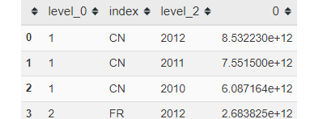

- #inbox
	- Eliminar un carácter en especifico de todos los valores de una columna pandas
		- 
		- ref
			- https://www.codegrepper.com/code-examples/python/pandas+strip+and+drop+characters+from+column
	- Concatenar combinar dos columnas pandas en una sola columna
		- 
		- ```python
		  df['colE'] = df.colB.str.cat(df.colD) 
		  ```
		- ref
			- https://towardsdatascience.com/combine-two-string-columns-pandas-fde0287485d9
	- Unir mas de dos dataframes por una columna pandas
		- 
		- ```python
		  import pandas as pd
		  from functools import reduce
		  
		  # compile the list of dataframes you want to merge
		  data_frames = [df1, df2, df3]
		  df_merged = reduce(lambda  left,right: pd.merge(left,right,on=['key_col'],
		                                              how='outer'), data_frames)
		  ```
		- ref
			- https://www.codegrepper.com/code-examples/python/merge+more+than+2+dataframes+in+pandas
	- Ordenar un dataframe por mas de una columna (Ordenar un dataframe por dos columnas )
		- ```python
		  df.sort_values(['Peak', 'Weeks'], ascending=[True, False], inplace=True)
		  ```
		- ref
			-
- Crear dataframe en Pandas
  collapsed:: true
	- collapsed:: true
	  ```python
	  import pandas as pd
	  data = {'spike-2': [1,2,3], 'hey spke': [4,5,6], 'spiked-in': [7,8,9], 'no': [10,11,12]}
	  df = pd.DataFrame(data)
	  ```
- Bases de datos del Banco Mundial en Python pandas
  collapsed:: true
	- ```python
	  import wbpy
	  from pprint import pprint
	  api = wbpy.IndicatorAPI()
	  Paises = ["CHN", "FR", "JP"]
	  PIB = "NY.GDP.MKTP.CD"
	  dataset = api.get_dataset(PIB, Paises, date="2010:2012")
	  dataset.as_dict()
	  ```
	- Se importa en formato de diccionario ((61d1f212-cddf-4b19-9497-3d511d30ab26))
- # Diccionarios a Pandas
- ¿Cómo cargamos datos .sav  , datos de SPSS?
  collapsed:: true
	- Importar datos SPSS a Pandas
	- collapsed:: true
	  ```python
	  ```
- Importar datos csv
  collapsed:: true
	- collapsed:: true
	  ```python
	  df = pd.read_csv("ejemplo.csv")
	  ```
- Crear Index en Daaframe Pnadas
  collapsed:: true
	- https://www.javatpoint.com/how-to-create-a-dataframes-in-python
	- collapsed:: true
	  ```python
	  df = pd.DataFrame(data, index =['position1', 'position2', 'position3', 'position4'])  
	  ```
- Crear multiples indices en dataframe
  collapsed:: true
	- añadir multiples indices adataframe pandas
	- agregar multiples indices adaatafrem pandas
	- {{renderer :linkpreview,https://www.datasciencemadesimple.com/hierarchical-indexing-multiple-indexing-python-pandas/}}
- Importar Excel en Pandas
	- collapsed:: true
	  ```python
	  df = pd.read_excel('example.xlsx', sheet_name='example')
	  ```
- Convertir dataframe pandas en excel
  collapsed:: true
	- exportar pandas a aexcel
	- collapsed:: true
	  ```python
	  df.to_excel('example.xlsx', sheet_name='example' index=False)
	  ```
	- {{renderer :linkpreview,https://www.analyticslane.com/2018/07/30/guardar-y-leer-archivos-excel-en-python/}}
- # Columnas
	- Añadir columna en la primera posición Pandas
	  collapsed:: true
		- Agregar columna en la primera posición pandas
	- Renombrar columnas especificas en pandas
	  collapsed:: true
		- Cambiar nombre de columnas en pandas
			- ```python
			  dta1=dta1.rename(columns = {'level_0':'coden','index':'code','level_2':'año',0:'PIB'})
			  ```
			- {:height 147, :width 369}
			- {:height 174, :width 369}
			- {{renderer :linkpreview,https://www.geeksforgeeks.org/rename-specific-columns-in-pandas/}}
	- Cambiar nombres de columnas
	  collapsed:: true
		- collapsed:: true
		  ```python
		  df.columns = df.columns.str.replace(', '')
		  ```
	- Poner nombre de columnas
	  collapsed:: true
		- collapsed:: true
		  ```python
		  df.columns = ['V', 'W', 'X', 'Y', 'Z']
		  ```
		- https://stackoverflow.com/questions/11346283/renaming-column-names-in-pandas
	- Ordenar Columnas Short columns
	  collapsed:: true
		-
			- collapsed:: true
			  ```python
			  df[(df.col1 == 'something1') | (df.col2 == 'something1')]
			  ```
			- https://stackoverflow.com/questions/37663931/selecting-columns-with-condition-on-pandas-dataframe
			- collapsed:: true
			  ```python
			  df.loc[df['A'] > 2, 'B'] = new_val
			  ```
			- https://www.it-swarm-es.com/es/python/como-lidiar-con-settingwithcopywarning-en-pandas/1044277694/
			- collapsed:: true
			  ```python
			  df.loc[(df.a < 0), 'a'] = 0
			  ```
			- collapsed:: true
			  ```stata
			  df.loc[df["gender"] == "male", "gender"] = 1
			  ```
			- https://www.geeksforgeeks.org/how-to-replace-values-in-column-based-on-condition-in-pandas/
		- collapsed:: true
		  ```python
		  result = df.sort(['A', 'B'], ascending=[1, 0])
		  sorted_df = df.sort_values(by=['Column_name'], ascending=True)
		  
		  ```
		- https://pandas.pydata.org/pandas-docs/version/0.19/generated/pandas.DataFrame.sort.html
		- Seleccionar valores de una columna  con condicionales
	- Comvertir columna en  numeros o enteros
	  collapsed:: true
		- Columna de string a numero o flotnate
		- ```python
		  df['col1'] = df['col1'].astype(int)
		  ```
		- {{renderer :linkpreview,https://www.statology.org/pandas-convert-column-to-int/}}
- Buscar Valores  mediante expresiones regulares
  collapsed:: true
	- collapsed:: true
	  ```python
	  df.filter(regex=("d.*"))
	  ```
	- https://intellipaat.com/community/28342/how-to-select-columns-from-dataframe-by-regex
- Optener Promedio de Columna pandas
	- ```python
	   df["weight"].mean()
	  ```
		- https://stackoverflow.com/questions/31037298/pandas-get-column-average-mean
-
-