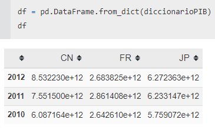
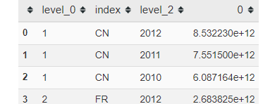
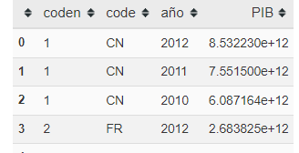
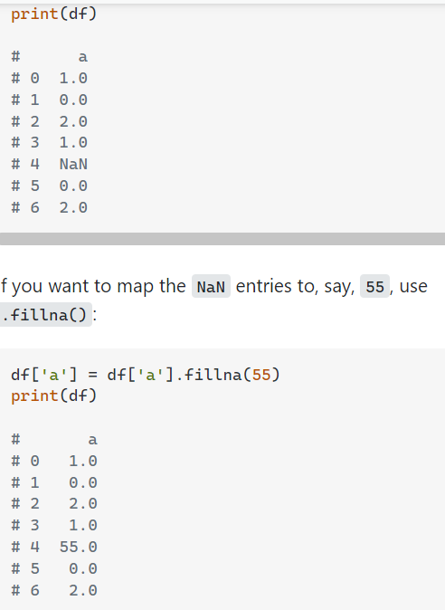
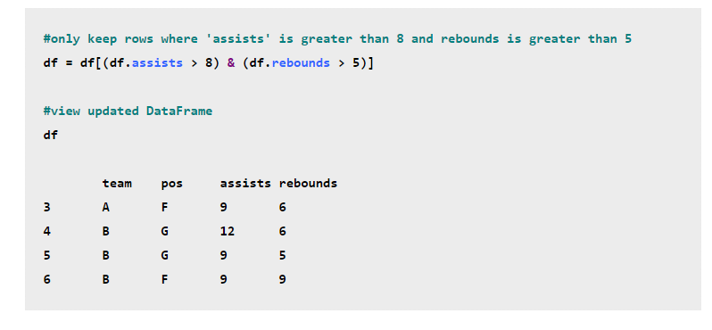
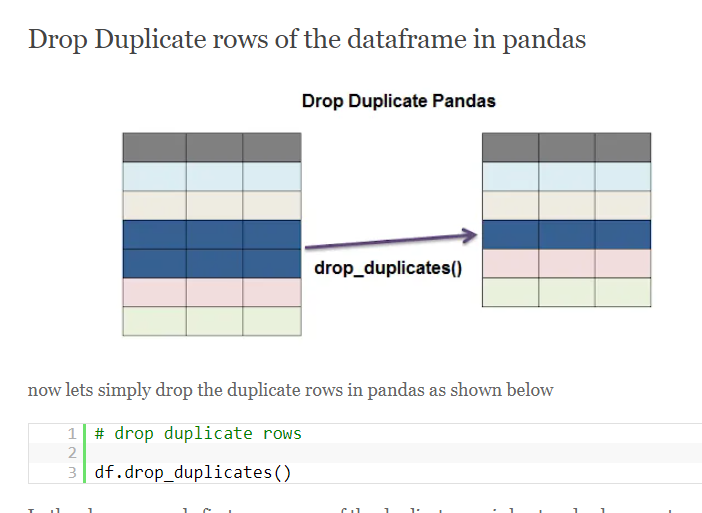
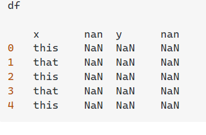
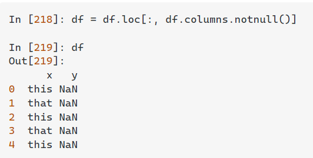

- Crear dataframe en Pandas
  collapsed:: true
	- collapsed:: true
	  ```python
	  import pandas as pd
	  data = {'spike-2': [1,2,3], 'hey spke': [4,5,6], 'spiked-in': [7,8,9], 'no': [10,11,12]}
	  df = pd.DataFrame(data)
	  ```
- Bases de datos del Banco Mundial en Python pandas
  collapsed:: true
	- ```python
	  import wbpy
	  from pprint import pprint
	  api = wbpy.IndicatorAPI()
	  Paises = ["CHN", "FR", "JP"]
	  PIB = "NY.GDP.MKTP.CD"
	  dataset = api.get_dataset(PIB, Paises, date="2010:2012")
	  dataset.as_dict()
	  ```
	- Se importa en formato de diccionario ((61d1f212-cddf-4b19-9497-3d511d30ab26))
- # Diccionarios a Pandas
  collapsed:: true
	- Importar diccionarios como dataframe pandas
	  id:: 61d1f212-cddf-4b19-9497-3d511d30ab26
	  collapsed:: true
		- ```python
		  df = pd.DataFrame.from_dict(dataset.as_dict()) 
		  ```
	- extraer valor de diccionario en pandas
	  collapsed:: true
		- ```python
		  dataset.as_dict()["CN"]
		  ```
		- {:height 344, :width 615}
	- Crear Datos de panes a partir de un diccionario en Pandas
		- Seleccionamos el diccionario
		- ```python
		  diccionarioPIB
		  ```
		- 
		- Convertimos el diccionario en un dataframe Pandas
		- ```python
		  df = pd.DataFrame.from_dict(diccionarioPIB) 
		  df
		  ```
		- 
		- Transponemos el Dataframe y reseteamos el índice de ser necesario
		- ```python
		  df1=df.T
		  df1=df1.reset_index()
		  df1
		  ```
		- 
		- Creamos el nuevo índice y el que ya teníamos para agregar a cada valor temporal y optenemos los datos en forma de panel
		- ```python
		  df1=df1.set_index([np.arange(1, len(df)+1),"index"])
		  dta1=pd.DataFrame(df1.stack())
		  dta1=dta1.reset_index()
		  dta1
		  ```
		- 
		- Con lo anterior  `np.arange(1, len(df)+1)` creamos un rango para que sea el indice numerico que queremos
	- {{renderer :linkpreview,https://python.quantecon.org/pandas_panel.html}}
- ¿Cómo cargamos datos .sav  , datos de SPSS?
	- Importar datos SPSS a Pandas
	- collapsed:: true
	  ```python
	  ```
- Importar datos csv
	- collapsed:: true
	  ```python
	  df = pd.read_csv("ejemplo.csv")
	  ```
- Crear Index en Daaframe Pnadas
  collapsed:: true
	- https://www.javatpoint.com/how-to-create-a-dataframes-in-python
	- collapsed:: true
	  ```python
	  df = pd.DataFrame(data, index =['position1', 'position2', 'position3', 'position4'])  
	  ```
- Crear multiples indices en dataframe
  collapsed:: true
	- añadir multiples indices adataframe pandas
	- agregar multiples indices adaatafrem pandas
	- {{renderer :linkpreview,https://www.datasciencemadesimple.com/hierarchical-indexing-multiple-indexing-python-pandas/}}
- Importar Excel en Pandas
  collapsed:: true
	- collapsed:: true
	  ```python
	  df = pd.read_excel('example.xlsx', sheet_name='example')
	  ```
- Convertir dataframe pandas en excel
  collapsed:: true
	- exportar pandas a aexcel
	- collapsed:: true
	  ```python
	  df.to_excel('example.xlsx', sheet_name='example' index=False)
	  ```
	- {{renderer :linkpreview,https://www.analyticslane.com/2018/07/30/guardar-y-leer-archivos-excel-en-python/}}
- # Columnas
  collapsed:: true
	- Añadir columna en la primera posición Pandas
	  collapsed:: true
		- Agregar columna en la primera posición pandas
	- Renombrar columnas especificas en pandas
	  collapsed:: true
		- Cambiar nombre de columnas en pandas
			- ```python
			  dta1=dta1.rename(columns = {'level_0':'coden','index':'code','level_2':'año',0:'PIB'})
			  ```
			- {:height 147, :width 369}
			- {:height 174, :width 369}
			- {{renderer :linkpreview,https://www.geeksforgeeks.org/rename-specific-columns-in-pandas/}}
	- Cambiar nombres de columnas
	  collapsed:: true
		- collapsed:: true
		  ```python
		  df.columns = df.columns.str.replace(', '')
		  ```
	- Poner nombre de columnas
	  collapsed:: true
		- collapsed:: true
		  ```python
		  df.columns = ['V', 'W', 'X', 'Y', 'Z']
		  ```
		- https://stackoverflow.com/questions/11346283/renaming-column-names-in-pandas
	- Ordenar Columnas Short columns
	  collapsed:: true
		-
			- collapsed:: true
			  ```python
			  df[(df.col1 == 'something1') | (df.col2 == 'something1')]
			  ```
			- https://stackoverflow.com/questions/37663931/selecting-columns-with-condition-on-pandas-dataframe
			- collapsed:: true
			  ```python
			  df.loc[df['A'] > 2, 'B'] = new_val
			  ```
			- https://www.it-swarm-es.com/es/python/como-lidiar-con-settingwithcopywarning-en-pandas/1044277694/
			- collapsed:: true
			  ```python
			  df.loc[(df.a < 0), 'a'] = 0
			  ```
			- collapsed:: true
			  ```stata
			  df.loc[df["gender"] == "male", "gender"] = 1
			  ```
			- https://www.geeksforgeeks.org/how-to-replace-values-in-column-based-on-condition-in-pandas/
		- collapsed:: true
		  ```python
		  result = df.sort(['A', 'B'], ascending=[1, 0])
		  sorted_df = df.sort_values(by=['Column_name'], ascending=True)
		  
		  ```
		- https://pandas.pydata.org/pandas-docs/version/0.19/generated/pandas.DataFrame.sort.html
		- Seleccionar valores de una columna  con condicionales
	- Comvertir columna en  numeros o enteros
	  collapsed:: true
		- Columna de string a numero o flotnate
		- ```python
		  df['col1'] = df['col1'].astype(int)
		  ```
		- {{renderer :linkpreview,https://www.statology.org/pandas-convert-column-to-int/}}
- Buscar Valores  mediante expresiones regulares
  collapsed:: true
	- collapsed:: true
	  ```python
	  df.filter(regex=("d.*"))
	  ```
	- https://intellipaat.com/community/28342/how-to-select-columns-from-dataframe-by-regex
- Optener Promedio de Columna pandas
  collapsed:: true
	- https://stackoverflow.com/questions/31037298/pandas-get-column-average-mean
	- ```python
	   df["weight"].mean()
	  ```
- Seleccionar algunas columnas de dataframe pandas
  collapsed:: true
	- collapsed:: true
	  ```python
	  df['Fruit Total']= df.iloc[:, -4:-1].sum(axis=1)
	  ```
	- https://stackoverflow.com/questions/42063716/pandas-sum-up-multiple-columns-into-one-column-without-last-column
- ((61b659d4-74eb-40c9-9bfd-0f741c201c32))
- Convertir columna pandas en números int enteros
  collapsed:: true
	- ```python
	  df['col1'] = df['col1'].astype(int)
	  ```
- Obtener Lista de nombres de columnas pandas
  collapsed:: true
	- collapsed:: true
	  ```Python
	  list(data.columns)
	  ```
	- https://www.geeksforgeeks.org/how-to-get-column-names-in-pandas-dataframe/
- Conocer el formato de un a columna pandas
  collapsed:: true
	- Tipo de Columna Pandas
	- collapsed:: true
	  ```python
	  df['DataFrame Column'].dtypes
	  ```
	- https://datatofish.com/data-type-pandas-dataframe/
- Combinar Dataframe Pandas
  collapsed:: true
	- collapsed:: true
	  ```python
	  frames = [df1, df2, df3]
	  result = pd.concat(frames)
	  ```
	- 
	- https://pandas.pydata.org/pandas-docs/stable/user_guide/merging.html
- Importar csv en python pandas
  collapsed:: true
	- collapsed:: true
	  ```python
	  import pandas as pd
	  df = pd.read_csv('./world-happiness-report-2019.csv')
	  ```
	- https://pretagteam.com/question/finding-all-regex-matches-from-a-pandas-dataframe-column
- Elegir valores de una columna pandas
  collapsed:: true
	- collapsed:: true
	  ```python
	  df.loc[:, df.columns.str.match('^d')]
	  ```
	- https://stackoverflow.com/questions/30808430/how-to-select-columns-from-dataframe-by-regex
- Crear rango de tiempo en pandas
  collapsed:: true
	- Crear Columna de tiempo pandas
	- collapsed:: true
	  ```python
	  ```
	- https://catriscode.com/2021/02/27/creating-time-range-in-python/
	- https://stackoverflow.com/questions/34915828/pandas-date-range-to-generate-monthly-data-at-beginning-of-the-month
- Extraer nombre de columnas Pandas como lista, opterner nombre de Columnas pandas
  collapsed:: true
	- collapsed:: true
	  ```python
	  df.columns
	  ```
	- Link
	  collapsed:: true
		- [https://cmdlinetips.com/2020/04/how-to-get-column-names-as-list-in-pandas/#:~:text=We%20can%20get%20the%20names,using%20Pandas%20method%20%E2%80%9Ccolumns%E2%80%9D.&text=Pandas'%20columns%20method%20returns%20the%20names%20as%20Pandas%20Index%20object.&text=We%20can%20convert%20the%20Pandas,using%20the%20tolist()%20method.&text=And%20now%20we%20have%20Pandas'%20dataframe%20column%20names%20as%20a%20list](https://datatofish.com/list-column-names-pandas-dataframe/)
- Contar numero de NAN pandas, contar valores faltantes Pandas
  collapsed:: true
	- collapsed:: true
	  ```Python
	  df.isna().sum()
	  ```
	- {{renderer :linkpreview,https://stackoverflow.com/questions/26266362/how-to-count-the-nan-values-in-a-column-in-pandas-dataframe}}
- Rellenar valores faltantes con promedio de columna en pandas,  Fill NaN whit average in data frame pandas
  collapsed:: true
	- collapsed:: true
	  ```python
	  df.fillna(df.mean())
	  ```
	- {{renderer :linkpreview,https://stackoverflow.com/questions/18689823/pandas-dataframe-replace-nan-values-with-average-of-columns}}
- Seleccionar lista de elementos en columna pandas
  collapsed:: true
	- collapsed:: true
	  ```python
	  class_23 = titanic[titanic["Pclass"].isin([2, 3])]
	  ```
	- 
	- {{renderer :linkpreview,https://pandas.pydata.org/docs/getting_started/intro_tutorials/03_subset_data.html}}
- Buscar todas las columnas sin nombre
  collapsed:: true
	- Buscar todas las columnas con nana
	- collapsed:: true
	  ```python
	  df.columns[df.notna().all()]
	  ```
	- {{renderer :linkpreview,https://www.codegrepper.com/code-examples/python/get+columns+names+having+nan+values+pandas}}
- Llenar celdas nan
  collapsed:: true
	- Fill NaN values
	- collapsed:: true
	  ```python
	  df['a'] = df['a'].fillna(55)
	  ```
	- 
	- {{renderer :linkpreview,https://stackoverflow.com/questions/38927099/keyerror-nan-in-dict}}
- Convertir todo un dataframe  a en formato numérico
  collapsed:: true
	- collapsed:: true
	  ```python
	  df.apply(pd.to_numeric)
	  ```
	- {{renderer :linkpreview,https://stackoverflow.com/questions/34844711/convert-entire-pandas-dataframe-to-integers-in-pandas-0-17-0/34844867}}
- Seleccionar rango de Columnas por nombre en Pandas  ⭐
  collapsed:: true
	- collapsed:: true
	  ```python
	  df[['alcohol','hue']]
	  data[['A', 'B']]
	  df1 = df[['a', 'b']]
	  ```
	- 
	- {{renderer :linkpreview,https://www.kite.com/python/examples/3182/pandas-select-columns-of-a-%60dataframe%60-by-column-names}}
	- {{renderer :linkpreview,https://towardsdatascience.com/interesting-ways-to-select-pandas-dataframe-columns-b29b82bbfb33}}
	- {{renderer :linkpreview,https://stackoverflow.com/questions/11285613/selecting-multiple-columns-in-a-pandas-dataframe}}
- Convertir en numero python pandas , convertir en entero
  collapsed:: true
	- collapsed:: true
	  ```python
	  int(float(a))
	  pd.to_numeric(s)
	  ```
- Convertir en flotante
  collapsed:: true
	- collapsed:: true
	  ```python
	  float(a)
	  ```
- Contar el numero de nan ausentes
  collapsed:: true
	- collapsed:: true
	  ```python
	  df['column name'].isna().sum()
	  ```
- Poner primera fila como columna pandas
  collapsed:: true
	- collapsed:: true
	  ```python
	  new_header = df.iloc[0] #Get the first row for the header
	  df = df[1:] #Take the data less the header row
	  df.columns = new_header #Set the header row as the df header
	  ```
	- {{renderer :linkpreview,https://poopcode.com/make-first-row-as-column-names-in-pandas/}}
- Optener ultimas letras de celda pandas
  collapsed:: true
	- Extraer ultimas letras de celda pandas
	- Optener ultimas letras de string pandas
	- ```python
	  df1['StateInitial'] = df1['State'].str[:2]
	  2
	  print(df1) 
	  ```
		- 
	- https://www.datasciencemadesimple.com/return-first-n-character-from-left-of-column-in-pandas-python/
	-
- # Exportar DataFrame
	- Exportar a Stata
		- ```python
		  df.to_stata('animals.dta')  
		  ```
		-
- # Eliminar, Borrar, Drop
  collapsed:: true
	- ## DataFrame Completo
	  collapsed:: true
		- Eliminar valores duplicados en dataframe pandas
		  collapsed:: true
			- ```python
			  df.drop_duplicates()
			  
			  ```
			- https://www.datasciencemadesimple.com/delete-drop-duplicate-row-dataframe-python-pandas/
	- ## Filas
	  collapsed:: true
		- Eliminar la primera  fila de un dataframe pandas
		  collapsed:: true
			- collapsed:: true
			  ```python
			  df = df.iloc[1: , :]
			  df.drop(df.index[1])
			  ```
			- {{renderer :linkpreview,https://thispointer.com/drop-first-row-of-pandas-dataframe-3-ways/}}
			- {{renderer :linkpreview,https://www.codegrepper.com/code-examples/python/pandas+set+first+row+as+column+names}}
		- Eliminar filas que contienen un valor específico 
		  collapsed:: true
			- ```python
			  #drop rows that contain specific 'value' in 'column_name'
			  df = df[df.column_name != value]
			  ```
			- https://www.statology.org/pandas-drop-rows-with-value/
		- Eliminar filas mediante condicionales
		  collapsed:: true
			- Eliminar filas con if o condicionales
			- Eliminar columnas con condicionales
			- https://www.statology.org/pandas-drop-rows-with-condition/
			- 
		- Eliminar filas Dubplicadas
		  collapsed:: true
			- 
			- https://www.statology.org/pandas-drop-rows-with-condition/
		- Eliminar filas duplicadas condicionadas en dos columnas
		  collapsed:: true
			- Eliminar filas duplicadas  mediante condicional
			- 
			- https://www.statology.org/pandas-drop-duplicates/
	- ## Columnas
	  collapsed:: true
		- Eliminar columna especfica en pandas
		  collapsed:: true
			- ```python
			  df.drop(['A'], axis = 1)
			  ```
			- https://www.geeksforgeeks.org/how-to-drop-one-or-multiple-columns-in-pandas-dataframe/
		- Eliminar columnas sin nombre
		  collapsed:: true
			- Eliminar columnas con NaN
			- 
			- collapsed:: true
			  ```python
			   df = df.loc[:, df.columns.notnull()]
			  ```
			- 
			- {{renderer :linkpreview,https://stackoverflow.com/questions/46101714/pandas-how-to-drop-multiple-columns-with-nan-as-col-name}}
		- Eliminar columnas que contengan NaN pandas
		  collapsed:: true
			- collapsed:: true
			  ```python
			  df.dropna(axis='columns')
			  ```
			- {{renderer :linkpreview,https://www.codegrepper.com/code-examples/python/pandas+drop+if+all+columns+are+nan}}