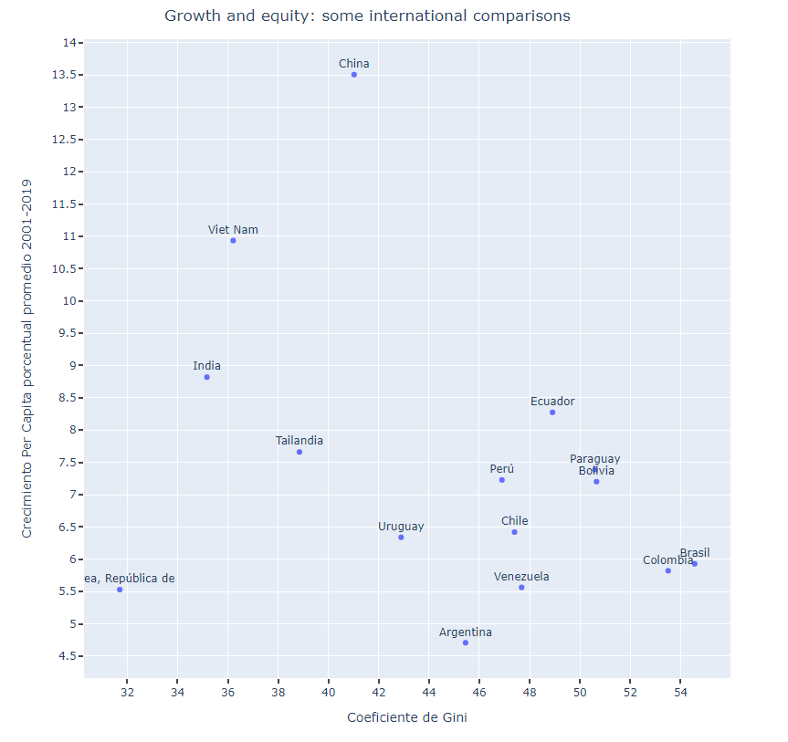

- Grafica de Barras en Plotly
- Importar Librería
	- ```python
	  import plotly.graph_objects as go
	  ```
- Grafica de Lineas
- https://plotly.com/python/line-charts/
- Grafica de Barras
- https://plotly.com/python/bar-charts/
- https://plotly.com/python/bar-charts/#bar-chart-with-direct-labels
- Suavizar Grafica de Lineas
- ```python
  import plotly.graph_objects as go
  import numpy as np
  
  x = np.array([1, 2, 3, 4, 5])
  y = np.array([1, 3, 2, 3, 1])
  
  fig = go.Figure()
  fig.add_trace(go.Scatter(x=x, y=y, name="linear",
                      line_shape='linear'))
  fig.add_trace(go.Scatter(x=x, y=y + 5, name="spline",
                      text=["tweak line smoothness<br>with 'smoothing' in line object"],
                      hoverinfo='text+name',
                      line_shape='spline'))
  fig.add_trace(go.Scatter(x=x, y=y + 10, name="vhv",
                      line_shape='vhv'))
  fig.add_trace(go.Scatter(x=x, y=y + 15, name="hvh",
                      line_shape='hvh'))
  fig.add_trace(go.Scatter(x=x, y=y + 20, name="vh",
                      line_shape='vh'))
  fig.add_trace(go.Scatter(x=x, y=y + 25, name="hv",
                      line_shape='hv'))
  
  fig.update_traces(hoverinfo='text+name', mode='lines+markers')
  fig.update_layout(legend=dict(y=0.5, traceorder='reversed', font_size=16))
  
  fig.show()
  
  ```
- Seleccionar  rango de valores de una columna
- ```python
  ### Seleciona las 3 primeras filas
  df[0:3]
  ```
- https://www.guru99.com/python-pandas-tutorial.html
- Grafica de Pastel - Pie Chart
	- ```python
	  import plotly.graph_objects as go
	  
	  labels = ['Oxygen','Hydrogen','Carbon_Dioxide','Nitrogen']
	  values = [4500, 2500, 1053, 500]
	  
	  # pull is given as a fraction of the pie radius
	  fig = go.Figure(data=[go.Pie(labels=labels, values=values, pull=[0, 0, 0.2, 0])])
	  fig.show()
	  ```
	- https://plotly.com/python/pie-charts/
- Cambiar Theme en plotly
	- ```python
	   fig.update_layout(template="seaborn",)
	  ```
	- https://plotly.com/python/templates/
- Modificar Posición y estilo de Leyendas en grafica Plotly
	- Para Modificar  las leyendas puedo usar los comados deplotly expres (px)
	- https://plotly.com/python/legend/#legend-position
	- Code
		- ```python
		  import plotly.graph_objects as go
		  import plotly
		  fig = go.Figure()
		  
		  fig.add_trace(go.Scatter(
		              x=result["t"],
		              y=result["SegP_Hospita"],
		              text=result["SegP_Hospita"],
		              mode='lines+markers+text',
		      textposition='top center',
		              name="Seguro Privado  Hospitalario",
		  #             line_shape='linear'
		              
		  #             marker_color='indianred',
		  #             textposition="inside",
		          ))
		  
		  fig.add_trace(go.Scatter(
		              x=result["t"],
		              y=result["SegP_NO_Hospita"],
		              text=result["SegP_NO_Hospita"],
		              mode='lines+markers+text',
		      textposition='top center',
		              name="Seguro Privado No Hospitalario",
		  #             line_shape='linear'
		              
		  #             marker_color='indianred',
		  #             textposition="inside",
		          ))
		  
		  fig.update_layout(title='Crecimiento de Seguros Privados Hospitalarios y No Hospitalarios',  title_x=0.2,
		                     xaxis_title='Meses',
		                     yaxis_title='Nº de Personas')
		  
		  
		  fig.update_layout(legend=dict(
		      orientation="h",
		      yanchor="bottom",
		      y=-0.3,
		      xanchor="right",
		      x=0.82,
		           font=dict(
		  #             family="Times",
		              size=16,
		              color="black"
		          ),
		  #             bgcolor="LightSteelBlue",
		          bordercolor="Black",
		          borderwidth=1
		      
		  ))
		  
		  fig.show()
		  # plotly.offline.plot(fig, filename='name.html')
		  ```
	- 
	- 
	- code
	  collapsed:: true
		- ```python
		  import plotly.graph_objects as go
		  import plotly
		  fig = go.Figure()
		  
		  fig.add_trace(go.Bar(
		              x=result["t"],
		              y=result["SegP_Hospita"],
		              text=result["SegP_Hospita"],
		  #             mode='lines+markers+text',
		      textposition='outside',
		              name="Seguro Privado  Hospitalario",
		  #             line_shape='linear'
		              
		  #             marker_color='indianred',
		  #             textposition="inside",
		          ))
		  
		  fig.add_trace(go.Bar(
		              x=result["t"],
		              y=result["SegP_NO_Hospita"],
		              text=result["SegP_NO_Hospita"],
		  #             mode='lines+markers+text',
		      textposition='outside',
		              name="Seguro Privado No Hospitalario",
		  #             line_shape='linear'
		              
		  #             marker_color='indianred',
		  #             textposition="inside",
		          ))
		  
		  
		  
		  
		  
		  
		  fig.update_layout(title='Crecimiento de Seguros Privados Hospitalarios y No Hospitalarios',  title_x=0.2,
		                     xaxis_title='Meses',
		                     yaxis_title='Nº de Personas')
		  
		  
		  fig.update_layout(legend=dict(
		      orientation="h",
		      yanchor="bottom",
		      y=-0.3,
		      xanchor="right",
		      x=0.82,
		           font=dict(
		  #             family="Times",
		              size=16,
		              color="black"
		          ),
		  #             bgcolor="LightSteelBlue",
		          bordercolor="Black",
		          borderwidth=1
		      
		  ))
		  
		  fig.show()
		  # plotly.offline.plot(fig, filename='name.html')
		  ```
- Incrementar NUmero de Ticks , Incrementar numero de labels axis plotly
	- ```python
	  import plotly.graph_objects as go
	  import numpy as np
	  
	  x = med_1_AMS["Gini"]
	  y = med_1_AMS["Promedio"]
	  
	  fig = go.Figure(data=go.Scatter(x=x,
	                                  y=y,
	    
	  #                                 marker_color=data['Population'],
	  #                                 text=data['State']
	                                              text=med_1_AMS["index"],
	              mode='markers+text',
	      textposition='top center',
	              name="Seguro Privado  Hospitalario",
	                                 
	                                 )) # hover text goes here
	  
	  fig.update_layout(
	      margin=dict(l=20, r=20, t=40, b=40),
	  #     paper_bgcolor="LightSteelBlue",
	  )
	  
	  fig.update_layout(
	      autosize=False,
	      width=800,
	      height=800,
	  
	  #     paper_bgcolor="LightSteelBlue",
	  )
	  fig.update_yaxes(
	  #     range=(-1, 10),
	  #     ticksubfix="%",
	      constrain='domain'
	  )
	  fig.update_yaxes(nticks=20,tickwidth=2,ticks="outside")
	  
	  
	  fig.update_xaxes(ticks="outside", tickwidth=2,nticks=20)
	  # fig.update_yaxes(ticks="outside", tickwidth=2, tickcolor='crimson', ticklen=10, col=1)
	  
	  
	  fig.update_layout(title='Growth and equity: some international comparisons',  title_x=0.2,
	                     xaxis_title='Coeficiente de Gini',
	                     yaxis_title='Crecimiento Per Capita porcentual promedio 2001-2019')
	  
	  fig.show()
	  ```
	- 
- Scatter Plot en plotly
- incremnetar el numero de tickets axis label plotly