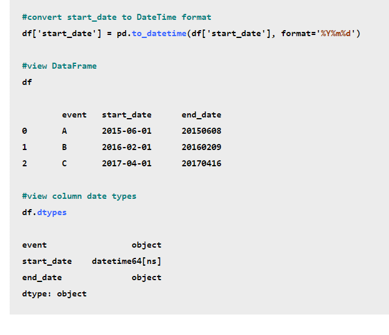
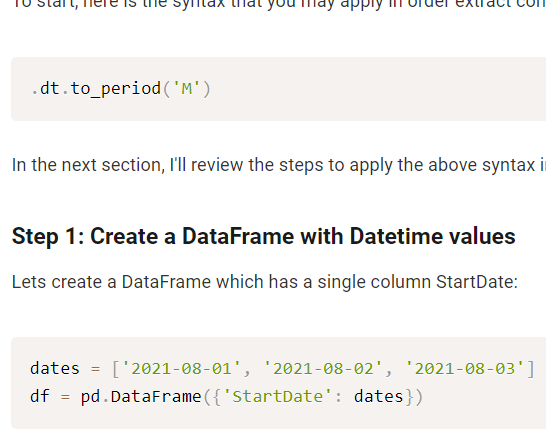

- Manejo de datos
	- Usamos la librería [[Pandas]]
- Graficas
  collapsed:: true
	- [[Plotly]]
- Generales
  collapsed:: true
	- Redondear Numeros
	- ```python
	  import numpy as np
	  myList = list(np.around(np.array(myList),2))
	  ```
- Convertir valores de una columna a logaritmos
  id:: 61b659d4-74eb-40c9-9bfd-0f741c201c32
  collapsed:: true
	- ```python
	  data['logarithm_base10'] = np.log10(data['Salary'])
	  ```
	- https://www.geeksforgeeks.org/log-and-natural-logarithmic-value-of-a-column-in-pandas-python/
- OLS → Mínimos cuadrados en Python regresión 
  collapsed:: true
	- ```python
	  ```
	- https://mohammadimranhasan.com/linear-regression-of-time-series-data-with-pandas-library-in-python/
- Modelo ARIMA en python
  collapsed:: true
	- ```python
	  ```
	- https://towardsdatascience.com/machine-learning-part-19-time-series-and-autoregressive-integrated-moving-average-model-arima-c1005347b0d7
- PDF Scraping
	- Extraer datos de pdf
		- Table de pdf con python
		- Datos de pdf python
		  collapsed:: true
			- Colucionar problema con tabula
				- cannot import name 'read_pdf'
				- https://stackoverflow.com/questions/47939921/tabula-py-importerror-cannot-import-name-read-pdf
		- Proyectos
			- PDF Scraping-[[Tasa de interés pasivas referenciales plazo 361 y más]]
				- Resumen:
					- Se Busco Extraer la tasa [[Tasa de interés pasivas referenciales plazo 361 y más]] del [[Banco Central]] utilizando el método de  pdf scraping debido a que esta tasa en concreto se encuentra únicamente en archivos pdf subidos al banco central
- Como saltar los errores en un loop for python
	- https://blog.carreralinux.com.ar/2017/06/try-y-except-en-python-excepciones/
	- COmo saltar errores en python
	- Omitir errores en python
	- Como omitir errores python
		- https://stackoverflow.com/questions/38707513/ignoring-an-error-message-to-continue-with-the-loop-in-python
- Poner en español las fechas
  collapsed:: true
	- Convertir tiempo en español a data time pandas
	- https://stackoverflow.com/questions/35226904/convert-spanish-date-in-string-format
	- https://stackoverflow.com/questions/67506116/abbreviated-month-or-day-of-the-week-with-a-dot-at-the-end-of-the-string
- Codigos para identificar fechas en python
	- https://www.dataindependent.com/pandas/pandas-to-datetime/
- Convertir columna pandas en datatime
	- Convertir columna fechas a tiempo Pandas
	- https://www.statology.org/convert-columns-to-datetime-pandas/v
	- 
	- Todos los codigos de fechas
		- https://www.dataindependent.com/pandas/pandas-to-datetime/
- Extraer mes o año o dia de columna tiempo pandas
	- Extraer año de columna pandas
	- Extraer mes de columna pandas
	- 
	- https://datascientyst.com/extract-month-and-year-datetime-column-in-pandas/
- Convertir datos extraidos de web a una lista
	- https://stackoverflow.com/questions/69420686/bs4-element-resultset-elements-to-a-list