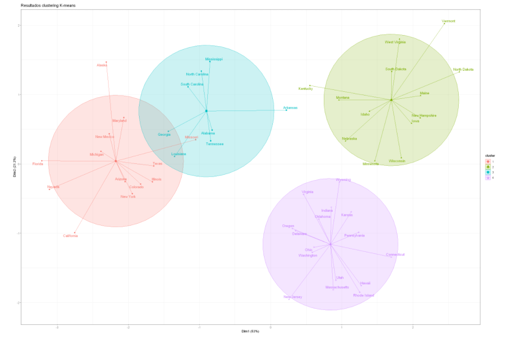

- Instalar Paquetes
- ```r
  install.packages("tidyverse")
  ```
- Conocer versión de R que utilizo
- ```terminal
  version
  ```
- Cambiar Imagen de tamaño en r  - Cambiar plot de tamaño en r en Jupyter
	- ```R
	  options(repr.plot.width=22, repr.plot.height=15)
	  ```
	- {:height 182, :width 239}
	- {:height 473, :width 683}
	- {{renderer :linkpreview,https://blog.revolutionanalytics.com/2015/09/resizing-plots-in-the-r-kernel-for-jupyter-notebooks.html}}
- Importar datos de Spss en R - Importar dataframe sps en R
	- ```r
	  library(haven)
	  enaho17_m1_A <- as.data.frame(read_sav("Enaho01-2017-100.sav"))
	  ```
	- {{renderer :linkpreview,https://rpubs.com/dsulmont/475703}}
- Seleccionar un Subconjunto especifico de  de columnas por nombre