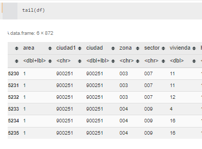

-
- {{renderer :toc_cqtnwk}}
	- # 1. Configuraciones
	  collapsed:: true
		- ## Instalar Paquetes
		  collapsed:: true
			- ```r
			  install.packages("tidyverse")
			  ```
		- ## Coocer versión de R que utilizo
		  collapsed:: true
			- ```terminal
			  version
			  ```
	- # 2. Graficas
		- ## Cambiar Imagen de tamaño en r
		  collapsed:: true
			- Cambiar plot de tamaño en r en Jupyter
			- ```R
			  options(repr.plot.width=22, repr.plot.height=15)
			  ```
			- {:height 182, :width 239}
			- {:height 473, :width 683}
			- {{renderer :linkpreview,https://blog.revolutionanalytics.com/2015/09/resizing-plots-in-the-r-kernel-for-jupyter-notebooks.html}}
	- # 3. Manejo de Data
		- ## Importar datos de Spss en R
		  collapsed:: true
			- Importar dataframe sps en R
			- ```r
			  library(haven)
			  enaho17_m1_A <- as.data.frame(read_sav("Enaho01-2017-100.sav"))
			  ```
			- Referencia
			  collapsed:: true
				- {{renderer :linkpreview,https://rpubs.com/dsulmont/475703}}
		- ## Seleccionar UNA  columna Especiica en R
			- ```r
			  df$edad
			  ```
		- ## Seleccionar  columnas Especificas
		  collapsed:: true
			- Seleccionar un Subconjunto especifico de  de columnas por nombre en R
			- ```r
			  df[,c("A","B","E")] 
			  ```
			- Referencias
			  collapsed:: true
				- {{renderer :linkpreview,https://stackoverflow.com/questions/10085806/extracting-specific-columns-from-a-data-frame}}
		- ## Seleccionar Columnas Por ubicación -Numero
		  collapsed:: true
			- ```r
			  df[,1:2]
			  ```
			- Ej:
			  collapsed:: true
				- 
		- ## Eliminar NaN en datafrane  R
		  collapsed:: true
			- - Eliminar valores ausentes de dataframe en R
			- ```r
			  df2<−na.omit(df2)
			  ```
			- https://www.tutorialspoint.com/how-to-remove-rows-from-data-frame-in-r-that-contains-nan
		- ## Detalles de las variables en Dataframe R
		  collapsed:: true
			- ```r
			  str(df)
			  ```
			- Ej
				- 
		- ## Primeros valores de un dataframe r
		  collapsed:: true
			- ```r
			  head(df)
			  ```
		- ## Últimos valores de un dataframe en R
		  collapsed:: true
			- ```r
			  tail(titanic)
			  ```
			- ej
				- 
	- # 4. Análisis Multivariado
	  collapsed:: true
		- ## Análisis Clústers
		  collapsed:: true
			- K-Means
				- {{renderer :linkpreview,https://www.youtube.com/watch?v=c1E_4lzfUBw}}
				- {{renderer :linkpreview,https://www.youtube.com/watch?v=WM3VfPLVFNw}}
		- ## Árbol de Decisiones
			- Instalar Librerias Necesarias
			  collapsed:: true
				- ```r
				  install.packages("rpart.plot")  
				  ```
			- Librerías necesarias
				- ```r
				  library(rpart)
				  library(rpart.plot)
				  ```