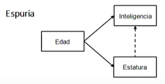

- _Una relación espuria se refiere a la apariencia en que existe una relación de causalidad entre variables cuando en realidad esta no existe._ - [Relación espuria - Qué es, definición y concepto | Economipedia](https://economipedia.com/definiciones/relacion-espuria.html)
- Una relación espuria se produce cuando se observa una alta correlación entre 2 variables que no tienen nada que ver, sin embargo esta relación se debe a que existe otra variable que influye sobre estas dos Como por ejemplo la relación entre estatura e inteligencia, las dos se ven afectadas por la edad.
- 
- [[Minicurso \(día 1\): Introducción a los Modelos de Ecuaciones Estructurales - YouTube](https://www.youtube.com/watch?v=d2vVy0VS-Hw)](https://youtu.be/d2vVy0VS-Hw?t=1587)