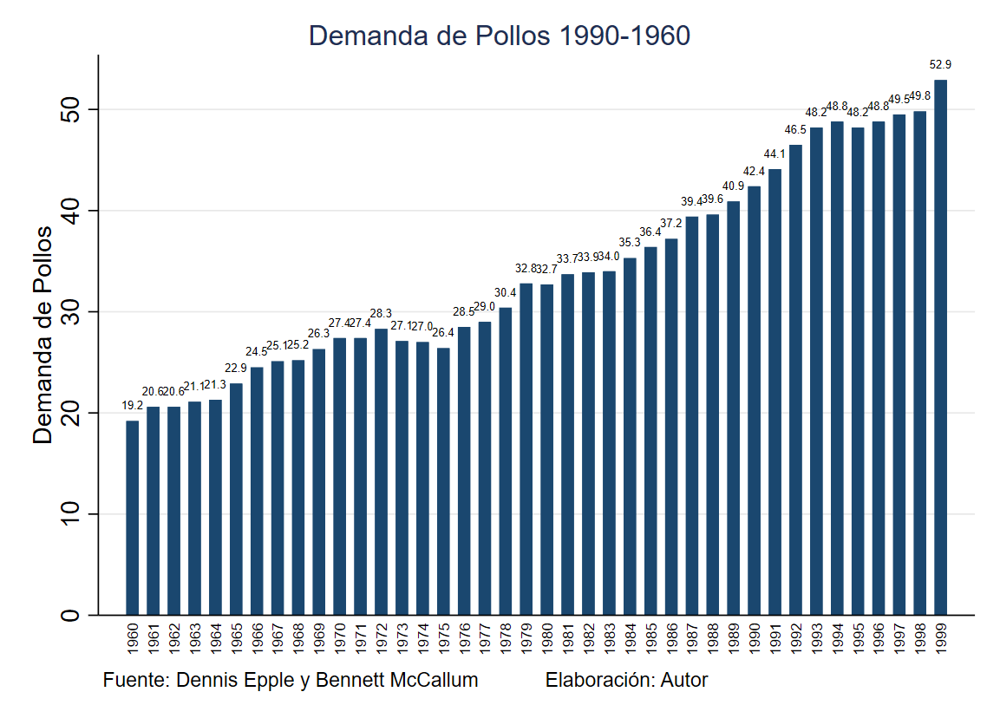
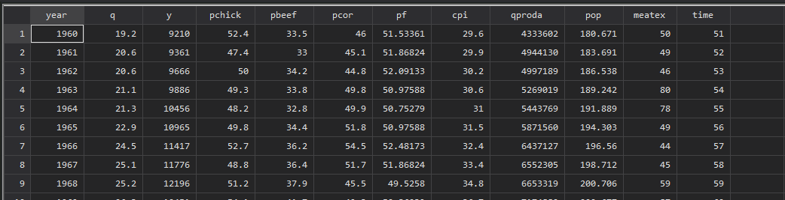
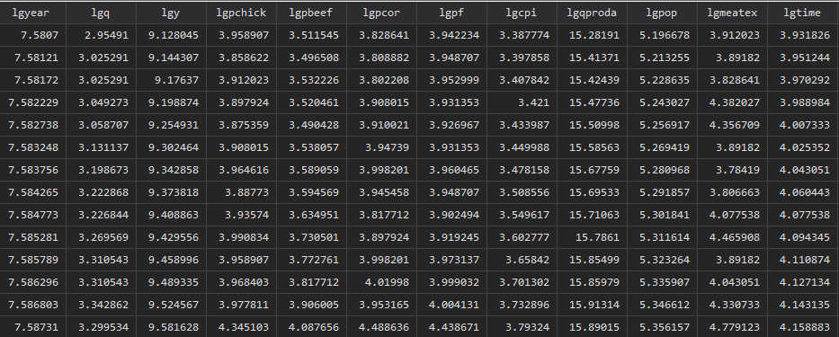

- Importar un archivo csv
- ```Stata
  import delimited "\Trabajos\3. Endogenidad\Items\endogeneidad\broiler.csv"
  ```
- Definir Color de tema standar
- ```stata
  set scheme s2color
  ```
- Cambiar estilo de presentación de gráficos
- ```stata
  set scheme s2color
  grstyle init
  . grstyle color background white
  . grstyle color major_grid dimgray
  . grstyle linewidth major_grid thin
  . grstyle yesno draw_major_hgrid yes
  . grstyle yesno grid_draw_min yes
  . grstyle yesno grid_draw_max yes
  ```
- Crear grafico  de barras , con todos los detalles. Donde $q$ es la variable en el eje de la las $Y$ y $year$ es la variable en el eje de las $X$
- ```stata
  graph bar q, ///
  over(year , label(labsize(2) angle(90) labgap(1)  ) relabel(`r(relabel)')) ///
  title("Demanda de Pollos 1990-1960" ///
  , span size(medium)) ///
  ytitle("Demanda de Pollos") ///
  blabel(bar, format(%4.1f) size(1.5) ) ///
  note("Fuente: Dennis Epple y Bennett McCallum            Elaboración: Autor  ")  
  ```
- 
- Cambiar el anglo de los axis en Stata
- ```stata
  graph bar q, ///
  over(year , label(angle(90)) ///
  ```
- Loop for en todo el rango de variables. Donde la primera coluna (variable es  `year` y la ultima es `time`). Generamos los logaritmos de cada variable
- ```stata
  foreach v of var year-time {
  gen lg`v'= log(`v')
   }
  ```
- Resultado
	- {:height 199, :width 689}
	- {:height 189, :width 689}
-
-
-
-
  ---
-
- {{renderer :linkpreview,https://journals.sagepub.com/doi/pdf/10.1177/1536867X1701700313}}