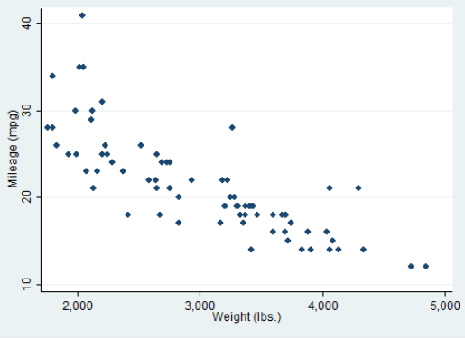

-
- Importar un archivo csv
- ```Stata
  import delimited "\Trabajos\3. Endogenidad\Items\endogeneidad\broiler.csv"
  ```
- #  [](#1.) Gráficas en Stata
  collapsed:: true
	- Librerías Necesarias
	  collapsed:: true
		- ```stata
		  ssc install blindschemes
		  ```
	- Definir Color de tema standar de las graficas
	  collapsed:: true
		- ```stata
		  set scheme s2color
		  ```
	- Mas temas para stata
	  collapsed:: true
		- {{renderer :linkpreview,https://blog.stata.com/2018/10/02/scheming-your-way-to-your-favorite-graph-style/}}
	- Cambiar estilo de presentación de gráficos
	  collapsed:: true
		- ```stata
		  set scheme s2color
		  grstyle init
		  . grstyle color background white
		  . grstyle color major_grid dimgray
		  . grstyle linewidth major_grid thin
		  . grstyle yesno draw_major_hgrid yes
		  . grstyle yesno grid_draw_min yes
		  . grstyle yesno grid_draw_max yes
		  ```
	- Pagina para cambiar el diseño, referencia de lo anterior
	  collapsed:: true
		- {{renderer :linkpreview,https://www.stata.com/meeting/germany18/slides/germany18_Jann.pdf}}
		-
	- Crear grafico  de barras , con todos los detalles. Donde $q$ es la variable en el eje de la las $Y$ y $year$ es la variable en el eje de las $X$
	  collapsed:: true
		- ```stata
		  graph bar q, ///
		  over(year , label(labsize(2) angle(90) labgap(1)  ) relabel(`r(relabel)')) ///
		  title("Demanda de Pollos 1990-1960" ///
		  , span size(medium)) ///
		  ytitle("Demanda de Pollos") ///
		  blabel(bar, format(%4.1f) size(1.5) ) ///
		  note("Fuente: Dennis Epple y Bennett McCallum            Elaboración: Autor  ")  
		  ```
		- 
	- Cambiar el angulo de los axis en Stata
	  collapsed:: true
		- ```stata
		  graph bar q, ///
		  over(year , label(angle(90)) ///
		  ```
	- ### Heatplot de correlacones
	  collapsed:: true
		- ```stata
		  pwcorr q  pchick y pf pcor pbeef pop, star(0.05)
		  matrix C = r(C)
		  heatplot C, values(format(%9.3f)) color(hcl, diverging intensity(.6)) ///
		  legend(off) aspectratio(1)
		  ```
		- 
		- ```stata
		  heatplot C, values(format(%9.3f)) color(hcl, diverging intensity(.6)) ///
		  legend(off) aspectratio(1) lower nodiagonal
		  ```
		- 
		- {{renderer :linkpreview,https://www.stata.com/meeting/germany19/slides/germany19_Jann.pdf}}
	- Scatterplot en Stata
	  collapsed:: true
		- 
		- ```stata
		   scatter  pchick q, ///
		  title("Precio del Pollo - Demanda de Pollos" ///
		  , span size(medium)) ///
		  ytitle("Precio del Pollo") ///
		  xtitle("Cantidad Demandad de Pollo") ///
		  note("Fuente: Dennis Epple y Bennett McCallum                                                        Elaboración: Autor  ")  
		  ```
		- Simple Scatter
		- ```stata
		  scatter mpg weight
		  ```
	- Cambiar tipo de linea en Grafica STATA
	  collapsed:: true
		- ```stata
		  twoway function . . . , lpattern(solid) .
		  ```
		- 
		- https://www.stata.com/manuals13/g-4linepatternstyle.pdf
	- Titulo de los  ejes en graficas Stata
	  collapsed:: true
		- Cambiar titulo de los Axis- Ejes STATA
		- Cambiar titulo del eje X en STATA
		- ```stata
		  xtitle("Month of 2001")
		  ```
		- Agregar ejes específicos en STATA - Agregar valores específicos a los ejes Satata  (esta en el bloque de abajo )
		- 
	- Cambiar el tamaño de la fuente  en Axis - letra en ejes STATA
	  collapsed:: true
		- ```stata
		  labsize(3) )
		  ```
		- 
		- Ref
		  collapsed:: true
			- https://www.stata.com/statalist/archive/2012-04/msg00300.html
	- Cambiar numero de axis en eje Stata
	  collapsed:: true
		- Cambiar numero de datos en eje x Stata
		- ```stata
		  ylabel(#10) xlabel(#10)
		  ```
		- 
		- 
		- Ref
			- https://www.stata.com/manuals/g-3axis_label_options.pdf
		-
# [](#2.) Loop for en Stata
collapsed:: true
	- Loop for en todo el rango de variables. Donde la primera coluna (variable es  `year` y la ultima es `time`). Generamos los logaritmos de cada variable
	- ```stata
	  foreach v of var year-time {
	  gen lg`v'= log(`v')
	   }
	  ```
	- Resultado
		- {:height 199, :width 689}
		- {:height 189, :width 689}
# [](#3.)  Modificar elementos de variable(Columna)
collapsed:: true
	- Cambiar nombres por labels en elementos de columna/variable Stata
	- ```stata
	  > label define sector 1 "SECTOR 1" 2 "SECTOR 2" 3 "SECTOR 3"
	  > label values sector sector
	  ```
- # [](#4.)  Series de Tiempo
  collapsed:: true
	- Rezagar una variable un periodo en Stata
	- ```stata
	  *Rezag la variable ingreso un periodo
	  L1.ingreso
	  *Si deseo rezagar mas periodos solo aumento el umero
	  *Ej: Rezago de la varaible ingreso 3 periodos
	  L3.ingreso
	  ```
	- Rezagar una variable mas de un periodo a la vez
	- ```stata
	  L(1/5).Ingreso
	  ```
- # [](#6.)  Test Econométricos
  collapsed:: true
	- Test de Heterocedasticidad
		- Test de White
		  collapsed:: true
			- id:: c923113e-05a6-4186-8401-3015d4c07281
			  ```stata
			  estat imtest
			  ```
			-
		- Test Breush y pagan
			- id:: 36eea4e8-4e33-4daf-bae6-f81bb09a4813
			  ```stata
			  estat hettest
			  ```
			- Si deseamos conocer mayor especificación de que variables pueden estar causando homocedasticidad  añadimos las variables exógenas y ' ' `,mtest`
			- ```stata
			  estat hettest ingreso educación, mtest
			  ```
			-
		- Video
		  collapsed:: true
			- Clase 6 Econometría II
			- {{renderer :linkpreview,https://drive.google.com/file/d/1fyWKT-bprk0qKy1dzQGLzBogxzjB-tTV/view?usp=sharing}}
	- Test de Endogenidad
		- Tets de Wu- Durbin -Hausman
			- id:: 8cead2be-c19c-4986-a218-9a2dea1256e5
			  ```stata
			  estat endogenous
			  ```
	- Test de Especificación del Modelo
		- Test de Ramsey
			- id:: 8d3feec9-0966-42ae-8d02-8186b4043d5a
			  ```stata
			  estat ovtest
			  ```
	- Test de Sobre instrumentación
		- Test de sargan
		- ```stata
		  estat overid
		  ```
# [](#7.)  Regresiones
collapsed:: true
	- MCO
	- IV (Variables instrumentales)
		- ```stata
		  ivregress 2sls lgq (lgpchick = lgpf lgpcor)
		  ```
		- Donde `lgq`  es la variable endógena, `lgpchick` es la variable exógena que se supone que sufre endogeneidad, `lgpf, lgpcor` son las varaibles instrumentales
# Correlaciones
collapsed:: true
	- Correlación de Pearson
	- ```stata
	  pwcorr,star(.05)
	  ```
	- 
	- https://www.reed.edu/psychology/stata/analyses/parametric/correlation.html#:~:text=Correlation%20is%20performed%20using%20the,those%20variables%20will%20be%20displayed. /
- # Drop aunque no este
  collapsed:: true
	- Eliminar variable auqnue no es
	- Eliminar varaible auqnue no exista o auqnue ya exista
	- Usamos capture antes
	- Renombrar variable auqnue no exista
	- ```stata
	   capture drop variable
	    capture rename make make_rename
	  
	  ```
	- https://www.statalist.org/forums/forum/general-stata-discussion/general/1402198-rename-variable-if-variable-exists
- # Loops en Stata
  collapsed:: true
	- {{renderer :linkpreview,https://data.library.virginia.edu/stata-basics-foreach-and-forvalues/}}
	- {{renderer :linkpreview,https://www.stata.com/manuals/pforeach.pdf}}
	- 
- Obtener total de una columna o variable Stata
	- Optener suma de una variable Stata columna Stata
	- ```stata
	  by industry: egen tot_2008 = total(revenue / (year == 2008)) 
	  ```
	- https://stackoverflow.com/questions/41122322/stata-calculate-change-between-years
	- Obtener la suma de una columna Stata
		- Obtener el total de una columna variable Stata
		- ```stata
		  summ x
		  scal sidney=r(sum)
		  
		  ```
		- https://www.stata.com/statalist/archive/2002-08/msg00265.html
- Poner nombre a linea verticas en Stata
  collapsed:: true
	- ```stata
	  https://stackoverflow.com/questions/31109311/stata-place-label-on-top-of-vertical-line-in-twoway-graph
	  ```
	- 
	- https://stackoverflow.com/questions/31109311/stata-place-label-on-top-of-vertical-line-in-twoway-graph
- Generar lineas verticales en stata en un grafico de linesa
  collapsed:: true
	- https://stackoverflow.com/questions/31109311/stata-place-label-on-top-of-vertical-line-in-twoway-graph
	- ```stata
	  xtline invest , overlay ysc(log) yla(1000 100 10 1, ang(h)) legend(off) addplot(scatter invest year if year == 1954, ms(none) mla(company) mlabcolor(black) || scatteri 1 1939 1000 1939, recast(line))
	  
	  ```
- Linea vertical en stata , controlando el alto de la linea
  collapsed:: true
	- ``` stata
	  gr twoway scatter mpg price ||
	  scatteri 20 5000 40 5000, c(l) msym(none) legend(off)
	  ```
	- https://www.stata.com/statalist/archive/2008-09/msg00224.html
- Cambiar linea de color stata
  collapsed:: true
	- https://www.stata.com/statalist/archive/2009-07/msg00154.html
- Agregar multiples lineas de colores en stata
  collapsed:: true
	- Cambiar color de lineas verticales en stata
	- ```stata
	  sysuse auto
	  scatter price mpg, xline(20, lcolor(red)) xline(30, lcolor(green))
	  ```
	- https://www.statalist.org/forums/forum/general-stata-discussion/general/1406627-add-vertical-line-to-a-twoway-graph
- Quitar el total de tabla stata
  collapsed:: true
	- ```stata
	  tabstat price weight mpg rep78, by(foreign) stat(mean sd min max) nototal
	  
	  ```
	- 
	- 
	- https://www.stata.com/manuals13/rtabstat.pdf
- ---
- {{renderer :linkpreview,https://journals.sagepub.com/doi/pdf/10.1177/1536867X1701700313}}
- {{renderer :linkpreview,https://www.stata.com/meeting/switzerland16/slides/bischof-switzerland16.pdf}}