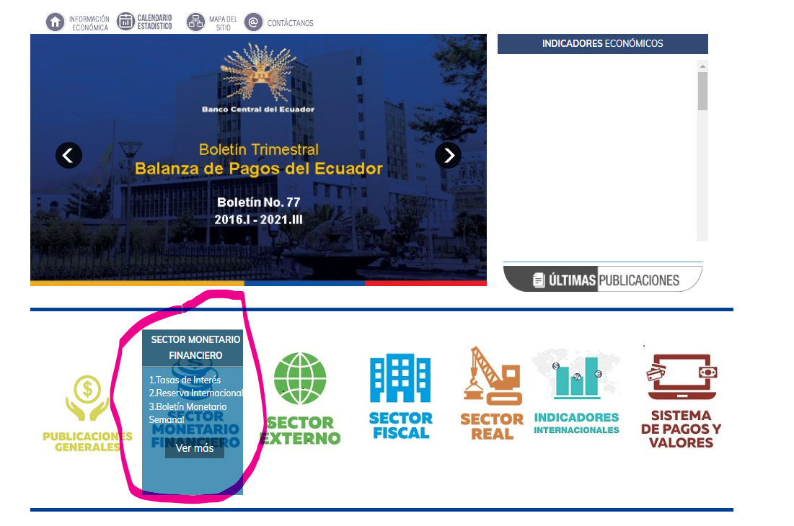

- Reportes Mensuales de tasa de interés
  collapsed:: true
	- https://contenido.bce.fin.ec/documentos/Estadisticas/SectorMonFin/TasasInteres/TasasVigentes012020.htm
- Datos Históricos
  collapsed:: true
	- Tasas de interés efectivas vigentes
	  collapsed:: true
		- [Banco central 🔗](https://contenido.bce.fin.ec/documentos/Estadisticas/SectorMonFin/TasasInteres/TasasHistorico.htm)
		- Ruta de Acceso al link desde el [[Banco Central]]
		  collapsed:: true
			- {:height 406, :width 530}
			- 
			- {:height 402, :width 530}
			- 
			- {:height 354, :width 530}
-