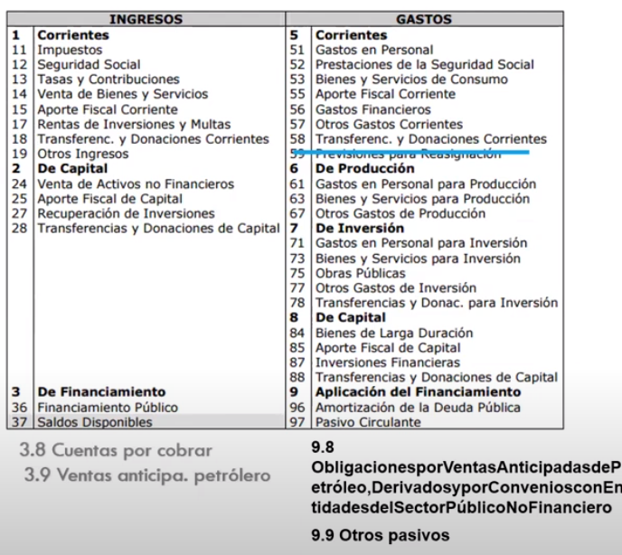

- Listado de uso institucional que especifica la gestión que se va a realizar tanto de donde proviene y hacia donde irán esos recursos .
- Uno de los clasificadores mas importantes es
	- El clasificador presupuestario
		- De acuerdo a su naturaleza
			- 
		- De Acuerdo a su clasificación económica
			- # Es importante aprenderse los códigos
			- Forma de los códigos, cada uno cuenta con 6 digitos
				- 
				- 
				- Clasificador presupuestario #documento
					- <object data="G:/Otros ordenadores/Mi Ordenador/Habilidades/Universidad/Fianzas Públicas/Documentos/clasificador_presupuestario.pdf" type="application/pdf" width="100%" height="800px"></object>
			- Ingresos
				- 1 - Corrientes
				- 2 - De capital
				- 3 - De Fianciamiento
			- Gastos
				- 5- Corrientes
				- 6 -De Producción
				- 7 -De Inversión
				- 8- De Capital
				- 9- De Aplicación del financiamiento
			- **Clasificador presupuestario para el Ecuador**
				- Es importante aprenderse los códigos de primer y segundo nivel, los de primer nivel son de la clasificación económica y los de segundo nivel son los de clasificación de su naturaleza
				- 