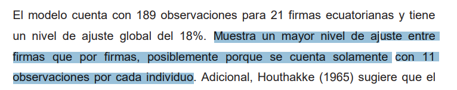

- Variables a tomar en cuenta
	- Tasa de Interes
	- Rentabilidad
	- Producto
	- Paper de referencia
-
- 
-
- ((61d61dcd-1148-439f-a241-dfee03455ec0))
- Los resultados obtenidos a través del modelo propuesto, muestran que la tasa de crecimiento de la q de Tobin en Ecuador, tiene una relación positiva con la tasa de crecimiento de la inversión privada ecuatoriana y es estadísticamente significativa  a  un  nivel  de  confianza  del  99%.  Adicional,  se  observa  que  el impacto que tiene este indicador sobre la variable dependiente es de 0.25; es decir, que un aumento de un 1% en la tasa de crecimiento de q, se traduce en un aumento del 0.25% en la tasa de crecimiento de la inversión. Aseveración que permite confirmar la hipótesis planteada en el presente trabajo.  Este resultado es el teóricamente esperado; las decisiones de inversión de las empresas,  dependen  en  gran  medida  del  ratio  estimado  entre  el  valor  de mercado de la empresa y el costo de reposición de sus activos. Pues si la q resulta mayor a la unidad, estimulará a que las firmas inviertan más en capital, dado que el mercado está asignándole un valor mayor al costo que incurrió en su creación (Tobin, 1969).  Adicional, como se mencionó en el apartado del marco teórico, la q, al incluir la valoración  bursátil  del  capital  de  la  empresa,  incorpora  implícitamente  a  las expectativas de los agentes sobre la rentabilidad futura de las inversiones de ésta (Hayashi, 1982), lo cual provoca que la q sea clave en el comportamiento de la inversión ecuatoriana.  Es  importante  mencionar  que  este  tipo  de  modelos  que  intentan  analizar  la relación entre la q de Tobin y la inversión, presentan un coeficiente de ajuste bajo;  por  ejemplo,  los  estudios  realizados  por  Alonso  y  Montoro  (1992); Montoro y Navarro (2010); y Cerda (2005),  para la economía peruana, chilena y  española,  obtienen  un  r-cuadrado  de  18.3%,  15.23%  y  19.68% respectivamente. El coeficiente de ajuste obtenido en el modelo estimado  se ubica dentro del  rango de estos estudios con un 18.5%.
- En cuanto a las variables de control utilizadas, se puede observar que la tasa de  interés  real,  tiene  una  relación  negativa  con  la  inversión. Pues  ante  un 36 aumento de un 1% en la tasa de crecimiento de la tasa de interés, la tasa de crecimiento  de  la  inversión  disminuirá  en  un  0.18%.  Se  observa que  esta variable es estadísticamente significativa a un nivel de confianza del 99%. Este resultado,  es  consistente  con  varios  estudios  que  han  encontrado  que  la inversión no resulta muy sensible a cambios en la tasa de interés. Se entiende este comportamiento porque la inversión suele ser más sensible a cambios en la oferta de crédito que a su precio. En este sentido, la tasa de interés captura los  costos  de  inversión.  Cuando esta  variable  sube,  el  costo  de  los  créditos aumenta con ella, y dificulta la capacidad del sector empresarial para financiar nuevas inversiones.
- El precio del petróleo, tiene una relación positiva con la tasa de crecimiento de la inversión y es estadísticamente significativa a un nivel de confianza del 99%. El impacto que tiene esta variable sobre la dependiente es de 0.48; es decir un aumento de un 1% en la tasa de crecimiento del precio del petróleo, la tasa de crecimiento de la inversión aumentará en un 0.48%. Esta relación puede ser explicada  por  la  alta  dependencia  que  tiene  la  economía  ecuatoriana  a  esta fuente  energética.  Según  el  Banco  Central,  las  exportaciones  del  Ecuador dependen  en  dos  tercios  del  precio  del  petróleo;  y  por  tanto,  es  un  factor esencial en los ingresos percibidos por el país, resultando un proxy de liquidez “en términos de la cantidad de dinero circulando en el país”. En este sentido, la economía se vuelve muy sensible a los cambios en su precio; pues si aumenta el  precio  de  éste,  ingresa  más  dinero  al  país  y  existen  más  recursos  para destinar a la inversión.
-
- 
-
-
-
-