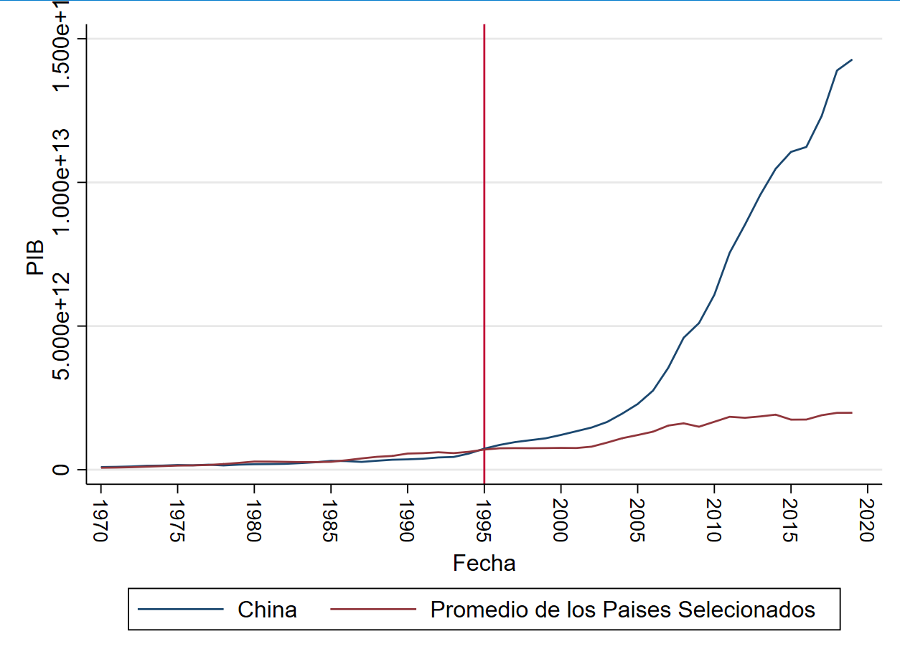
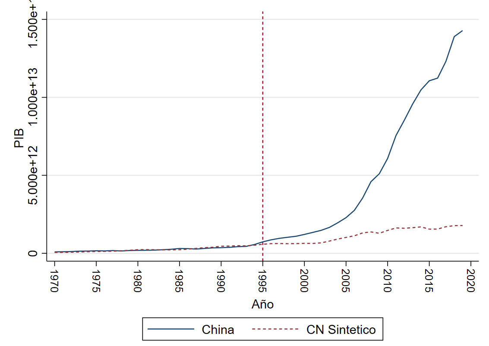
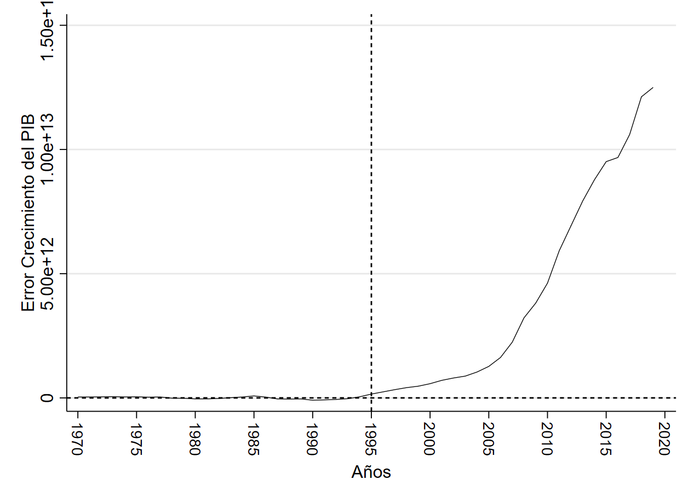
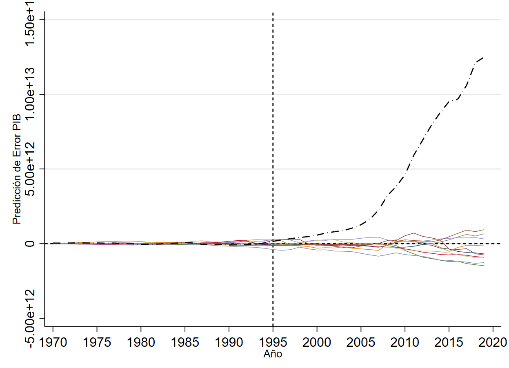
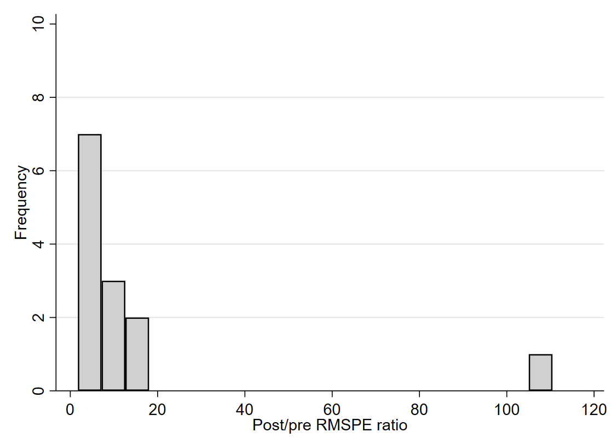

- # Diapos
- # ¿Cuál sería el crecimiento del Pib Per-Cápita Español si no se hubiese dado la crisis financiera del 2008? {{renderer :wordcount_xjsboqv}} Maximo ==2500==
	- # Resumen
	- # Introducción
	- Problema
		- Como sab
	- Hipótesis
		- China logro un crecimiento acelerado debido a que se introdujo a la  OMC a partir del año 1995
	- Objetivos
		- Usar el modelo de control sintético para comparar el crecimiento que hubiese tenido china de no aperturarse al mercado internacional
	- # Metodología
	- # Análisis Descriptivo
		- País a Analizado China
		- Países con un crecimiento Superior
		  collapsed:: true
			- Francia
			- Italia
		- Países Con un Crecimiento Similar al PIB de China antes el año 2001
		  collapsed:: true
			- India
			- Sudafrica
			- Corea el Sur
			- Mexico
			- Brasil
			- Rusia
			- España
			- Canada
			- Australia
			- Países Con un crecimiento Inferior
			  collapsed:: true
				- Sudafrica
				- Indonesia
		- En la grafica 1 se puede evidenciar la comparación entre el promedio de países seleccionados para comparar  frente al crecimiento de  de la economía China, como se puede evidenciar, las tendencias son muy similares hasta el año de 1995, momento en el cual se nota el comienzo de una gran diferencia.
		- Grafica 1 PIB China vs Resto de Países 
		   
		  Fuente: Banco Mundial 
		  Elaboración : Autores
	- # Resultados
		- La gráfica 2 muestra los resultados tras aplicar el modelo de control sintético
		- Grafica 2  Resultado modelo de control sintético
		  
		  Fuente: Banco Central
		  Elaboración Autores
		- ## Diferencia entre el PIB en control sintético Chino y el original
		- La gráfica 3 nos permite ver que existe una diferencia de casi cero desde los años 70 hasta inicio de los 90 , siendo a parir de estos donde la diferencia  comienza a incrementarse.
		- Grafica 3 Crecimiento de la diferencia entren el Control Sintético y El PIB Original 
		  
		  Fuente: Banco Central
		  Elaboración : Autores
		- ## Pruebas de Estado Placebo
		- En la gráfica 4 se muestra lo que se conoce como pruebas de estado placebo, misma que muestra el crecimiento del error entre el modelo sintético y el PIB original en cada uno de los países que entraron  en nuestra muestra usada para la comparación inicial.
		- Grafica 4 Comparación placeb
		  
		  Fuente : Banco Mundial
		  Elaboración: Autores
		- ## Ratio de Frecuencia
		- 
	- # Discusión
	- la diferencia entre el control sintético y el PIB original como se vio en la Gráfica 3 cumple con lo esperado, ya que esta diferencia crece a medida que se aleja del punto de quiebre planteado , el año de 1995
	- # Conclusión
	- # Bibliografía
	- Tigres Asiáticos
	- https://mundoeducacao.uol.com.br/geografia/tigres-asiaticos.htm
	- # Anexos
-