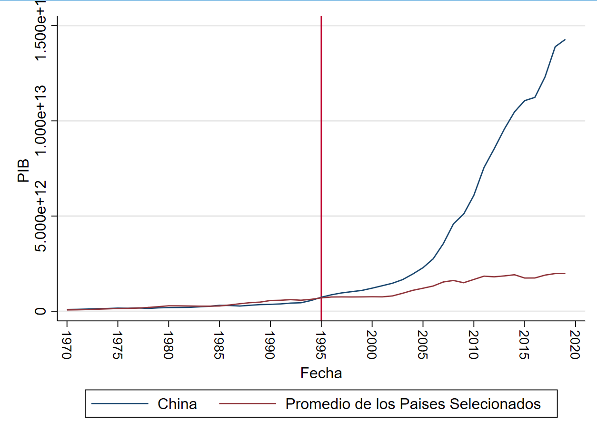
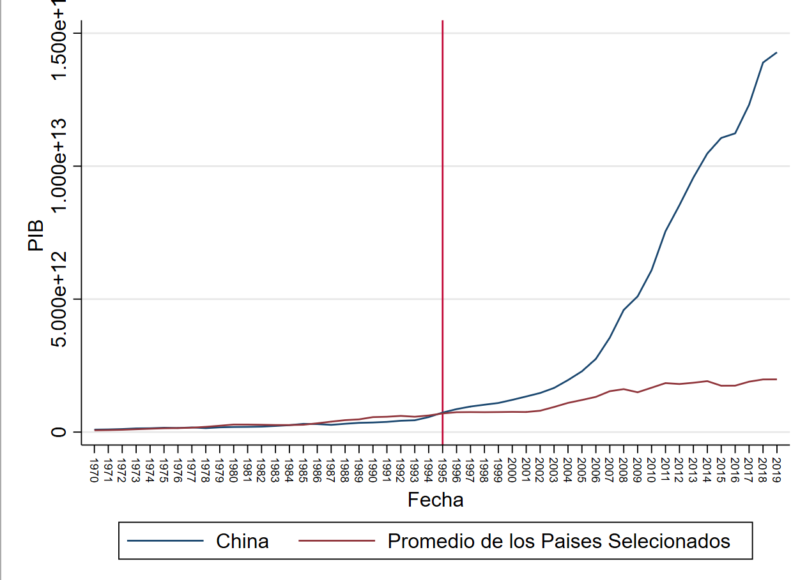

- # Diapos
- # ¿Cuál sería el crecimiento del Pib Per-Cápita Español si no se hubiese dado la crisis financiera del 2008? {{renderer :wordcount_xjsboqv}} Maximo ==2500==
	- # Resumen
	- # Introducción
	- # Metodología
	- # Análisis Descriptivo
		- País a Analizado China
		- Países con un crecimiento Superior
		  collapsed:: true
			- Francia
			- Italia
		- Países Con un Crecimiento Similar al PIB de China antes el año 2001
		  collapsed:: true
			- India
			- Sudafrica
			- Corea el Sur
			- Mexico
			- Brasil
			- Rusia
			- España
			- Canada
			- Australia
			- Países Con un crecimiento Inferior
			  collapsed:: true
				- Sudafrica
				- Indonesia
		- En la grafica 1 se puede evidenciar la comparación entre el promedio de países seleccionados para comparar  frente al crecimiento de  de la economía China, como se puede evidenciar, las tendencias son muy similares hasta el año de 1995, momento en el cual se nota el comienzo de una gran diferencia.
		- Grafica 1 PIB China vs Resto de Países 
		   
		- Fuente: Banco Mundial
		- Elaboración : Autores
	- # Resultados
	- # Discusión
	- # Conclusión
	- # Bibliografía
	- Tigres Asiáticos
	- https://mundoeducacao.uol.com.br/geografia/tigres-asiaticos.htm
	- # Anexos
-