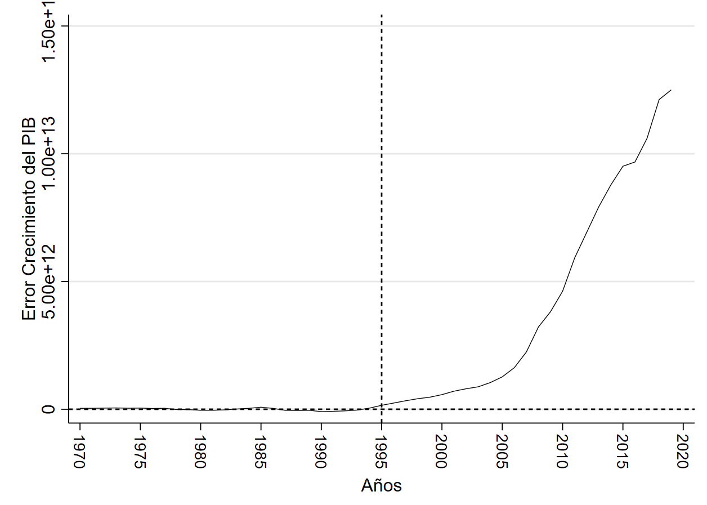

title:: ¿Cómo sería el crecimiento del PIB de China de no aperturarse al comercio internacional?

- # Diapos
	- ((61ce52f2-b8a2-41fc-a7a2-4a103fe14c79))
	- ((61d2ff06-452f-4ccc-b824-82f60a11872f))
	-
	- {{embed ((61d2617c-e05c-4552-87d0-79c682f00cae))}}
- # ¿Cómo sería el crecimiento del PIB de China de no aperturarse al comercio internacional? {{renderer :wordcount_xjsboqv}} Maximo ==2500==
  id:: 61ce52f2-b8a2-41fc-a7a2-4a103fe14c79
	- # Resumen
	- En este trabajo se busca conocer el punto de partida del crecimiento acelerado de la economía china y considerando que hubiese pasado de no existir este punto como tal, por lo cual se aplico el método de análisis sintético respecto al crecimiento del PIB chino tomando como punto de referencia el año de 1995 en el cual china comenzó su expansión en los mercados internacionales. Los resultados evidencian que en este punto se da un gran quiebre de crecimiento acelerado de la economía china, mismo que no hubiese sucedido de no darse tal apertura al comercio, lo que presentaría a china hoy en día con un PIB similar al de países como India o Brasil.
	  id:: 61d2ff06-452f-4ccc-b824-82f60a11872f
	- # Introducción
	- Problema
		- Como saber lo que hubiese pasado con china de no ingresar a la OMC
	- Hipótesis
		- China logro un crecimiento acelerado debido a que se introdujo a la  OMC a partir del año 1995
	- Objetivos
		- Usar el modelo de control sintético para comparar el crecimiento que hubiese tenido china de no aperturarse al mercado internacional
	- # Revisión Literaria
	- Método de control sintético Abadie, A. (2020).
	- # Metodología
	- Método de control sintético Abadie, A. (2020).
	- # Análisis Descriptivo
		- País a Analizado China
		- Países con un crecimiento Superior
		  collapsed:: true
			- Francia
			- Italia
		- Países Con un Crecimiento Similar al PIB de China antes el año 2001
			- India
			- Sudafrica
			- Corea el Sur
			- Mexico
			- Brasil
			- Rusia
			- España
			- Canada
			- Australia
			- Países Con un crecimiento Inferior
			  collapsed:: true
				- Sudafrica
				- Indonesia
		- En la grafica 1 se puede evidenciar la comparación entre el promedio de países seleccionados para comparar  frente al crecimiento de  de la economía China, como se puede evidenciar, las tendencias son muy similares hasta el año de 1995, momento en el cual se nota el comienzo de una gran diferencia.
		- Grafica 1 PIB China vs Resto de Países 
		  id:: 61d2617c-e05c-4552-87d0-79c682f00cae
		   
		  Fuente: Banco Mundial 
		  Elaboración : Autores
	- # Resultados
		- La gráfica 2 muestra los resultados tras aplicar el modelo de control sintético
		- Grafica 2  Resultado modelo de control sintético
		  
		  Fuente: Banco Central
		  Elaboración Autores
		- ## Diferencia entre el PIB en control sintético Chino y el original
		- La gráfica 3 nos permite ver que existe una diferencia de casi cero desde los años 70 hasta inicio de los 90 , siendo a parir de estos donde la diferencia  comienza a incrementarse.
		- Grafica 3 Crecimiento de la diferencia entren el Control Sintético y El PIB Original 
		  
		  Fuente: Banco Central
		  Elaboración : Autores
		- ## Pruebas de Estado Placebo
		- En la gráfica 4 se muestra lo que se conoce como pruebas de estado placebo, misma que muestra el crecimiento del error entre el modelo sintético y el PIB original en cada uno de los países que entraron  en nuestra muestra usada para la comparación inicial.
		- Grafica 4 Comparación placeb
		  
		  Fuente : Banco Mundial
		  Elaboración: Autores
		- ## Ratio de Frecuencia
		- {:height 451, :width 619}
	- # Discusión
	- la diferencia entre el control sintético y el PIB original como se vio en la Gráfica 3 cumple con lo esperado, ya que esta diferencia crece a medida que se aleja del punto de quiebre planteado , el año de 1995
	- # Conclusión
	- # Bibliografía
	- Abadie, A. (2020). Using synthetic controls: Feasibility, data requirements, and methodological aspects. Journal of Economic Literature.
	- Banco Mundial
	- https://datos.bancomundial.org/indicador/NY.GDP.MKTP.CD?end=2008&locations=IN-KR-MX-BR-RU-ES-CA-AU-CN-GB-IT-FR&start=1997&view=chart
	- Tigres Asiáticos
	- https://mundoeducacao.uol.com.br/geografia/tigres-asiaticos.htm
	- Método de Control Sintético
	- https://www.youtube.com/watch?v=uT6Gtzg1dyw
	- # Anexos